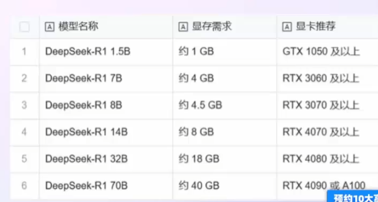
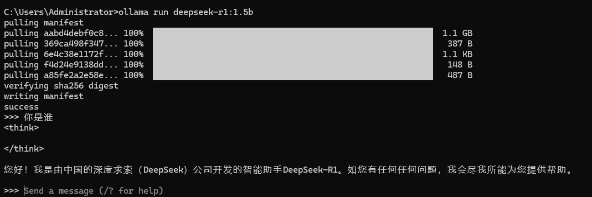
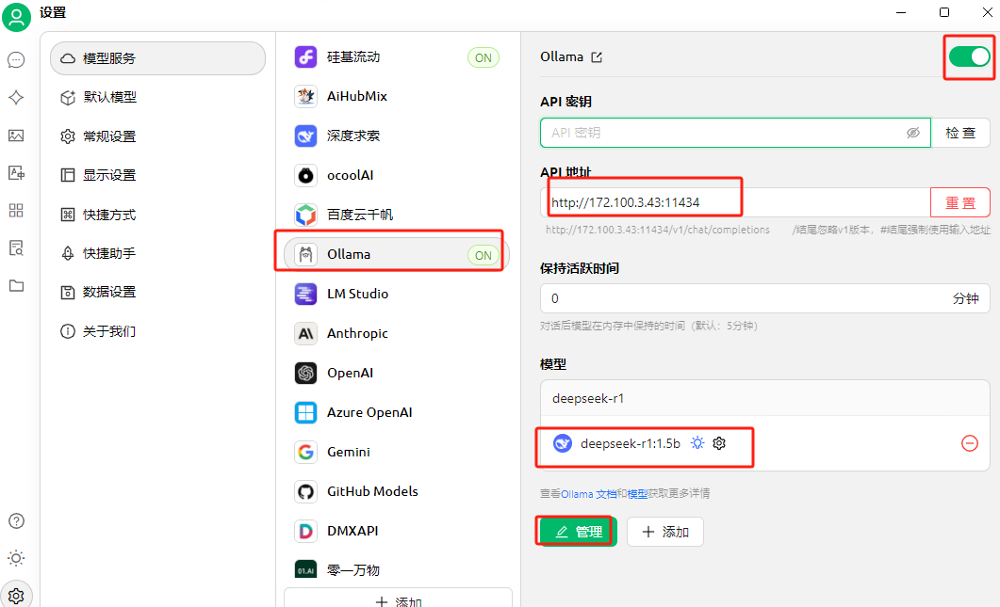
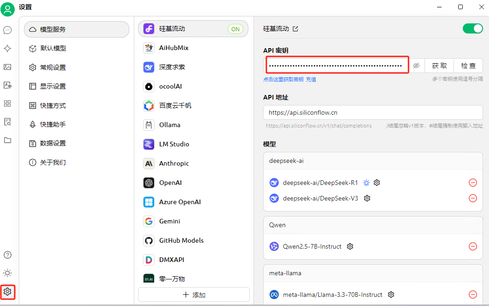
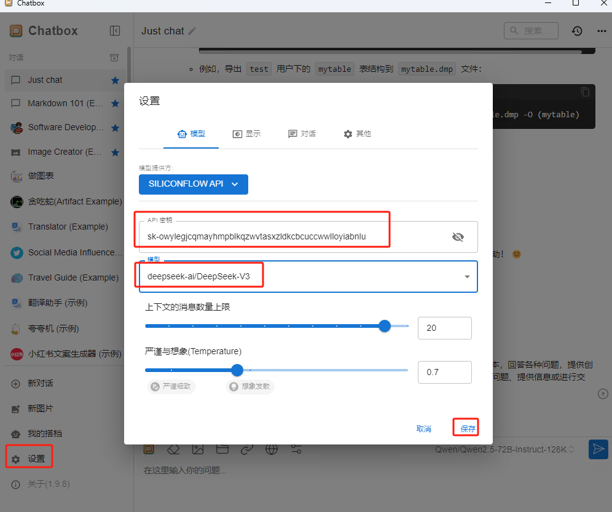

## 1.安装Ollama

官网：https://ollama.com/download

1.1 Linux部署Ollama

```
curl -fsSL https://ollama.com/install.sh | sh
```

## 2.部署Deepseek

[deepseek-r1](https://ollama.com/library/deepseek-r1)

```
ollama run deepseek-r1:1.5b
```



等待下载安装完成



使用 Cherry Studio访问

软件下载： [Cherry Studio - 全能的AI助手](https://cherry-ai.com/download)

客户端配置



## 3.Dify+Deepseek构建AI语言助手

[Dify.AI · 生成式 AI 应用创新引擎](https://dify.ai/zh)

```
git clone https://github.com/langgenius/dify.git
cd dify/docker/
cp .env.example .env
docker-compose up -d
```

## 4.使用Deepseek api

[DeepSeek 开放平台](https://platform.deepseek.com/api_keys)

```
sk-28e5c9e91f3f467da27834b4aa8694ef
```

## 5.使用第三方工具接入Deepseek

### 5.1 Cherry Studio

软件下载： [Cherry Studio - 全能的AI助手](https://cherry-ai.com/download)

获取api：[SiliconCloud](https://cloud.siliconflow.cn/account/ak)

配置



### 5.2 Chatbox

软件下载：[Chatbox AI官网：办公学习的AI好助手，全平台AI客户端，官方免费下载](https://chatboxai.app/zh)

获取api：[SiliconCloud](https://cloud.siliconflow.cn/account/ak)

配置chatbox


