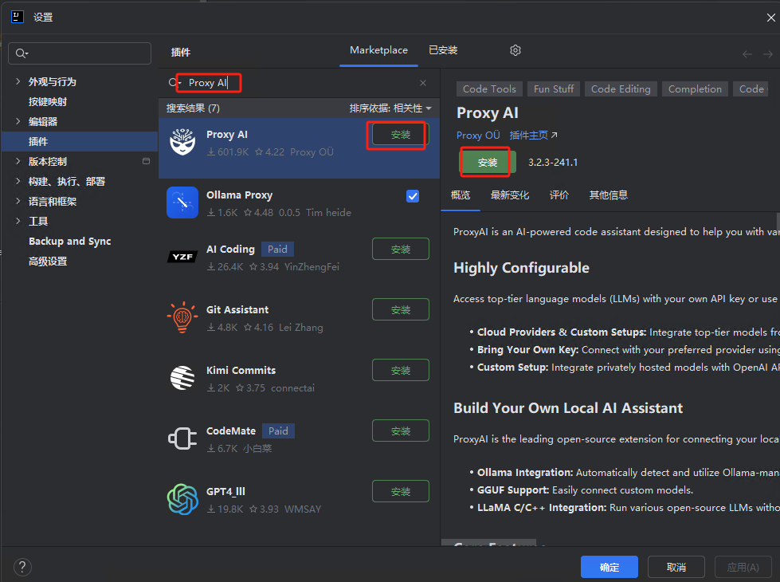

# Idea与大模型集成

## 1.插件下载：

（在线安装跳过此步骤）

官方：https://plugins.jetbrains.com/plugin/26803-codegpt-tools/versions/stable

## 2.**在IDE中安装Proxy AI插件**

### 2.1 在线安装，如安装失败选择本地安装

### 2.2 本地安装

安装完插件，重启软件

## 3.**配置Proxy AI连接大模型**

进入插件配置界面（如`Settings > Tools > Proxy AI`），选择服务商为**Ollama(Local)**

填写Ollama的本地API地址：http://172.100.2.251:11434

从下拉列表中选择已下载的模型（如deepseek-coder-v2:16b或deepseek-r1:32b）

## 4.使用Proxy AI

在idea右侧找到图标点击可以打开对话框，输入问题使用

## 5.使用灵码

[Lingma - Alibaba Cloud AI Coding Assistant Plugin for JetBrains IDEs | JetBrains Marketplace](https://plugins.jetbrains.com/plugin/17809-lingma--alibaba-cloud-ai-coding-assistant/versions/stable)

