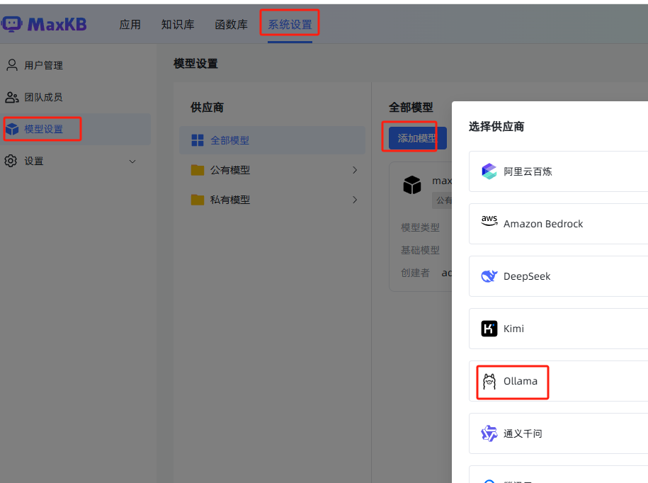
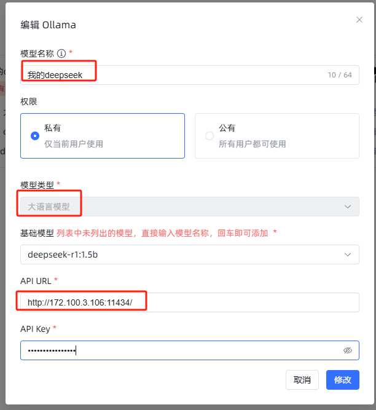
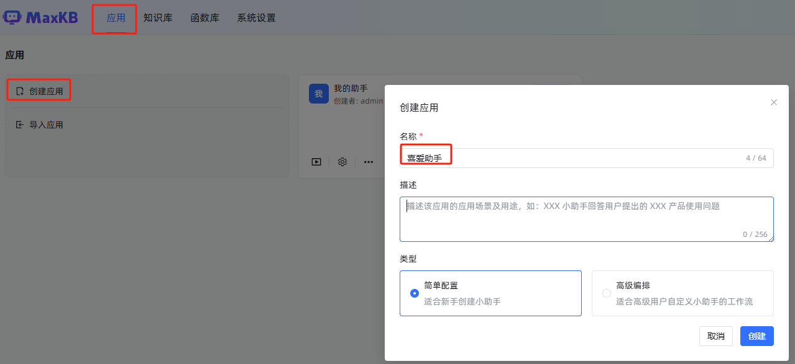
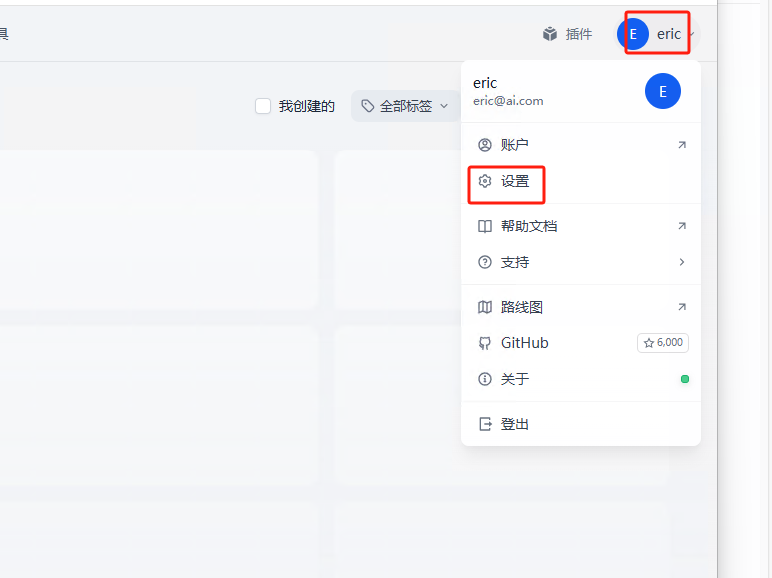
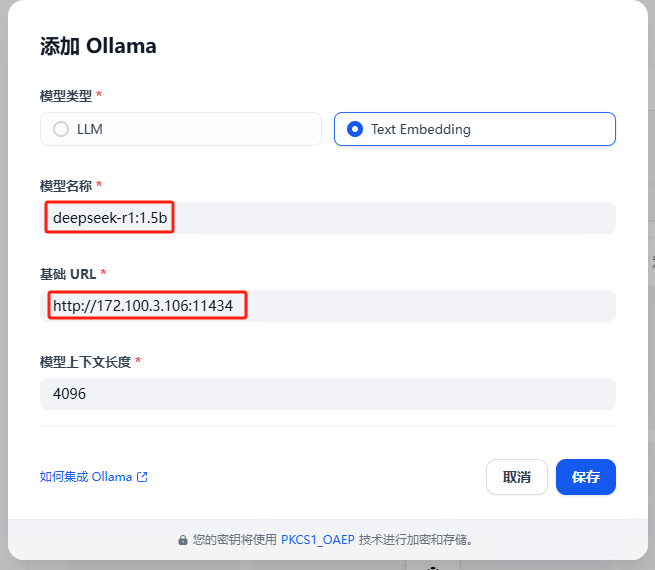
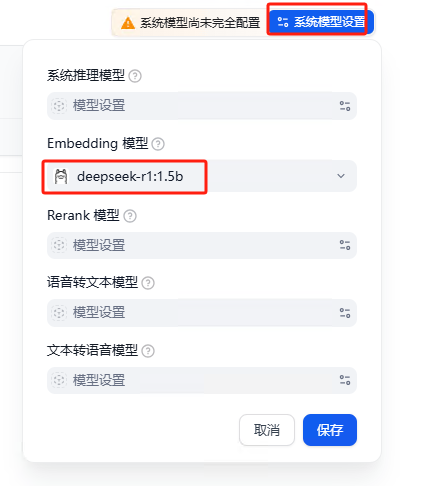
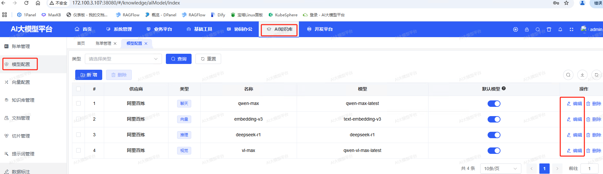

## 准备1panel

配置参考：https://bbs.fit2cloud.com/t/topic/10745

1.下载

离线包下载链接: https://community.fit2cloud.com/#/products/1panel/downloads

```
wget https://cdn0-download-offline-installer.fit2cloud.com/1panel/1panel-v1.10.26-lts-linux-amd64.tar.gz?Expires=1741585272&OSSAccessKeyId=LTAI5tNm6eCXpZo6cgoJet2h&Signature=iEhSEYJywOMZK7%2FR7fBsiz5%2BxVA%3D
```

2.安装

```
]# sh install.sh 
Select a language:

1. English
2. Chinese  中文(简体)
3. Persian
4. Português (Brasil)
5. Русский
   Enter the number corresponding to your language choice: 2
   You selected:  Chinese  中文(简体)
    ██╗    ██████╗  █████╗ ███╗   ██╗███████╗██╗     
   ███║    ██╔══██╗██╔══██╗████╗  ██║██╔════╝██║     
   ╚██║    ██████╔╝███████║██╔██╗ ██║█████╗  ██║     
    ██║    ██╔═══╝ ██╔══██║██║╚██╗██║██╔══╝  ██║     
    ██║    ██║     ██║  ██║██║ ╚████║███████╗███████╗
    ╚═╝    ╚═╝     ╚═╝  ╚═╝╚═╝  ╚═══╝╚══════╝╚══════╝
   [1Panel Log]: ======================= 开始安装 ======================= 
   设置1Panel安装目录 (默认为/opt): /data
   [1Panel Log]: ... 在线安装Docker 

[1Panel Log]: Docker安装成功

Created symlink from /etc/systemd/system/multi-user.target.wants/docker.service to /etc/systemd/system/docker.service.
设置1Panel端口 (默认是 33620): 
[1Panel Log]: 您设置的端口是:  33620 
[1Panel Log]: 正在打开防火墙端口 33620 
success
success
设置1Panel安全入口 (默认是 aaa873651e): eastport
[1Panel Log]: 设置1Panel安全入口 (默认是 eastport 
设置1Panel面板用户 (默认是 e2f4f3e2ea): admin
[1Panel Log]: 您设置的面板用户是 admin 
[1Panel Log]: 设置1Panel面板密码，设置后按回车键继续 (默认是 7c58438456):  

********

[1Panel Log]: 正在配置1Panel服务

Created symlink from /etc/systemd/system/multi-user.target.wants/1panel.service to /etc/systemd/system/1panel.service.

[1Panel Log]: 正在启动1Panel服务
[1Panel Log]: 1Panel服务已成功启动！

[1Panel Log]:  

[1Panel Log]: =================感谢您的耐心等待，安装已完成==================

[1Panel Log]:  

[1Panel Log]: 请使用您的浏览器访问面板:

[1Panel Log]: 外部地址:  http://218.244.55.14:33620/eastport 
[1Panel Log]: 内部地址:  http://172.100.3.106:33620/eastport 
[1Panel Log]: 面板用户:  admin 
[1Panel Log]: 面板密码:  1234qwer 
[1Panel Log]:  
[1Panel Log]: 官方网站: https://1panel.cn 
[1Panel Log]: 项目文档: https://1panel.cn/docs 
[1Panel Log]: 代码仓库: https://github.com/1Panel-dev/1Panel 
[1Panel Log]: 前往 1Panel 官方论坛获取帮助: https://bbs.fit2cloud.com/c/1p/7 
[1Panel Log]:  
[1Panel Log]: 如果您使用的是云服务器，请在安全组中打开端口 33620 
[1Panel Log]:  

[1Panel Log]: 为了您的服务器安全，离开此屏幕后您将无法再次看到您的密码，请记住您的密码。

[1Panel Log]:  

[1Panel Log]: ================================================================
```

## 1.安装Ollama

配置docker

```
cat > /etc/docker/daemon.json << EOF
{
    "registry-mirrors":[
    "https://kzjowymh.mirror.aliyuncs.com",
    "https://docker.1ms.run",
    "https://proxy.1panel.live",
    "https://docker.ketches.cn"
    ],
   
}
EOF
```

```
docker pull ollama/ollama:0.5.13
docker pull 1panel/maxkb:v1.10.2-lts
```

验证：http://172.100.3.106:11434/

```
ollama run deepseek-r1:1.5b
```


## 2.安装MaxKB

可以显示 MaxKB 应用的登录页面，即可正常使用 MaxKB 服务。默认登录信息是：
用户名：admin
密码：MaxKB@123..

http://172.100.3.106:8080/




deepseek-r1:1.5b

http://172.100.3.106:11434






## 3.安装ragflow

[ragflow/README_zh.md at main · infiniflow/ragflow](https://github.com/infiniflow/ragflow/blob/main/README_zh.md)

```
echo "vm.max_map_count=262144">>/etc/sysctl.conf 
sysctl -w vm.max_map_count=262144
```

```
$ git clone https://github.com/infiniflow/ragflow.git

```

## 4.安装Dify

[Docker Compose 部署 | Dify](https://docs.dify.ai/zh-hans/getting-started/install-self-hosted/docker-compose)

```
克隆库
git clone https://github.com/langgenius/dify.git --branch 0.15.3
进入 Dify 源代码的 Docker 目录
cd dify/docker
复制环境配置文件
Copy
cp .env.example .env
在Dify项目-docker-找到.env文件，在未尾加上下面的配置:
# 启用自定义模型
CUSTOM_MODEL_ENABLED=true
# 指定 01ama 的 API地址(根据部署环境调整IP)
OLLAMA_API_BASE_URL=172.100.3.106:11434
启动 Docker 容器
docker compose up -d
```

访问：http://172.100.3.107/

注册并登录，配置




deepseek-r1:1.5b

http://172.100.3.106:11434





## 5.安装PigAI

[📄 Pig AI 本地体验指南 - 零基础上手教程 | PIGCLOUD](https://ai.pig4cloud.com/doc/quick-test.html)

执行一键部署命令

```
确保 Docker 已安装后，只需执行以下命令即可完成部署：
curl https://try.pig4cloud.com/ai.sh | bash  
系统将自动下载并启动 Pig AI 所需的所有组件。
```

自定义安装

```
wget https://try.pig4cloud.com/docker-compose.yml
docker-compose up -d
```

#访问系统
部署完成后，打开浏览器访问：

地址：http://您服务器的IP地址:38080
默认账号：admin
默认密码：123456

更换自己的阿里api

[阿里云百炼](https://bailian.console.aliyun.com/?apiKey=1#/api-key)



| 1951039 | sk-18a7d7f455574a049b0e015ae15b9719 |
| ------- | ----------------------------------- |
|         |                                     |

