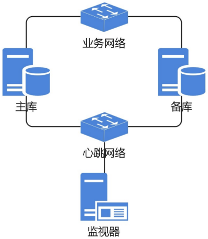
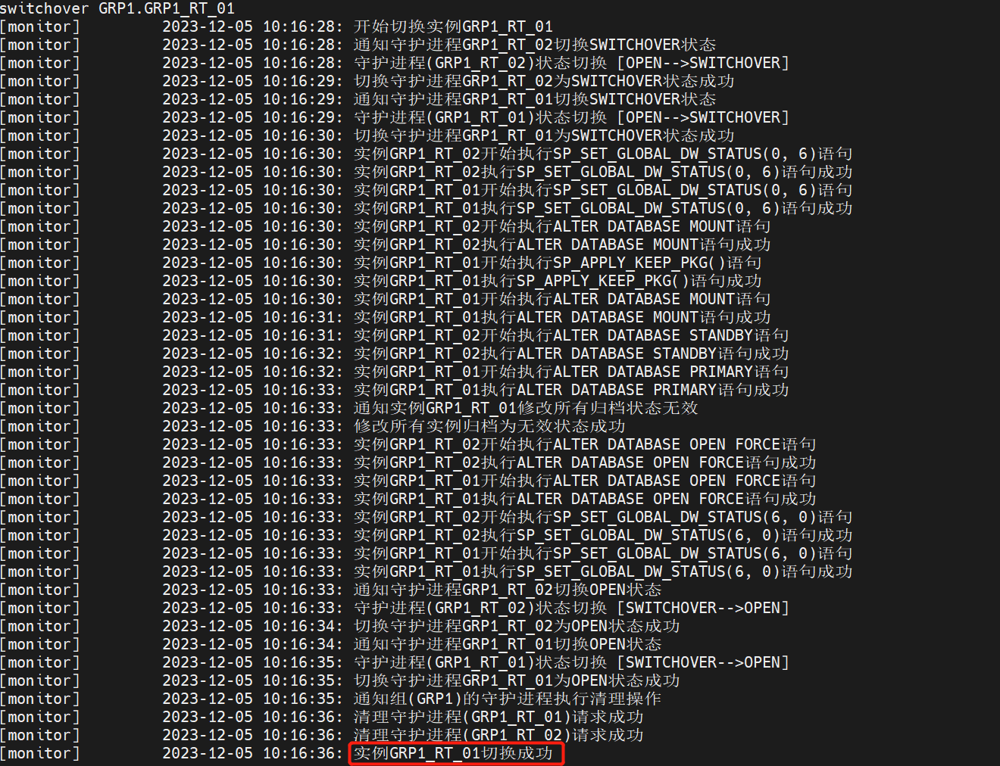
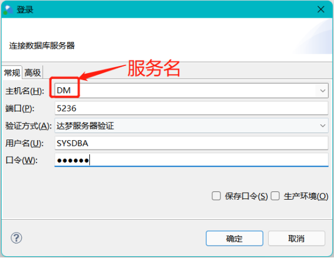

# 数据守护集群安装部署

## 一、安装前准备

### 1.1 硬件环境建议

数据守护集群安装部署前需要额外注意网络环境和磁盘 IO 配置情况，其他环境配置项建议请参考[安装前准备工作](https://eco.dameng.com/document/dm/zh-cn/ops/before-installation.html)。

#### 1.1.1 网络环境

心跳网络对 mal 通讯系统的影响非常大，如果网络丢包或者延迟较大，则会严重影响 mal 系统的处理能力，从而导致整个集群出现响应服务请求慢的情况。为确保集群的稳定性，网络配置如下：

1. 使用千兆或千兆以上网络；
2. 集群间的心跳网络需同步数据，建议尽量使用两个交换机构建内网，以实现冗余和负载均衡；
3. 建议服务器采用两个网卡绑定为一个逻辑网卡来使用（比如 bond 方式）。

#### 1.1.2 磁盘 IO

磁盘 IO 的读写速率会极大影响系统性能和用户体验。因此在进行集群安装部署前，应测试 IO 性能能否满足系统功能和性能需求。

IO 性能指标与系统的并发数、热点数据等因素往往密切相关。在数据守护集群，尤其生产系统中，推荐使用高性能 SSD 磁盘，以获得更佳性能，保证集群数据的实时同步。

### 1.2 集群规划

|                  | A 机器             | B 机器             |
| :--------------- | :----------------- | :----------------- |
| 业务 IP          | 172.100.3.111      | 172.100.3.112      |
| 心跳 IP          | 172.100.3.111      | 172.100.3.112      |
| 实例名           | GRP1_RT_01         | GRP1_RT_02         |
| 实例端口         | 5236               | 5236               |
| MAL 端口         | 5336               | 5336               |
| MAL 守护进程端口 | 5436               | 5436               |
| 守护进程端口     | 5536               | 5536               |
| OGUID            | 45331              | 45331              |
| 守护组           | GRP1               | GRP1               |
| 安装目录         | /apps/dmdba/dmdbms | /apps/dmdba/dmdbms |
| 实例目录         | /apps/dmdata/data/ | /apps/dmdata/data/ |
| 归档上限         | 51200              | 51200              |

确认监视器 IP 为 10.10.10.10。

说明：具体规划及部署方式以现场环境为准。

### 1.3 集群架构

搭建的主备集群架构如下图：



### 1.4 切换模式说明

| 故障切换方式 | dmarch              | dmwatcher       | dmmonitor         | 监视器要求                                                   |
| :----------- | :------------------ | :-------------- | :---------------- | :----------------------------------------------------------- |
| 故障手动切换 | ARCH_WAIT_APP LY=0  | DW_MODE= MANUAL | MON_DW_CON FIRM=0 | 1、手动切换：集群各节点的 bin 目录中，存放非确认监视器配置文件。 |
| 故障自动切换 | ARCH_WAIT_APP LY= 1 | DW_MODE= AUTO   | MON_DW_CON FIRM=1 | 1、手动切换：集群各节点的 bin 目录中，存放非确认监视器配置文件。 2、自动切换：在确认监视器上（非集群节点），存放确认监视器配置文件，并注册后台自启服务。 |

- ARCH_WAIT_APPLY 参数，设置为 0：高性能模式；设置为 1：事务一致模式。
- 故障手动切换情境下 ARCH_WAIT_APPLY 只能为 0。故障自动切换情境下 ARCH_WAIT_APPLY 可以为 0，也可以为 1。
- ARCH_WAIT_APPLY 参数设置的判断依据为业务是否要查询备机最新数据。如果需要，则配置为 1（较大性能衰减）；如果不需要，则配置为 0。

## 二、集群搭建

### 2.1 配置 A 机器

#### 2.1.1 初始化实例并备份数据

- 初始化实例

  ```shell
  [dmdba@~]$ /apps/dmdba/dmdbms/bin/dminit PATH=/apps/dmdba/dmdbms/data/ INSTANCE_NAME=GRP1_RT_01 PAGE_SIZE=32 EXTENT_SIZE=32 LOG_SIZE=2048
  ```

- 启动服务

  ```shell
  [dmdba@~]$ /apps/dmdba/dmdbms/bin/dmserver /apps/dmdba/dmdbms/data/DAMENG/dm.ini
  ```

- 开启归档

  ```sql
  [dmdba@~]$ /apps/dmdba/dmdbms/bin/disql SYSDBA/SYSDBA@172.100.3.111:5236
  
  SQL> ALTER DATABASE MOUNT;
  SQL> ALTER DATABASE ARCHIVELOG;
  SQL> ALTER DATABASE ADD ARCHIVELOG 'DEST=/apps/dmdba/dmdbms/data/DAMENG/arch, TYPE=LOCAL, FILE_SIZE=1024, SPACE_LIMIT=51200';
  SQL> ALTER DATABASE OPEN;
  SQL> commit;
  ```

- 备份数据

  ```sql
  
  SQL> BACKUP DATABASE BACKUPSET '/apps/dmdba/dmdbms/data/DAMENG/bak/BACKUP_FILE';
  
  A:
  rm -rf /apps/dmdba/dmdbms/data/DAMENG/bak/BACKUP_FILE
  /apps/dmdba/dmdbms/bin/dmrman CTLSTMT="backup database '/apps/dmdba/dmdbms/data/DAMENG/dm.ini'  full backupset  '/apps/dmdba/dmdbms/data/DAMENG/bak/BACKUP_FILE'"
  ll /apps/dmdba/dmdbms/data/DAMENG/bak/BACKUP_FILE
  scp -r  /apps/dmdba/dmdbms/data/DAMENG/bak/BACKUP_FILE root@172.100.3.112:/apps/dmdba/dmdbms/data/DAMENG/bak/
  B:
  /apps/dmdba/dmdbms/bin/dmrman CTLSTMT="RESTORE DATABASE '/apps/dmdba/dmdbms/data/DAMENG/dm.ini' FROM BACKUPSET '/apps/dmdba/dmdbms/data/DAMENG/bak/BACKUP_FILE'"
  
  /apps/dmdba/dmdbms/bin/dmrman CTLSTMT="RECOVER DATABASE '/apps/dmdba/dmdbms/data/DAMENG/dm.ini' FROM BACKUPSET '/apps/dmdba/dmdbms/data/DAMENG/bak/BACKUP_FILE'"
  
  /apps/dmdba/dmdbms/bin/dmrman CTLSTMT="RECOVER DATABASE '/apps/dmdba/dmdbms/data/DAMENG/dm.ini' UPDATE DB_MAGIC"
  
  ```

- 修改 dm.ini

  ```sql
  SQL> SP_SET_PARA_VALUE (2,'PORT_NUM',5236);
  SQL> SP_SET_PARA_VALUE (2,'DW_INACTIVE_INTERVAL',60);
  SQL> SP_SET_PARA_VALUE (2,'ALTER_MODE_STATUS',0);
  SQL> SP_SET_PARA_VALUE (2,'ENABLE_OFFLINE_TS',2);
  SQL> SP_SET_PARA_VALUE (2,'MAL_INI',1);
  SQL> SP_SET_PARA_VALUE (2,'RLOG_SEND_APPLY_MON',64);
  ```

- 关闭前台实例服务

#### 2.1.2 修改 dmarch.ini

```shell
[dmdba@~]$ vim /apps/dmdba/dmdbms/data/DAMENG/dmarch.ini

ARCH_WAIT_APPLY            = 0   #0：高性能 1：事务一致
[ARCHIVE_LOCAL]
ARCH_TYPE                = LOCAL  #本地归档类型
ARCH_DEST                = /apps/dmdba/dmdbms/data/DAMENG/arch/  #本地归档存放路径
ARCH_FILE_SIZE           = 1024  #单个归档大小，单位 MB
ARCH_SPACE_LIMIT         = 51200  #归档上限，单位 MB
##添加
[ARCHIVE_REALTIME1]
ARCH_TYPE                = REALTIME  #实时归档类型
ARCH_DEST                = GRP1_RT_02  #实时归档目标实例名
```

#### 2.1.3 创建 dmmal.ini

```shell
[dmdba@~]$ vim /apps/dmdba/dmdbms/data/DAMENG/dmmal.ini

MAL_CHECK_INTERVAL         = 10  #MAL 链路检测时间间隔
MAL_CONN_FAIL_INTERVAL     = 10  #判定 MAL 链路断开的时间
MAL_TEMP_PATH              = /apps/dmdba/dmdbms/data/malpath/  #临时文件目录
MAL_BUF_SIZE               = 512  #单个 MAL 缓存大小，单位 MB
MAL_SYS_BUF_SIZE           = 2048  #MAL 总大小限制，单位 MB
MAL_COMPRESS_LEVEL         = 0  #MAL 消息压缩等级，0 表示不压缩

[MAL_INST1]
MAL_INST_NAME            = GRP1_RT_01  #实例名，和 dm.ini 的 INSTANCE_NAME 一致
MAL_HOST                 = 172.100.3.111  #MAL 系统监听 TCP 连接的 IP 地址
MAL_PORT                 = 5336  #MAL 系统监听 TCP 连接的端口
MAL_INST_HOST            = 172.100.3.111  #实例的对外服务 IP 地址
MAL_INST_PORT            = 5236  #实例对外服务端口，和 dm.ini 的 PORT_NUM 一致
MAL_DW_PORT              = 5436  #实例对应的守护进程监听 TCP 连接的端口
MAL_INST_DW_PORT         = 5536  #实例监听守护进程 TCP 连接的端口

[MAL_INST2]
MAL_INST_NAME            = GRP1_RT_02
MAL_HOST                 = 172.100.3.112
MAL_PORT                 = 5336
MAL_INST_HOST            = 172.100.3.112
MAL_INST_PORT            = 5236
MAL_DW_PORT              = 5436
MAL_INST_DW_PORT         = 5536
```

#### 2.1.4 创建 dmwatcher.ini

```shell
[dmdba@~]$ vim /apps/dmdba/dmdbms/data/DAMENG/dmwatcher.ini

[GRP1]
DW_TYPE                  = GLOBAL  #全局守护类型
DW_MODE                  = MANUAL  #MANUAL：故障手切 AUTO：故障自切
DW_ERROR_TIME            = 20  #远程守护进程故障认定时间
INST_ERROR_TIME          = 20  #本地实例故障认定时间
INST_RECOVER_TIME        = 60  #主库守护进程启动恢复的间隔时间
INST_OGUID               = 45331  #守护系统唯一 OGUID 值
INST_INI                 = /apps/dmdba/dmdbms/data/DAMENG/dm.ini  #dm.ini 文件路径
INST_AUTO_RESTART        = 1  #打开实例的自动启动功能
INST_STARTUP_CMD         = /apps/dmdba/dmdbms/bin/dmserver  #命令行方式启动
RLOG_SEND_THRESHOLD      = 0  #指定主库发送日志到备库的时间阈值，默认关闭
RLOG_APPLY_THRESHOLD     = 0  #指定备库重演日志的时间阈值，默认关闭
```

#### 2.1.5 拷贝备份文件

```shell
##拷贝备份文件到 B 机器（没目录可以先初始化）
[dmdba@~]$ scp -r /apps/dmdba/dmdbms/data/DAMENG/bak/BACKUP_FILE dmdba@172.100.3.112:/apps/dmdba/dmdbms/data/DAMENG/bak
```

#### 2.1.6 注册服务（root执行）

```shell
[root@~]# /apps/dmdba/dmdbms/script/root/dm_service_installer.sh -t dmserver -p GRP1_RT_01 -dm_ini /apps/dmdba/dmdbms/data/DAMENG/dm.ini -m mount

[root@~]# /apps/dmdba/dmdbms/script/root/dm_service_installer.sh -t dmwatcher -p Watcher -watcher_ini /apps/dmdba/dmdbms/data/DAMENG/dmwatcher.ini
```

若要删除自启，可利用如下方式：

```shell
[root@~]# /apps/dmdba/dmdbms/script/root/dm_service_uninstaller.sh -n DmServiceGRP1_RT_01

[root@~]# /apps/dmdba/dmdbms/script/root/dm_service_uninstaller.sh -n DmWatcherServiceWatcher
```

### 2.2 配置 B 机器

#### 2.2.1 初始化实例

```shell
[dmdba@~]$ /apps/dmdba/dmdbms/bin/dminit PATH=/apps/dmdba/dmdbms/data/ INSTANCE_NAME=GRP1_RT_02 PAGE_SIZE=32 EXTENT_SIZE=32 LOG_SIZE=2048
```

#### 2.2.2 恢复数据

```shell
[dmdba@~]$ /apps/dmdba/dmdbms/bin/dmrman CTLSTMT="RESTORE DATABASE '/apps/dmdba/dmdbms/data/DAMENG/dm.ini' FROM BACKUPSET '/apps/dmdba/dmdbms/data/DAMENG/bak/BACKUP_FILE'"

[dmdba@~]$ /apps/dmdba/dmdbms/bin/dmrman CTLSTMT="RECOVER DATABASE '/apps/dmdba/dmdbms/data/DAMENG/dm.ini' FROM BACKUPSET '/apps/dmdba/dmdbms/data/DAMENG/bak/BACKUP_FILE'"

[dmdba@~]$ /apps/dmdba/dmdbms/bin/dmrman CTLSTMT="RECOVER DATABASE '/apps/dmdba/dmdbms/data/DAMENG/dm.ini' UPDATE DB_MAGIC"
```

#### 2.2.3 替换 dmarch.ini

```shell
[dmdba@~]$ vim /apps/dmdba/dmdbms/data/DAMENG/dmarch.ini

ARCH_WAIT_APPLY            = 0  #0：高性能  1：事务一致

[ARCHIVE_LOCAL]
ARCH_TYPE                = LOCAL  #本地归档类型
ARCH_DEST                = /apps/dmdba/dmdbms/data/DAMENG/arch/  #本地归档存放路径
ARCH_FILE_SIZE           = 1024  #单个归档大小，单位 MB
ARCH_SPACE_LIMIT         = 51200  #归档上限，单位 MB

[ARCHIVE_REALTIME1]
ARCH_TYPE                = REALTIME  #实时归档类型
ARCH_DEST                = GRP1_RT_01  #实时归档目标实例名
```

#### 2.2.4 配置 dm.ini、dmmal.ini 和 dmwatcher.ini

**配置 dm.ini**

在 B 机器上配置备库的实例名为 GRP1_RT_02，dm.ini 参数修改如下：

```shell
INSTANCE_NAME  = GRP1_RT_02
PORT_NUM = 5236                               #数据库实例监听端口
DW_INACTIVE_INTERVAL = 60              #接收守护进程消息超时时间
ALTER_MODE_STATUS = 0                     #不允许手工方式修改实例模式/状态/OGUID
ENABLE_OFFLINE_TS  = 2                      #不允许备库 OFFLINE 表空间
MAL_INI = 1                                           #打开 MAL 系统
ARCH_INI = 1                                         #打开归档配置
RLOG_SEND_APPLY_MON = 64             #统计最近 64 次的日志重演信息
```

```
$ vim dm.ini
16                 INSTANCE_NAME                   = GRP1_RT_02
260                 PORT_NUM                        = 5236
664                 DW_INACTIVE_INTERVAL            = 60
666                 ALTER_MODE_STATUS               = 0                
667                 ENABLE_OFFLINE_TS               = 2 
683                 MAL_INI                         = 1 
684                 ARCH_INI                        = 1 
446                 RLOG_SEND_APPLY_MON             = 64
```

**配置 dmmal.ini 和 dmwatcher.ini**

B 机器里 dmmal.ini、dmwatcher.ini 与 A 机器 GRP1_RT_01 的 dmmal.ini、dmwatcher.ini 相同，参照 A 机器 dmmal.ini、dmwatcher.ini 文件进行配置。

```
#登录111
cd /apps/dmdba/dmdbms/data/DAMENG
scp dmmal.ini dmwatcher.ini dmdba@172.100.3.112:/apps/dmdba/dmdbms/data/DAMENG/
```


#### 2.2.5 注册服务

```shell
[root@~]# /apps/dmdba/dmdbms/script/root/dm_service_installer.sh -t dmserver -p GRP1_RT_02 -dm_ini /apps/dmdba/dmdbms/data/DAMENG/dm.ini -m mount

[root@~]# /apps/dmdba/dmdbms/script/root/dm_service_installer.sh -t dmwatcher -p Watcher -watcher_ini /apps/dmdba/dmdbms/data/DAMENG/dmwatcher.ini
```

若要删除自启，可利用如下方式：

```shell
[root@~]# /apps/dmdba/dmdbms/script/root/dm_service_uninstaller.sh -n DmServiceGRP1_RT_02

[root@~]# /apps/dmdba/dmdbms/script/root/dm_service_uninstaller.sh -n DmWatcherServiceWatcher
```

### 2.3 配置监视器

- 手动切换：集群各节点的 bin 目录中，存放非确认监视器配置文件。
- 自动切换：在确认监视器上（非集群节点），存放确认监视器配置文件，并注册后台自启服务。

#### 2.3.1 创建 dmmonitor.ini

```shell
[dmdba@~]$ vim /apps/dmdba/dmdbms/bin/dmmonitor.ini

MON_DW_CONFIRM             = 1  #0：非确认（故障手切） 1：确认（故障自切）
MON_LOG_PATH               = ../log  #监视器日志文件存放路径
MON_LOG_INTERVAL           = 60  #每隔 60s 定时记录系统信息到日志文件
MON_LOG_FILE_SIZE          = 512  #单个日志大小，单位 MB
MON_LOG_SPACE_LIMIT        = 2048  #日志上限，单位 MB

[GRP1]
MON_INST_OGUID           = 45331  #组 GRP1 的唯一 OGUID 值
MON_DW_IP                = 172.100.3.111:5436  #IP 对应 MAL_HOST，PORT 对应 MAL_DW_PORT
MON_DW_IP                = 172.100.3.112:5436
```

在配置监视器时，一般配置好确认监视器后，建议再配置一个非确认监视器的配置文件，在主备发生切换时，可以通过前台的方式启动非确认监视器进行手动切换。非确认监视器是通过将监视器配置文件中 MON_DW_CONFIRM 参数值修改为 0 来实现，示例如下：

```shell
[dmdba@~]$ vim /apps/dmdba/dmdbms/bin/dmmonitor_manual.ini

MON_DW_CONFIRM             = 0  #0：非确认（故障手切） 1：确认（故障自切）
MON_LOG_PATH               = ../log  #监视器日志文件存放路径
MON_LOG_INTERVAL           = 60  #每隔 60s 定时记录系统信息到日志文件
MON_LOG_FILE_SIZE          = 512  #单个日志大小，单位 MB
MON_LOG_SPACE_LIMIT        = 2048  #日志上限，单位 MB

[GRP1]
MON_INST_OGUID           = 45331  #组 GRP1 的唯一 OGUID 值
MON_DW_IP                = 172.100.3.111:5436  #IP 对应 MAL_HOST，PORT 对应 MAL_DW_PORT
MON_DW_IP                = 172.100.3.112:5436
```

#### 2.3.2 注册服务（选做）

```shell
[root@~]# /apps/dmdba/dmdbms/script/root/dm_service_installer.sh -t dmmonitor -p Monitor -monitor_ini /apps/dmdba/dmdbms/bin/dmmonitor.ini
```

若要删除自启，可利用如下方式：

```shell
[root@~]# /apps/dmdba/dmdbms/script/root/dm_service_uninstaller.sh -n DmMonitorServiceMonitor
```

#### 2.3.3 监视器使用

| **命令**                   | **含义**                                   |
| :------------------------- | :----------------------------------------- |
| list                       | 查看守护进程的配置信息                     |
| show global info           | 查看所有实例组的信息                       |
| tip                        | 查看系统当前运行状态                       |
| login                      | 登录监视器                                 |
| logout                     | 退出登录                                   |
| choose switchover GRP1     | 主机正常：查看可切换为主机的实例列表       |
| switchover GRP1.实例名     | 主机正常：使用指定组的指定实例，切换为主机 |
| choose takeover GRP1       | 主机故障：查看可切换为主机的实例列表       |
| takeover GRP1.实例名       | 主机故障：使用指定组的指定实例，切换为主机 |
| choose takeover force GRP1 | 强制切换：查看可切换为主机的实例列表       |
| takeover force GRP1.实例名 | 强制切换：使用指定组的指定实例，切换为主机 |

对于在生产环境中配置有确认监视器时，主备只是发生了切换的情况下，再想将主备切换回去时，只需要启动非确认监视器执行切换命令即可。

例如，有主库 GRP1_RT_01 与备库 GRP1_RT_02 发生切换，恢复方法如下：

1. 通过前台方式启动非确认监视器。

```shell
./dmmonitor dmmonitor_manual.ini
```


从监视器中可以看到 GRP1_RT_02 变成了主库，GRP1_RT_01 变成了备库。

1. 检查集群状态。

可通过监视器命令"tip"或"show"来检查集群状态是否正常。


通过 "tip" 命令可以看到集群状态正常。

1. 登录非确认监视器。

在非确认监视器中输入"login"再输入用户名和密码登录监视器。


1. 查看满足切换条件的实例。

输入命令"choose switchover 组名"查看可切换为主机的实例列表。

```shell
choose switchover GRP1
```


可以看到 GRP1_RT_01 可以进行切换。

1. 主备切换。

执行命令"switchover GRP1.实例名"进行切换。

```SQL
switchover GRP1.GRP1_RT_01
```



切换成功，GRP1_RT_01 恢复到主库对外提供服务。

1. 退出非确认监视器。

先通过监视器命令"tip"和"show"检查当前集群状态。


集群状态正常，执行“exit”命令退出监视器。


> 建议
>
> 生产环境中建议应用使用服务名的方式进行连接，在配置文件 dm_svc.conf 中配置只连主库，这样连接的好处在于当主备发生切换后应用会自动连接到当前的主库，不会影响应用的正常使用。dm_svc.conf 详细介绍参考第三章节 dm_svc.conf 配置。

### 2.4 启动服务及查看信息

#### 2.4.1 启动数据库并修改参数

```shell
##A 机器
[dmdba@~]$ /apps/dmdba/dmdbms/bin/DmServiceGRP1_RT_01 start
[dmdba@~]$ /apps/dmdba/dmdbms/bin/disql SYSDBA/SYSDBA@172.100.3.111:5236
SQL> SP_SET_OGUID(45331);
SQL> ALTER DATABASE PRIMARY;
SQL> alter database open force;

##B 机器
[dmdba@~]$ /apps/dmdba/dmdbms/bin/DmServiceGRP1_RT_02 start
[dmdba@~]$ /apps/dmdba/dmdbms/bin/disql SYSDBA/SYSDBA@172.100.3.112:5236
SQL> SP_SET_OGUID(45331);
SQL> ALTER DATABASE STANDBY;
SQL> alter database open force;
```

#### 2.4.2 启动守护进程

```shell
##A/B机器
[dmdba@~]$ /apps/dmdba/dmdbms/bin/DmWatcherServiceWatcher start
```

#### 2.4.3 启动监视器

```shell
##后台启动
[dmdba@~]$ /apps/dmdba/dmdbms/bin/DmMonitorServiceMonitor start

##前台启动
[dmdba@~]$ /apps/dmdba/dmdbms/bin/dmmonitor /apps/dmdba/dmdbms/bin/dmmonitor.ini
```

### 2.5 启停集群

```shell
##启动
##A/B 机器
[dmdba@~]$ /apps/dmdba/dmdbms/bin/DmWatcherServiceWatcher start

##停止
##A/B机器
[dmdba@~]$ /apps/dmdba/dmdbms/bin/DmWatcherServiceWatcher stop
##A 机器
[dmdba@~]$ /apps/dmdba/dmdbms/bin/DmServiceGRP1_RT_01 stop
##B机器
[dmdba@~]$ /apps/dmdba/dmdbms/bin/DmServiceGRP1_RT_02 stop
```

#### 启动后集群状态处于mount状态切换为open。

先将与此主备集群相关的所有watcher、monitor关闭，在执行如下操作

```
前台启动
[dmdba@ha1 DAMENG]$  /apps/dmdba/dmdbms/bin/dmserver /apps/dmdba/dmdbms/data/DAMENG/dm.ini
登录修改
[dmdba@ha1 DAMENG]$ disql 
disql V8
用户名:
密码:

服务器[LOCALHOST:5236]:处于主库配置状态
登录使用时间 : 3.046(ms)
SQL> SP_SET_PARA_VALUE(1, 'ALTER_MODE_STATUS', 1); 
DMSQL 过程已成功完成
已用时间: 6.597(毫秒). 执行号:1.
SQL> alter database open force;
操作已执行
已用时间: 19.314(毫秒). 执行号:0.
SQL> SELECT MODE$,STATUS$,OGUID from v$instance;

行号     MODE$   STATUS$
---------- ------- -------
1          STANDBY OPEN

已用时间: 0.336(毫秒). 执行号:3.
SQL> 


```

达梦数据库常用信息

```
ps -ef | grep dms 查看 数据库的进程
ps -ef | grep dmw 查看 守护的进程
./disql 用户/密码
参数：v$parameter
数据库配置：v$dm_ini
进程: v$process
线程：v$threads
表空间：dba_tablespaces ,v$tablespace
用户: select * from dba_users; sysuser, all_users, dba_users
当前账户：select user
角色：select role from dba_roles;
查看账户权限：select grantee,granted_role from dba_role_privs where grantee=‘TEST1’
字段注释：select * from dba_col_comments;
序列：select * from dba_sequences
试图：dba_views
查询数据库备份：select backup_name,backup_path from v$backupset;
ethool bond1 查看网卡

```


## 三、卸载集群和数据库

```
#root执行
#A机器
systemctl stop DmServiceGRP1_RT_01
systemctl stop DmWatcherServiceWatcher
/apps/dmdba/dmdbms/script/root/dm_service_uninstaller.sh -n DmWatcherServiceWatcher
/apps/dmdba/dmdbms/script/root/dm_service_uninstaller.sh -n DmServiceGRP1_RT_01
#B机器
systemctl stop DmServiceGRP1_RT_02
systemctl stop DmWatcherServiceWatcher
/apps/dmdba/dmdbms/script/root/dm_service_uninstaller.sh -n DmWatcherServiceWatcher
/apps/dmdba/dmdbms/script/root/dm_service_uninstaller.sh -n DmServiceGRP1_RT_02

#检查
 ps -ef |grep dm.ini
 
 #清除数据库实例（慎重操作）
  rm -rf  /apps/dmdba/dmdbms/data/*
```


## 附、dm_svc.conf 配置

### 3.1 简介

dm_svc.conf 是使用达梦数据库时非常重要的配置文件，它包含了达梦各接口和客户端工具所需要配置的一些参数。通过它可以实现达梦各种集群的读写分离和均衡负载，且必须和接口/客户端工具位于同一台机器上才能生效。

初始 dm_svc.conf 文件由达梦安装时自动生成。不同的平台生成目录有所不同，注意相应访问用户需要对该文件有读取权限。

- 32 位的 DM 安装在 Win32 操作平台下，此文件位于 %SystemRoot%\system32 目录；
- 64 位的 DM 安装在 Win64 操作平台下，此文件位于 %SystemRoot%\system32 目录；
- 32 位的 DM 安装在 Win64 操作平台下，此文件位于 %SystemRoot%\SysWOW64 目录；
- 在 Linux 平台下，此文件位于 /etc 目录。

但在某些情况下，所使用的用户没有读取和修改 /etc 目录下文件的权限，这时就需要将 dm_svc.conf 文件放到有权限的目录下，并修改 url 连接串的内容。以 Linux 平台，文件放在 /home/dmdba 目录下为例：

- 在 /home/dmdba 目录下，编辑 dm_svc.conf 文件：

  ```shell
  TIME_ZONE=(480)
  LANGUAGE=(cn)
  dm=(ip:端口)
  [dm]
  KEYWORDS=(需要排除的关键字)
  ```

- 修改连接串

  ```shell
  jdbc:dm://dm?dmsvcconf=/home/dmdba/dm_svc.conf
  ```

dm_svc.conf 配置文件的内容分为全局配置区和服务配置区。全局配置区在前，可配置所有的配置项，服务配置区在后，以“[服务名]”开头，可配置除了服务名外的所有配置项。服务配置区中的配置优先级高于全局配置区（服务配置区的相同配置项会覆盖全局配置区对应的配置项）。

### 3.2 常用配置项介绍

- 服务名

用于连接数据库的服务名，参数值格式为：

服务名=(IP[:PORT],IP[:PORT],......)。

- TIME_ZONE

指明客户端的默认时区设置范围为：-779~840M，如 60 对应 +1:00 时区，+480 对于东八区，如果不做配置默认是操作系统的时区。

- KEYWORDS

该参数可以用于屏蔽数据库关键字，如果数据库关键字在 SQL 语句中以单词的形式存在，无法识别需要加上双引号或者可以通过该参数来屏蔽关键字，建议大小写都写入参数中。

例如：KEYWORDS=（versions,VERSIONS,type,TYPE）

- LOGIN_MODE

指定优先登录的服务器模式。0：优先连接 PRIMARY 模式的库，NORMAL 模式次之，最后选择 STANTBY 模式；1：只连接主库；2：只连接备库；3：优先连接 STANDBY 模式的库，PRIMARY 模式次之，最后选择 NORMAL 模式；4：优先连接 NORMAL 模式的库，PRIMARY 模式次之，最后选择 STANDBY 模式。

> 注意
>
> 在 2021 年版本之后，此参数的默认值由 0 变更为 4。该参数详细介绍及使用办法请参考《DM 数据守护与读写分离集群》-5.8 章节。手册位于**数据库安装路径 /dmdbms/doc** 文件夹。

- SWITCH_TIMES

表示以服务名连接数据库时，若未找到符合条件的库成功建立连接，将尝试遍历服务名中库列表的次数。有效值范围 1~9223372036854775807，默认值为 1，可以设置至少 3 次用来避免由于网卡的波动，造成数据库连接测频繁切换。

- SWITCH_INTERVAL

表示在服务器之间切换的时间间隔，单位为毫秒，有效值范围 1~9223372036854775807。与参数 SWITCH_TIMES、EP_SELECTOR 配合使用，EP_SELECTOR 设置为 0，等待 SWITCH_INTERVAL 后会切换尝试连接下一个服务器，EP_SELECTOR 设置为 1，等待 SWITCH_INTERVAL 后会继续尝试连接该服务器，直到 SWITCH_TIMES 次再切换下一个服务器。

- EP_SELECTOR

表示连接数据库时采用何种模型建立连接，0：依次选取列表中的不同节点建立连接，使得所有连接均匀地分布在各个节点上；1：选择列表中最前面的节点建立连接，只有当前节点无法建立连接时才会选择下一个节点进行连接。

- AUTO_RECONNECT

表示连接发生异常或一些特殊场景下连接处理策略。0：关闭连接，1：当连接发生异常时自动切换到其他库，无论切换成功还是失败都会抛一个 SQLEXCEPTION，用于通知上层应用进行事务执行失败时的相关处理；2 配合 EP_SELECTOR=1 使用，如果服务名列表前面的节点恢复了，将当前连接切换到前面的节点上，可以根据应用的实际要求设定。

### 3.3 常用配置

#### 3.3.1 单机配置

配置示例

```shell
##以#开头的行表示是注释
##全局配置区
TIME_ZONE=(480)
LANGUAGE=(cn)
DM=(192.168.100.100:5236)
```

连接示例：

- Disql 连接：

```shell
[dmdba@localhost~]$/dmsoft/dmdbms/disql SYSDBA/SYSDBA@DM
```

- 通过管理工具连接：



#### 3.3.2 主备集群配置

- 配置示例

  ```shell
  ##以#开头的行表示是注释#
  ##全局配置区
  TIME_ZONE=(480)
  LANGUAGE=(cn)
  DMHA=(192.168.100.100:5236,192.168.100.101:5236)
  ##服务配置
  [DMHA]
  SWITCH_TIMES=(3)
  SWITCH_INTERVAL=(100)
  LOGIN_MODE=(1)
  ```

- jdbc 连接串

  ```shell
  jdbc:dm://DMHA
  ```