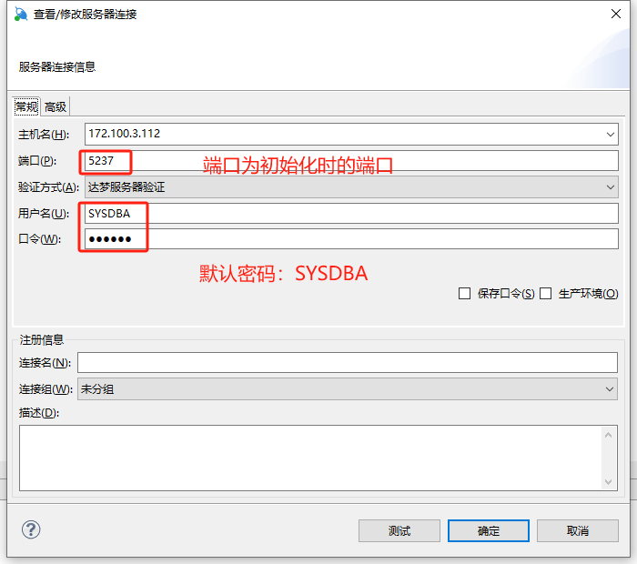
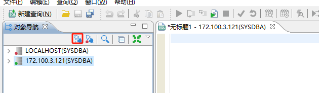

# 达梦数据库使用记录

# 使用windows客户端连接配置

软件下载地址：https://eco.dameng.com/download/

官方文档地址：https://eco.dameng.com/document/dm/zh-cn/start/dm-create-tablespace.html

下载windows版本安装选择客户端

1. 启动客户端-新建连接
1. 




 

数据库默认用户名/密码为SYSDBA/SYSDBA

docker数据库默认用户名/密码为 SYSDBA/SYSDBA001

```
dmdba@ha2 bin]$ disql SYSDBA/SYSDBA@172.100.3.112:5237

服务器[172.100.3.112:5237]:处于普通打开状态
登录使用时间 : 6.187(ms)
disql V8
SQL> select name from v$database;
```


## 数据库连接操作

```
[dmdba@ha2 bin]$ disql SYSDBA/SYSDBA@172.100.3.112:5237

服务器[172.100.3.112:5237]:处于普通打开状态
登录使用时间 : 6.187(ms)
disql V8
SQL> select status$ from v$database;

行号     STATUS$    
---------- -----------
1          4

已用时间: 0.882(毫秒). 执行号:1101.
SQL> alter database mount;
操作已执行
已用时间: 13.338(毫秒). 执行号:0.
SQL> select status$ from v$database;

行号     STATUS$    
---------- -----------
1          3

已用时间: 0.606(毫秒). 执行号:1102.
SQL> alter database open;
操作已执行
已用时间: 78.615(毫秒). 执行号:0.
SQL>  select status$ from v$database;

行号     STATUS$    
---------- -----------
1          4

已用时间: 0.432(毫秒). 执行号:1103.
SQL> 

```

## 执行sql脚本

在linux 系统中需要使用\进行转义，windows 平台不需要进行转义，如下:

```
]$ disql SYSDBA/SYSDBA \`/dm/dmdbms/samples/instance/script/dmhr/JOB_HISTORY.sql
```

在disql中有两种方法:

方法1:使用"`"，在工具里面执行时，不需要进行转义:

```
SQL>`/dm/dmdbms/samples/instance/script/dmhr/JOB_HISTORY.sql
```

方法2:使用start

```
SQL>start /dm/dmdbms/samples/instance/script/dmhr/JOB_HISTORY.sql
```

## 执行系统命令host

```
SQL> host df -h
Filesystem                 Size  Used Avail Use% Mounted on
devtmpfs                   200M     0  200M   0% /dev
tmpfs                      211M     0  211M   0% /dev/shm
tmpfs                      211M   26M  186M  13% /run
tmpfs                      211M     0  211M   0% /sys/fs/cgroup
/dev/mapper/centos-root    100G  6.2G   94G   7% /
SQL> exit

```

# 使用测试库测试

准备：执行创建测试实例和表

```
 #disql 
start /apps/dmdba/dmdbms/samples/instance_script/dmhr/UTF-8/1-CREATESCHEMA.sql
start /apps/dmdba/dmdbms/samples/instance_script/dmhr/UTF-8/2-REGION.sql
start /apps/dmdba/dmdbms/samples/instance_script/dmhr/UTF-8/3-CITY.sql
start /apps/dmdba/dmdbms/samples/instance_script/dmhr/UTF-8/4-LOCATION.sql
start /apps/dmdba/dmdbms/samples/instance_script/dmhr/UTF-8/5-DEPARTMENT.sql
start /apps/dmdba/dmdbms/samples/instance_script/dmhr/UTF-8/6-JOB.sql
start /apps/dmdba/dmdbms/samples/instance_script/dmhr/UTF-8/7-EMPLOYEE.sql
start /apps/dmdba/dmdbms/samples/instance_script/dmhr/UTF-8/8-JOB_HISTORY.sql


start /apps/dmdba/dmdbms/samples/instance_script/bookshop/UTF-8/1-CREATESCHEMA.sql
start /apps/dmdba/dmdbms/samples/instance_script/bookshop/UTF-8/2-CREATETABLE.sql
start /apps/dmdba/dmdbms/samples/instance_script/bookshop/UTF-8/3-INSERTSQL.sql


```

## 常用SQL操作

### 1. 简单查询

```
SQL>select city_name,city_id from city;
SQL>select city_name cn,city_id from dmhr.city;
SQL>select employee_name,salary as tol from dmhr.employee limit 10;
SQL>select employee_name||'的工资是:'||salary as desc1 from dmhr.employee limit 10;
SQL>select distinct department_id from dmhr.employee;
```

### 2. where条件

WHERE 子句常用的査询条件由谓词和逻辑运算符组成。

谓词指明了一个条件，该条件求解后，结果为一个布尔值:真、假或未知。
逻辑算符有:AND，OR，NOT。
谓词包括比较谓词(=、>、<、> =、<=、<>)，BETWEEN 谓词、IN 谓词、LIKE谓词、NULL 谓词、EXISTS 谓词.

```

SQL>select * from production.product
SQL>select name, author, publisher, nowprice from production.product where nowprice>=10 and nowprice<=20;
SQL>select name, author, publisher, nowprice from production.product where nowprice between 10 and 20;
SQL>select name, author from production.product where publisher in('中华书局','人民文学出版社');
SQL>select name, sex, phone from person.person where email is null;
SQL>select name, author from production.product where nowprice < 15 and discount < 7 or publisher='人民文学出版社';

组合查询
SELECT * FROM SYS.DBA_DATA_FILES;

SELECT * FROM SYS.DBA_TABLESPACES;

SELECT T1.TABLESPACE_NAME,T1.BLOCK_SIZE,T2.FILE_NAME FROM SYS.DBA_TABLESPACES T1,SYS.DBA_DATA_FILES T2 WHERE T1.TABLESPACE_NAME = T2.TABLESPACE_NAME;

```

### 3. 集函数

集函数可分:
1.COUNT(*);
2.相异集函数 AVG|MAX|MIN|SUMICOUNT(DISTINCT<列名>);
3.完全集函数 AVG|MAX|MIN|COUNT|SUM([ALL]<值表达式>);
4.方差集函数 VAR POP、VAR SAMP、VARIANCE、STDDEV POP、STDDEV SAMP、STDDEV;
5.协方差函数 COVAR POP、COVAR SAMP、CORR;
6.首行函数 FIRST VALUE;
7.区间范围内最大值集函数 AREA MAX;
8.FIRST/LAST 集函数 AVG|MAX|MIN| COUNT|SUM([ALL]<值表达式>)KEEP (DENSE RANKFIRSTILAST ORDER BY 子句);
9.字符串集函数 LISTAGG/LISTAGG2.

```
SQL>select min(nowprice) from production.product where discount < 7;
SQL>select avg(nowprice) from production.product where discount < 7;
SQL>select sum(nowprice) from production.product where discount >8;
SQL>select count(*)from purchasing.vendor;
SQL>select count(distinct publisher) from production.product;
```

### 4.分析函数

DM 分析函数为用户分析数据提供了一种更加简单高效的处理方式。如果不使用分析函数，则必须使用连接查询子查询或者视图，甚至复杂的存储过程实现。

引入分析函数后，只需要简单的 SQL语句，并且执行效率方面也有大幅提高。

分析函数可分:
1.COUNT(*);
2.完全分析函数 AVGIMAXIMIN|COUNT|SUM([ALL]<值表达式>),这5个分析函数的参数和作为集函数时的参数一致;
3.方差函数 VAR POP、VAR SAMP、VARIANCE、STDDEV POP、STDDEV SAMP、STDDEV;
4.协方差函数 COVAR POP、COVAR SAMP、CORR;
5.首尾函数 FIRST VALUE、LAST VALUE;
6.相邻函数 LAG 和 LEAD;
7.分组函数 NTILE;
8.排序函数 RANK、DENSE RANK、ROW NUMBER;
9.百分比函数 PERCENT RANK、CUME DIST、RATIO TO REPORT、PERCENTILE CONT、NTH VALUE;
10.字符串函数 LISTAGG;
11.指定行函数 NTH VALUE.

```
查询折扣大于7 的图书作者以及最大折扣。
SQL>select author, max(discount) over (partition by author) as max from production.product where discount>7;
求折扣小于 7 的图书作者和平均价格。
SQL>select author, avg(nowprice) over (partition by author) as avg from production.product where discount < 7;
求折扣大于 8 的图书作者和书的总价格。
SQL>select author, sum(nowprice) over (partition by author) as sum from production.product where discount >8;
查询信用级别为“很好”的已登记供应商的名称和个数。
SQL>select name, count(*) over (partition by credit) as cnt from purchasing.vendor where credit = 2;
```

## 表空间管理


