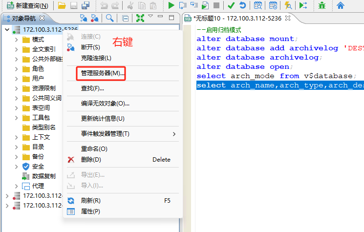
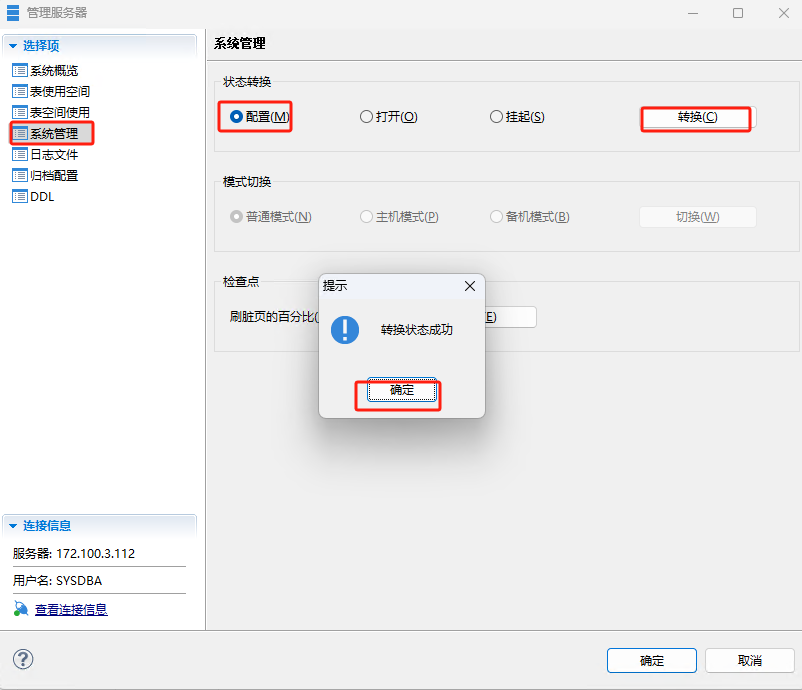
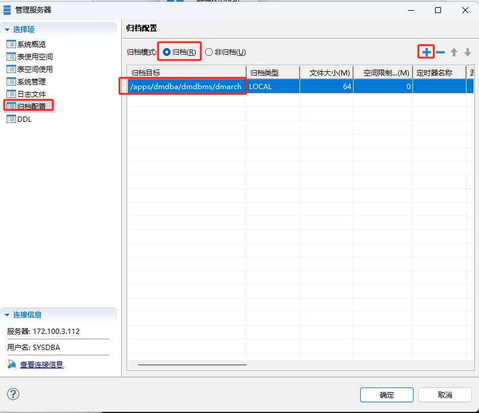

# 达梦数据库备份与还原

## 1. 归档管理

### 图形化启用归档模式








### 命令行启用归档模式

```
--启用归档模式
alter database mount;

alter database archivelog;

alter database add archivelog 'DEST=/apps/dmdba/dmdbms/dmarch, TYPE=LOCAL, FILE_SIZE=64, SPACE_LIMIT=0, ARCH_FLUSH_BUF_SIZE=0';


alter database open;

--查看状态
select arch_mode from v$database;

select arch_name,arch_type,arch_dest,arch_file_size from v$dm_arch_ini;


alter system switch logfile;
/*
 cat /apps/dmdata/data/DMDB1/dmarch.ini 
#DaMeng Database Archive Configuration file
#this is comments

	ARCH_WAIT_APPLY      = 0        

[ARCHIVE_LOCAL1]
	ARCH_TYPE            = LOCAL        
	ARCH_DEST            = /apps/dmdba/dmdbms/dmarch        
	ARCH_FILE_SIZE       = 64        
	ARCH_SPACE_LIMIT     = 0        
	ARCH_FLUSH_BUF_SIZE  = 0        
	ARCH_HANG_FLAG       = 1 
	
	*/
```


## 2. 逻辑备份与还原

```
--逻辑导出(dexp)和逻辑导入(dimp)支持如下四种级别操作:
----数据库级(FULL):导出或导入整个数据库中的所有对象。
----用户级(OWNER):导出或导入一个或多个用户所拥有的所有对象。
----模式级(SCHEMAS):导出或导入一个或多个式下的所有对象。
----表级(TABLE):导出或导入一个或多个指定的表或表分区，
--创建测试数据
--创建用户:
create user dexp identified by dameng123;
grant resource,dba to dexp;
--连接测试用户并创建测试表:
--conn dexp/dameng123;
create table dexp as select * from sysobjects;
--导出导入过程数据库要保持OPEN状态
select count(1) from dexp;
--1.全量导出导入
-- 全库导出
--]$dexp SYSDBA/SYSDBA file=full_01.dmp log=full1.log directory=/apps/dmdba/dmdbms/dmbak full=y
--删除测试数据:
drop table dexp ;
select count(1) from dexp;
--全库导入
--]$ dimp USERID=SYSDBA/SYSDBA file=full_01.dmp LOG=full2.log directory=/apps/dmdba/dmdbms/dmbak full=y table_exists_action=replace
--验证之前创建的测试表
select count(1) from dexp;
--2.按用户导出导入
--导出用户
--]$ dexp SYSDBA/SYSDBA file=user_01.dmp log=user_out.log directory=/apps/dmdba/dmdbms/dmbak owner=dexp
--删除测试数据:
drop table dexp ;
select count(1) from dexp;
--导入数据
	--导入数据到原用户:
--]$ dimp USERID=SYSDBA/SYSDBA FILE=user_01.dmp LOG=user_in.log directory=/apps/dmdba/dmdbms/dmbak owner=dexp table_exists_action=replace
--验证之前创建的测试表
select count(1) from dexp;
	--导入数据到其他用户:
create user dimp identified by dameng123;
grant resource,dba to dimp;
--验证导入前数据
--SQL>conn dimp/dameng123
select count(1) from dexp;
--注意这里的remap schema中的模式名要用大写，否则会导入原来的模式中:
--]$ dimp USERID=SYSDBA/SYSDBA FILE=user_01.dmp LOG=user_in_.log directory=/apps/dmdba/dmdbms/dmbak remap_schema=DEXP:DIMP table_exists_action=replace
--验证导入后数据
--SQL>conn dimp/dameng123
select count(1) from dexp;


--3.按模式导出导入
--导出模式
--]$ dexp SYSDBA/SYSDBA file=schema_01.dmp log=schema_out.log directory=/apps/dmdba/dmdbms/dmbak schemas=dexp

--删除测试数据:
--SQL>conn dimp/dameng123
drop table dexp ;
select count(1) from dexp;
--导入模式
--注意这里的remap_schema中的模式名要用大写，否则会导入原来的模式中:
--l$ dimp USERID=dimp/dameng123 file=schema_01.dmp LOG=schema_in.log directory=/apps/dmdba/dmdbms/dmbak remap_schema=DEXP:DIMP table_exists_action=replace
--验证模式
select user();
select count(1) from dexp;


--4.按表导出导入
--导出表
--在原库dexp用户下创建2张测试表
--SQL>conn dexp/dameng123
create table anqing as select * from sysobjects;
create table huaining as select * from sysobjects;
--#导出这2张表:
--]$ dexp dexp/dameng123 file=tables_01.dmp log=tables_out.log directory=/apps/dmdba/dmdbms/dmbak tables=anqing,huaining
drop TABLE anqing;
drop TABLE huaining;
select count(1) from anqing;
select count(1)from huaining;
--导入表
--将表导入到原用户dexp用户下:
--]$ dimp dexp/dameng123 file=tables_01.dmp log=tables_in.log directory=/apps/dmdba/dmdbms/dmbak tables=anqing,huaining table_exists_action=replace
--将表导入到dimp用户下:
--注意这里连接用户必须是对象的原用户，然后加上remap_schema=DEXP:DIMP 就可以导入到新用户下:
--]$ dimp dexp/dameng123 file=tables_01.dmp log=tables_in_dimp.log directory=/apps/dmdba/dmdbms/dmbak tables=anqing,huaining table_exists_action=replace remap_schema=DEXP:DIMP
--验证表
--SQL>conn dimp/dameng123
select user();
select count(1) from anqing;
select count(1)from huaining;


```


## 3. 联机备份与还原

```
--联机备份在数据库级别只支持备份操作，不支持还原，数据库级别的还原必须在脱机进行。
--默认的备份路径为 dm.in 中 BAK PATH 参数配置的路径，若未配置，则使用 SYSTEM_PATH 下的 bak目录,
--1.数据库备份
--全备:full 参数可以省略，不指定备份类型默认为完全备份
backup database backupset '/apps/dmdba/dmdbms/dmbak/full01';
--增量备份
backup database increment with backupdir '/apps/dmdba/dmdbms/dmbak' backupset '/apps/dmdba/dmdbms/dmbak/inc_back';

--2.表空间备份与还原
--备份表空间:
BACKUP TABLESPACE MAIN BACKUPSET '/apps/dmdba/dmdbms/dmbak/ts_full_bak_01';
--校验表空间备份(可选):
SELECT SF_BAKSET_CHECK('DISK','/apps/dmdba/dmdbms/dmbak/ts_full_bak_01');
--修改表空间为脱机。
ALTER TABLESPACE MAIN OFFLINE;
--还原表空间:
RESTORE TABLESPACE MAIN FROM BACKUPSET '/apps/dmdba/dmdbms/dmbak/ts_full_bak_01';
--修改表空间为联机:
ALTER TABLESPACE MAIN ONLINE;

--3.表备份与还原
--执行表还原，数据库必须处于 OPEN 状态，MOUNT和 SUSPEND 状态下不允许执行表还原
--创建测试表:
create table tbak as select * from sysobjects;
--备份表:
backup table tbak backupset '/apps/dmdba/dmdbms/tbak';
select count(1) from tbak;
--清空表，不是删除
DELETE FROM tbak;
--还原表:
restore table tbak from backupset '/apps/dmdba/dmdbms/tbak';

select count(1) from tbak;
--这里还原时表必须存在，不支持drop 的恢复


--如果表上有索引和约束，需要先还原表结构，示例如下，
--创建待备份的表:
create table dmbak2 as select * from sysobjects;
--创建索引:
create index idx_dmbak2_id on dmbak2(id);
--备份表:
backup table dmbak2 backupset '/apps/dmdba/dmdbms/dmbak2';
--因为表上有索引，直接还原数据会报错:
restore table dmbak2 from backupset '/apps/dmdba/dmdbms/dmbak2';
--[-8327]:还原表中存在二级索引或几余约束.已用时间: 7.418(毫秒).执行号:0.

--执行表结构还原:
restore table dmbak2 struct from backupset '/apps/dmdba/dmdbms/dmbak2';
--执行表数据还原。
restore table dmbak2 from backupset '/apps/dmdba/dmdbms/dmbak2';

```


## 4. 脱机备份与还原


```
备份

/*--停止数据库实例
]$ DmServiceDM
DmServiceDMDB1   DmServiceDMDB2   DmServiceDMTEST  
[dmdba@ha2 dmbak]$ DmServiceDMDB1 stop
Stopping DmServiceDMDB1:                                   [ OK ]


进入dmrman
 ]$cd /apps/dmdba/dmdbms/bin
bin]$ ./dmrman 
dmrman V8
RMAN> 

*/


--1.创建数据库完全备份
RMAN> backup database '/apps/dmdata/data/DMDB1/dm.ini'  full backupset '/apps/dmdba/dmdbms/dmbak/db_full_bak_01'
--注意:执行脱机备份要求数据库必须处于脱机状态。


--2.创建数据库增量备份:
RMAN> backup database '/apps/dmdata/data/DMDB1/dm.ini' increment with backupdir '/apps/dmdba/dmdbms/dmbak/' backupset'/apps/dmdba/dmdbms/dmbak/db_increment_bak_02'
--注意:脱机增量备份要求两次备份之间数据库必须有操作，否则备份会报错。

还原

--数据库恢复有三种方式:更新 DB MAGIC 恢复、从备份集恢复和从归档恢复。
--1.更新 DB MAGIC 恢复(脱机备份恢复)可以直接更新 DB MAGIC完成数据库恢复在不需要重做归档日志恢复数据的情况下，
--备份数据库:
RMAN>backup database '/apps/dmdata/data/DMDB1/dm.ini' backupset '/apps/dmdba/dmdbms/dmbak/db_full_bak_01';
--还原数据库:
RMAN>restore database '/apps/dmdata/data/DMDB1/dm.ini' from backupset '/apps/dmdba/dmdbms/dmbak/db_full_bak_01';
--恢复数据库:
RMAN>recover database '/apps/dmdata/data/DMDB1/dm.ini' update db_magic;

--2.从备份集恢复(联机备份恢复)
--如果备份集在备份过程中生成了日志，目这些日志在备份集中有完整备份(如联机数据库备份)，在执行数据库还原后，可以重做备份集中备份的日志，将数据库恢复到备份时的状态，即从备份集恢复。说明:如果数据库要恢复到最新时间点，需要从归档恢复(从归档恢复步骤这里不做说明)
--联机备份数据库:
SQL>backup database backupset '/apps/dmdba/dmdbms/dmbak/db_full_bak_01';
--还原数据库:
RMAN>restore database '/apps/dmdata/data/DMDB1/dm.ini' from backupset '/apps/dmdba/dmdbms/dmbak/db_full_bak_01';
--恢复数据库(从备份集恢复):
RMAN>recover database '/apps/dmdata/data/DMDB1/dm.ini' from backupset '/apps/dmdba/dmdbms/dmbak/db_full_bak_01'.
--更新db magic:
RMAN>recover database '/apps/dmdata/data/DMDB1/dm.ini' update db_magic


```

--命令行直接执行：

```
#备份
[dmdba@~]$/apps/dmdba/dmdbms/bin/dmrman CTLSTMT="backup database '/apps/dmdba/dmdbms/data/DAMENG/dm.ini'  full backupset  '/apps/dmdba/dmdbms/data/DAMENG/bak/BACKUP_FILE'"

#还原
[dmdba@~]$ /apps/dmdba/dmdbms/bin/dmrman CTLSTMT="RESTORE DATABASE '/apps/dmdba/dmdbms/data/DAMENG/dm.ini' FROM BACKUPSET '/apps/dmdba/dmdbms/data/DAMENG/bak/BACKUP_FILE'"

[dmdba@~]$ /apps/dmdba/dmdbms/bin/dmrman CTLSTMT="RECOVER DATABASE '/apps/dmdba/dmdbms/data/DAMENG/dm.ini' FROM BACKUPSET '/apps/dmdba/dmdbms/data/DAMENG/bak/BACKUP_FILE'"

[dmdba@~]$ /apps/dmdba/dmdbms/bin/dmrman CTLSTMT="RECOVER DATABASE '/apps/dmdba/dmdbms/data/DAMENG/dm.ini' UPDATE DB_MAGIC"
```


