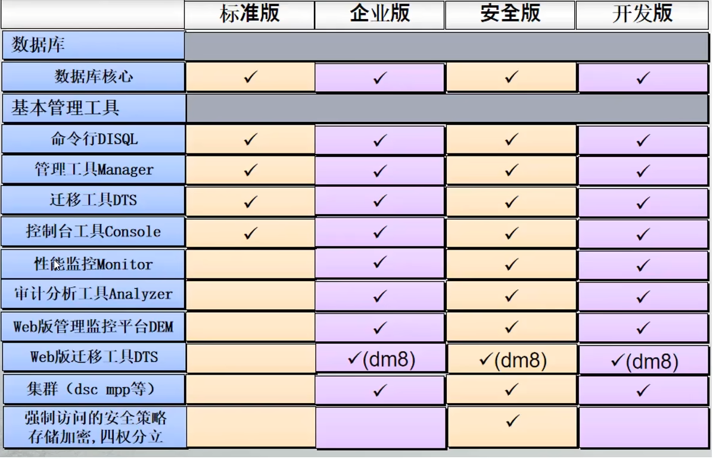
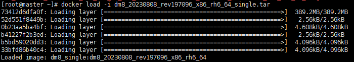
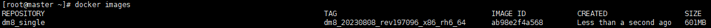
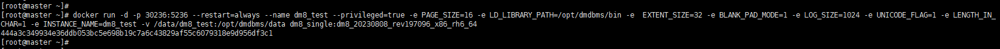
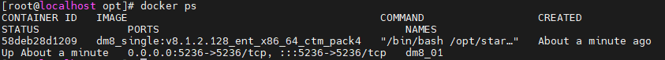
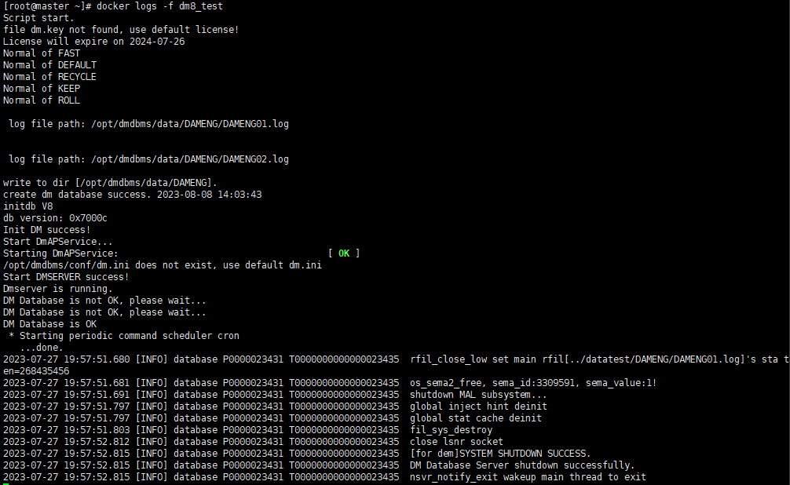
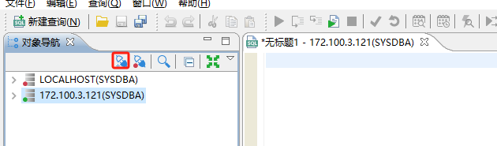
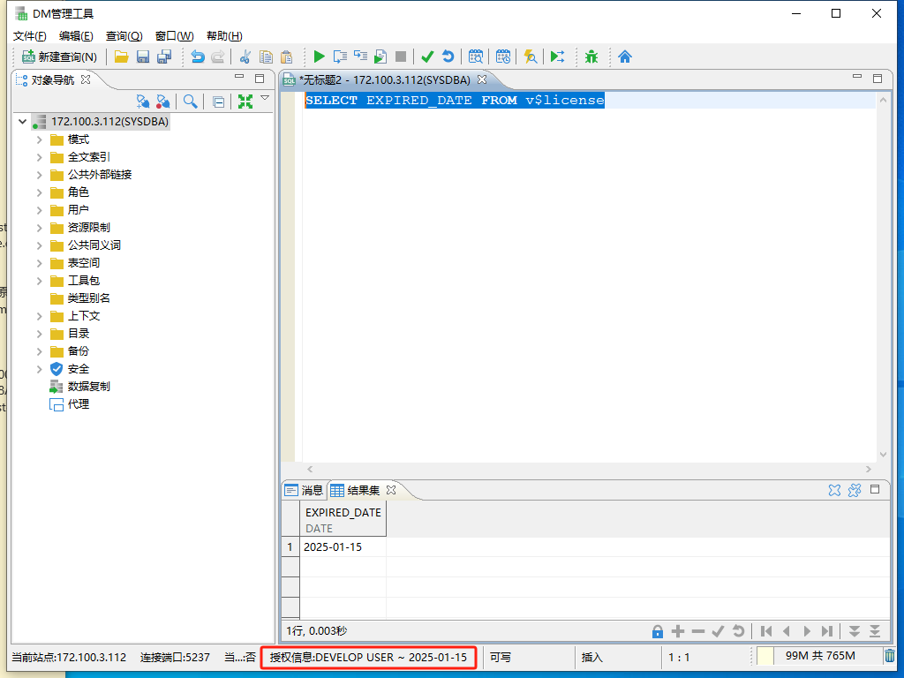

# 达梦数据库安装配置

## 各版本区别



 

# Docker安装

https://eco.dameng.com/document/dm/zh-cn/start/dm-install-docker.html

## 安装前准备

| 软硬件 | 版本           |
| :----- | :------------- |
| 终端   | X86-64 架构    |
| Docker | 2023 年 6 月版 |

## 下载 Docker 安装包

请在达梦数据库官网下载 [Docker 安装包](https://eco.dameng.com/download/)。

## 导入安装包

拷贝安装包到 /opt 目录下，执行以下命令导入安装包：

```shell
Copydocker load -i dm8_20230808_rev197096_x86_rh6_64_single.tar
```

结果显示如下：



导入完成后，可以使用 `docker images` 查看导入的镜像。结果显示如下：



## 启动容器

镜像导入后，使用 `docker run` 启动容器，启动命令如下：

```shell
docker run -d \
-p 30236:5236 \
--restart=always \
--name dm8_test \
--privileged=true \
-e PAGE_SIZE=16 \
-e LD_LIBRARY_PATH=/opt/dmdbms/bin \
-e  EXTENT_SIZE=32 \
-e BLANK_PAD_MODE=1 \
-e LOG_SIZE=1024 \
-e UNICODE_FLAG=1 \
-e LENGTH_IN_CHAR=1 \
-e INSTANCE_NAME=dm8_test \
-v /data/dm8_test:/opt/dmdbms/data \
dm8_single:dm8_20230808_rev197096_x86_rh6_64
```

结果显示如下：



容器启动完成后，使用 `docker ps` 查看镜像的启动情况，结果显示如下：



启动完成后，可通过日志检查启动情况，命令如下：

```shell
docker logs -f  dm8_test
或
docker logs -f 58deb28d1209
```

结果显示如下：



## 启动/停止数据库

停止数据库命令如下：

```shell
docker stop  dm8_test
```

启动数据库命令如下：

```shell
docker start  dm8_test
```

重启命令如下：

```shell
docker restart  dm8_test
```

> 注意
>
> 1.如果使用 docker 容器里面的 disql，进入容器后，先执行 source /etc/profile 防止中文乱码。
> 2.新版本 Docker 镜像中数据库默认用户名/密码为 SYSDBA/SYSDBA001。

# Linux安装

## 1. 安装前准备

用户在安装 DM 数据库之前需要检查或修改操作系统的配置，以保证 DM 数据库能够正确安装和运行。

本文演示环境如下：

| 操作系统 | CPU         | 数据库                  |
| :------- | :---------- | :---------------------- |
| CentOS7  | x86_64 架构 | dm8_20240116_x86_rh7_64 |

**信创环境安装部署也可以参考此篇文章，但需注意 CPU 和操作系统对应的 DM 数据库版本。**

### 新建 dmdba 用户

> 注意
>
> 安装前必须创建 dmdba 用户，禁止使用 root 用户安装数据库。

1. 创建用户所在的组，命令如下：

```plaintext
groupadd dinstall -g 2001
```

1. 创建用户，命令如下：

```plaintext
useradd  -G dinstall -m -d /apps/dmdba -s /bin/bash -u 2001 dmdba
```

1. 修改用户密码，命令如下：

```plaintext
passwd dmdba

echo gwqgwq | passwd --stdin dmdba
```

### 修改文件打开最大数

在 Linux、Solaris、AIX 和 HP-UNIX 等系统中，操作系统默认会对程序使用资源进行限制。如果不取消对应的限制，则数据库的性能将会受到影响。

永久修改和临时修改。

- 重启服务器后永久生效。

使用 root 用户打开 `/etc/security/limits.conf` 文件进行修改，命令如下：

```plaintext
vi /etc/security/limits.conf
```

在最后添加四条语句，需添加的语句如下：

```plaintext
echo "dmdba  soft      nice       0
dmdba  hard      nice       0
dmdba  soft      as         unlimited
dmdba  hard      as         unlimited
dmdba  soft      fsize      unlimited
dmdba  hard      fsize      unlimited
dmdba  soft      nproc      65536
dmdba  hard      nproc      65536
dmdba  soft      nofile     65536
dmdba  hard      nofile     65536
dmdba  soft      core       unlimited
dmdba  hard      core       unlimited
dmdba  soft      data       unlimited
dmdba  hard      data       unlimited">>/etc/security/limits.conf
cat /etc/security/limits.conf
```

> 注意
>
> 修改配置文件后重启服务器生效。

切换到 dmdba 用户，查看是否生效，命令如下：

```plaintext
su - dmdba
ulimit -a |grep open
ulimit -a |grep user

[dmdba@ha2 ~]$ ulimit -a |grep open
open files                      (-n) 65536
[dmdba@ha2 ~]$ ulimit -a |grep user
max user processes              (-u) 65536
```

参数配置已生效。

- 设置参数临时生效

可使用 dmdba 用户执行如下命令，使设置临时生效：

```plaintext
ulimit -n 65536
ulimit -u 65536
```

> 建议
>
> 使用永久修改方式进行配置。

### 目录规划

1.可根据实际需求规划安装目录，本示例使用默认配置 DM 数据库安装在 /home/dmdba 文件夹下。

2.规划创建实例保存目录、归档保存目录、备份保存目录。

```shell
##实例保存目录
mkdir -p /apps/dmdata/data 
##归档保存目录
mkdir -p /apps/dmdata/arch
##备份保存目录
mkdir -p /apps/dmdata/dmbak
```

> 注意
>
> 使用 root 用户建立文件夹，待 dmdba 用户建立完成后需将文件所有者更改为 dmdba 用户，否则无法安装到该目录下

### 修改目录权限

将新建的路径目录权限的用户修改为 dmdba，用户组修改为 dinstall。命令如下：

```plaintext
chown -R dmdba:dinstall /apps/dmdata/data
chown -R dmdba:dinstall /apps/dmdata/arch
chown -R dmdba:dinstall /apps/dmdata/dmbak
```

给路径下的文件设置 755 权限。命令如下：

```plaintext
chmod -R 755 /apps/dmdata/data
chmod -R 755 /apps/dmdata/arch
chmod -R 755 /apps/dmdata/dmbak
```

## 2. 数据库安装

DM 数据库在 Linux 环境下支持**命令行安装**和**图形化安装**，本章节将分别进行详细介绍。

### 挂载镜像

切换到 root 用户，将 DM 数据库的 iso 安装包保存在任意位置，例如 /opt 目录下，执行如下命令挂载镜像：

```plaintext
unzip dm8_20240116_x86_rh7_64.zip
mount -o loop dm8_20240116_x86_rh7_64.iso /mnt
```

### 命令行安装

切换至 dmdba 用户下，在 /mnt 目录下使用命令行安装数据库程序，依次执行以下命令安装 DM 数据库。

```plaintext
su - dmdba
cd /mnt
```

执行如下命令进行安装。

```shell
./DMInstall.bin -i
```

按需求选择安装语言，没有 key 文件选择 "n"，时区按需求选择一般选择 “21”，安装类型选择“1”，安装目录按实际情况配置，这里示例使用默认安装位置。数据库安装大概 1~2 分钟，数据库安装完成后，显示如下界面。

```
~]$ ./DMInstall.bin -i
Installer Language: 
[1]: 简体中文
[2]: English
Please select the installer's language [2]:1
解压安装程序......... 
欢迎使用达梦数据库安装程序

是否输入Key文件路径? (Y/y:是 N/n:否) [Y/y]:n

是否设置时区? (Y/y:是 N/n:否) [Y/y]:y
设置时区:
[ 1]: (GTM-12:00) 日界线西
[ 2]: (GTM-11:00) 萨摩亚群岛
[ 3]: (GTM-10:00) 夏威夷
[ 4]: (GTM-09:00) 阿拉斯加
[ 5]: (GTM-08:00) 太平洋时间（美国和加拿大）
[ 6]: (GTM-07:00) 亚利桑那
[ 7]: (GTM-06:00) 中部时间（美国和加拿大）
[ 8]: (GTM-05:00) 东部部时间（美国和加拿大）
[ 9]: (GTM-04:00) 大西洋时间（美国和加拿大）
[10]: (GTM-03:00) 巴西利亚
[11]: (GTM-02:00) 中大西洋
[12]: (GTM-01:00) 亚速尔群岛
[13]: (GTM) 格林威治标准时间
[14]: (GTM+01:00) 萨拉热窝
[15]: (GTM+02:00) 开罗
[16]: (GTM+03:00) 莫斯科
[17]: (GTM+04:00) 阿布扎比
[18]: (GTM+05:00) 伊斯兰堡
[19]: (GTM+06:00) 达卡
[20]: (GTM+07:00) 曼谷，河内
[21]: (GTM+08:00) 中国标准时间
[22]: (GTM+09:00) 首尔
[23]: (GTM+10:00) 关岛
[24]: (GTM+11:00) 所罗门群岛
[25]: (GTM+12:00) 斐济
[26]: (GTM+13:00) 努库阿勒法
[27]: (GTM+14:00) 基里巴斯
请选择时区 [21]:21

安装类型:
1 典型安装
2 服务器
3 客户端
4 自定义
请选择安装类型的数字序号 [1 典型安装]:1
所需空间: 1979M

请选择安装目录 [/apps/dmdba/dmdbms]:
可用空间: 1624G
是否确认安装路径(/apps/dmdba/dmdbms)? (Y/y:是 N/n:否)  [Y/y]:y

安装前小结
安装位置: /apps/dmdba/dmdbms
所需空间: 1979M
可用空间: 1624G
版本信息: 
有效日期: 
安装类型: 典型安装
是否确认安装? (Y/y:是 N/n:否):y
2024-03-12 16:26:35 
[INFO] 安装达梦数据库...
2024-03-12 16:26:36 
[INFO] 安装 基础 模块...
2024-03-12 16:26:40 
[INFO] 安装 服务器 模块...
2024-03-12 16:26:40 
[INFO] 安装 客户端 模块...
2024-03-12 16:26:41 
[INFO] 安装 驱动 模块...
2024-03-12 16:26:42 
[INFO] 安装 手册 模块...
2024-03-12 16:26:43 
[INFO] 安装 服务 模块...
2024-03-12 16:26:43 
[INFO] 移动日志文件。
2024-03-12 16:26:43 
[INFO] 安装达梦数据库完成。

请以root系统用户执行命令:
/apps/dmdba/dmdbms/script/root/root_installer.sh

安装结束

```

数据库安装完成后，需要切换至 root 用户执行上图中的命令 `/home/dmdba/dmdbms/script/root/root_installer.sh` 创建 DmAPService，否则会影响数据库备份。

```
]# /apps/dmdba/dmdbms/script/root/root_installer.sh
移动 /apps/dmdba/dmdbms/bin/dm_svc.conf 到/etc目录
创建DmAPService服务
Created symlink from /etc/systemd/system/multi-user.target.wants/DmAPService.service to /usr/lib/systemd/system/DmAPService.service.
创建服务(DmAPService)完成
启动DmAPService服务
```

数据库安装完成后还需注册实例才能使用数据库，注册实例可参考[配置实例](https://eco.dameng.com/document/dm/zh-cn/start/dm-instance-linux)章节。

### 配置环境变量

切换到 root 用户进入 dmdba 用户的根目录下，配置对应的环境变量。DM_HOME 变量和动态链接库文件的加载路径在程序安装成功后会自动导入。命令如下：

编辑 .bash_profile，使其最终效果如下图所示：

```plaintext
cd /home/dmdba/
vim .bash_profile
export LD_LIBRARY_PATH="$LD_LIBRARY_PATH:/apps/dmdba/dmdbms/bin"
export DM_HOME="/apps/dmdba/dmdbms"
export PATH=$PATH:$DM_HOME/bin:$DM_HOME/tool

```

切换至 dmdba 用户下，执行以下命令，使环境变量生效。

```plaintext
su - dmdba
source .bash_profile
```

若需要主动打开配置助手，可使用 dmdba 用户配置实例，进入到 DM 数据库安装目录下的 tool 目录中，使用 `./dbca.sh` 命令打开数据库配置助手。

进入 DM 安装目录下的 tool 目录，使用如下命令打开 DM 服务查看器，如下所示：

```plaintext
Copy[dmdba@localhost ~]$ cd /home/dmdba/dmdbms/tool/
[dmdba@localhost tool]$ ll
[dmdba@localhost tool]$ ./dbca.sh
```

## 3. 配置实例

DM 数据库在 Linux 环境支持命令行配置实例以及图形化配置实例，本章节将分别进行介绍。

### 命令行方式初始化实例

使用 dmdba 用户配置实例，进入到 DM 数据库安装目录下的 bin 目录中。

```shell
su - dmdba
cd /home/dmdba/dmdbms/bin
```

使用 dminit 命令初始化实例，dminit 命令可设置多种参数，可执行如下命令查看可配置参数。

```plaintext
./dminit help
```

需要注意的是 **页大小 (page_size)、簇大小 (extent_size)、大小写敏感 (case_sensitive)、字符集 (charset) 、VARCHAR 类型以字符为单位 (LENGTH_IN_CHAR)、空格填充模式 (BLANK_PAD_MODE) 、页检查模式（PAGE CHECK）** 等部分参数，**一旦确定无法修改**，在初始化实例时确认需求后谨慎设置。

部分参数解释如下：

- page_size：数据文件使用的页大小。取值范围 4、8、16、32，单位：KB。缺省值为 8。可选参数。选择的页大小越大，则 DM 支持的元组长度也越大，但同时空间利用率可能下降。数据库创建成功后无法再修改页大小，可通过系统函数 SF_GET_PAGE_SIZE()获取系统的页大小。
- extent_size：数据文件使用的簇大小，即每次分配新的段空间时连续的页数。取值范围 16、32、64。单位：页数。缺省值为 16。可选参数。数据库创建成功后无法再修改簇大小，可通过系统函数 SF_GET_EXTENT_SIZE()获取系统的簇大小。
- case_sensitive： 标识符大小写敏感。当大小写敏感时，小写的标识符应用""括起，否则被系统自动转换为大写；当大小写不敏感时，系统不会转换标识符的大小写，系统比较函数会将大写字母全部转为小写字母再进行比较。取值：Y、y、1 表示敏感；N、n、0 表示不敏感。缺省值为 Y。可选参数。此参数在数据库创建成功后无法修改，可通过系统函数 SF_GET_CASE_SENSITIVE_FLAG()或 CASE_SENSITIVE()查询设置的参数置。
- charset：字符集选项。取值范围 0、1、2。0 代表 GB18030，1 代表 UTF-8，2 代表韩文字符集 EUC-KR。缺省值为 0。可选参数。此参数在数据库创建成功后无法修改，可通过系统函数 SF_GET_UNICODE_FLAG()或 UNICODE()查询设置的参数置。
- LENGTH_IN_CHAR：VARCHAR 类型对象的长度是否以字符为单位。取值范围：1、Y 表示是，0、N 表示否。缺省值为 0。可选参数。1 或 Y：是，所有 VARCHAR 类型对象的长度以字符为单位。这种情况下，定义长度并非真正按照字符长度调整，而是将存储长度值按照理论字符长度进行放大。所以会出现实际可插入字符数超过定义长度的情况，这种情况也是允许的。同时，存储的字节长度 32767 上限仍然不变，也就是说，即使定义列长度为 32767 字符，其实际能插入的字符串占用总字节长度仍然不能超过 32767；0 或 N：否，所有 VARCHAR 类型对象的长度以字节为单位。此参数在数据库创建成功后无法修改，可通过查询 V$PARAMETER 中的 LENGTH_IN_CHAR 参数名查看此参数的设置值。
- BLANK_PAD_MODE：设置字符串比较时，结尾空格填充模式是否兼容 ORACLE。1：兼容；0：不兼容。缺省值为 0。可选参数。此参数在数据库创建成功后无法修改，可通过查询 V$PARAMETER 中的 BLANK_PAD_MODE 参数名查看此参数的设置值。
- PAGE_CHECK：PAGE_CHECK 为页检查模式。取值范围 0、1、2、3。0：禁用页校验；1：开启页校验并使用 CRC 校验；2：开启页校验并使用指定的 HASH 算法进行校验；3：开启页校验并使用快速 CRC 校验。缺省值为 3。可选参数。在数据库创建成功后无法修改。

更多 dminit 参数解释可参考达梦数据库安装目录下 doc 目录中《DM8_dminit 使用手册》。

> 建议
>
> 在实际使用中，初始化时建议提前设置好 COMPATIBLE_MODE 的参数值，便于更好的兼容其他数据库。参数说明：是否兼容其他数据库模式。0：不兼容，1：兼容 SQL92 标准，2：部分兼容 ORACLE，3：部分兼容 MS SQL SERVER，4：部分兼容 MYSQL，5：兼容 DM6，6：部分兼容 TERADATA，7：部分兼容 POSTGRES。

可以使用默认参数初始化实例，需要附加实例存放路径。此处以初始化实例到 /dmdata/data 目录下为例（执行初始化命令前，需要使用 root 用户授予 /dmdata/data 目录相应权限，可以参考[修改目录权限](https://eco.dameng.com/document/dm/zh-cn/start/install-dm-linux-prepare#目录规划)），初始化命令如下：

```plaintext
dminit path=/apps/dmdata/data PAGE_SIZE=32 EXTENT_SIZE=32 CASE_SENSITIVE=y CHARSET=1 DB_NAME=DMERIC INSTANCE_NAME=DBSERVER PORT_NUM=5236
```

也可以自定义初始化实例的参数，参考如下示例：

以下命令设置页大小为 32 KB，簇大小为 32 KB，大小写敏感，字符集为 utf_8，数据库名为 DMTEST，实例名为 DBSERVER，端口为 5237。

```plaintext
dminit path=/apps/dmdata/data PAGE_SIZE=32 EXTENT_SIZE=32 CASE_SENSITIVE=y CHARSET=1 DB_NAME=DMTEST INSTANCE_NAME=DBSERVER PORT_NUM=5237

initdb V8
db version: 0x7000c
file dm.key not found, use default license!
License will expire on 2025-01-15
Normal of FAST
Normal of DEFAULT
Normal of RECYCLE
Normal of KEEP
Normal of ROLL

 log file path: /apps/dmdata/data/DMTEST/DMTEST01.log


 log file path: /apps/dmdata/data/DMTEST/DMTEST02.log

write to dir [/apps/dmdata/data/DMTEST].
create dm database success. 2024-03-12 16:40:30

```

> #### 注意
>
> 如果此处自定义了初始化参数，在后面的注册服务和启动数据库等步骤中，请按实际的自定义参数进行操作。


至此达梦数据库就可以开始使用了。

## 4. 注册服务

### 命令行注册服务

DM 提供了将 DM 服务脚本注册成操作系统服务的脚本，同时也提供了卸载操作系统服务的脚本。注册和卸载脚本文件所在目录为安装目录的“/script/root”子目录下。

注册服务脚本为 dm_service_installer.sh，用户可以使用注册服务脚本将服务脚本注册成为操作系统服务。注册服务需使用 root 用户进行注册，使用 root 用户进入数据库安装目录的 `/script/root` 下，如下所示：

```plaintext
cd /apps/dmdba/dmdbms/script/root
```

注册实例服务，如下所示：

```plaintext
[root@ha2 root]# ./dm_service_installer.sh -t dmserver -dm_ini /apps/dmdata/data/DMTEST/dm.ini -p DMTEST

Created symlink from /etc/systemd/system/multi-user.target.wants/DmServiceDMTEST.service to /usr/lib/systemd/system/DmServiceDMTEST.service.
创建服务(DmServiceDMTEST)完成
```

部分参数说明：

| 标志    | 参数         | 说明                                                         |
| :------ | :----------- | :----------------------------------------------------------- |
| -t      | 服务类型     | 注册服务类型，支持一下服务类型：dmap、dmamon、dmserver、dmwatcher、dmmonitor、dmasmsvr、dmasmsvrm、dmcss、dmcssm。 |
| -dm_ini | INI 文件路径 | 指定服务所需要的 dm.ini 文件路径。                           |
| -p      | 服务名后缀   | 指定服务名后缀，生成的操作系统服务名为“服务脚本模板名，称 + 服务名后缀”。此参数只针对 dmserver、dmwatcher、dmmonitor、dmasmsvr、dmasmsvrm、dmcss、dmcssm 服务脚本生效。 |

更多参数说明和脚本使用方法可参考数据库安装目录下 doc 目录中 《DM8_Linux 服务脚本使用手册》。

进入数据安装目录下 bin 目录中可以看到已经注册好的服务 DmServiceDMTEST。

```plaintext
cd /apps/dmdba/dmdbms/bin
[root@ha2 bin]# ls -l |grep DmServiceDMTEST 
-rwxr-xr-x 1 dmdba dmdba     17511 Mar 13 09:43 DmServiceDMTEST
[root@ha2 bin]# 

```

## 5. 启动、停止数据库

### 命令行启停数据库

### 服务名方式

服务注册成功后，启动数据库。

使用 dmdba 用户进入 DM 安装目录下的 bin 目录下，启动数据库，如下所示：

```shell
[dmdba@ha2 ~]$ DmServiceDMTEST start
Starting DmServiceDMTEST:                                  [ OK ]

```

停止数据库

```shell
[dmdba@ha2 ~]$ DmServiceDMTEST stop
Stopping DmServiceDMTEST:                                  [ OK ]
[dmdba@ha2 ~]$ 
```

重启数据库

```shell
[dmdba@ha2 ~]$ DmServiceDMTEST restart
DmServiceDMTEST service is stopped.
Starting DmServiceDMTEST:                                  [ OK ]

```

查看数据库状态，如下所示：

```plaintext
[dmdba@ha2 ~]$ DmServiceDMTEST status
DmServiceDMTEST (pid 22614) is running.
[dmdba@ha2 ~]$ 

```

### 前台方式

前台方式启动数据库后如果启动界面会话关闭数据库也相应会关闭所以一般情况下建议采用服务的方式启动数据库。

dmdba 用户使用前台的方式启动数据库，进入 DM 安装目录下的 bin 目录下，命令如下：

```plaintext
[dmdba@ha2 ~]$ dmserver /apps/dmdata/data/DMTEST/dm.ini
file dm.key not found, use default license!
version info: develop
DM Database Server 64 V8 03134284132-20240115-215128-20081 startup...
Normal of FAST
Normal of DEFAULT
Normal of RECYCLE
Normal of KEEP
Normal of ROLL
Database mode = 0, oguid = 0
License will expire on 2025-01-15
file lsn: 41381
ndct db load finished, code:0
ndct second level fill fast pool finished
ndct third level fill fast pool finished
ndct second level fill fast pool finished
ndct third level fill fast pool finished
ndct fill fast pool finished
pseg_set_gtv_trxid_low next_trxid in mem:[12012]
pseg_collect_mgr_items, total collect 0 active_trxs, 0 cmt_trxs, 0 pre_cmt_trxs, 0 to_release_trxs, 0 active_pages, 0 cmt_pages, 0 pre_cmt_pages, 0 to_release_pages, 0 mgr pages, 0 mgr recs!
next_trxid in mem:[14014]
next_trxid = 16016.
pseg recv finished
nsvr_startup end.
uthr_pipe_create, create pipe[read:12, write:13]
uthr_pipe_create, create pipe[read:14, write:15]
uthr_pipe_create, create pipe[read:16, write:17]
uthr_pipe_create, create pipe[read:18, write:19]
uthr_pipe_create, create pipe[read:20, write:21]
uthr_pipe_create, create pipe[read:22, write:23]
uthr_pipe_create, create pipe[read:24, write:25]
uthr_pipe_create, create pipe[read:26, write:27]
uthr_pipe_create, create pipe[read:28, write:29]
uthr_pipe_create, create pipe[read:30, write:31]
uthr_pipe_create, create pipe[read:32, write:33]
uthr_pipe_create, create pipe[read:34, write:35]
uthr_pipe_create, create pipe[read:36, write:37]
uthr_pipe_create, create pipe[read:38, write:39]
uthr_pipe_create, create pipe[read:40, write:41]
uthr_pipe_create, create pipe[read:42, write:43]
aud sys init success.
aud rt sys init success.
systables desc init success.
ndct_db_load_info finished, code:0.
nsvr_process_before_open begin.
nsvr_process_before_open success.
SYSTEM IS READY.

```

该启动方式为前台启动，界面输出“SYSTEM IS READY”后表示前台启动成功，若想关闭数据库，输入 exit 退出即可。

# 创建多实例

以下命令设置页大小为 32 KB，簇大小为 32 KB，大小写敏感，字符集为 utf_8，数据库名为 DMTEST，实例名为 DBSERVER，端口为 5237。

```
su - dmdba
cd /home/dmdba/dmdbms/bin
dminit path=/apps/dmdata/data PAGE_SIZE=32 EXTENT_SIZE=32 CASE_SENSITIVE=y CHARSET=1 DB_NAME=DMDB1 INSTANCE_NAME=DBSERVER PORT_NUM=5236

dminit path=/apps/dmdata/data PAGE_SIZE=32 EXTENT_SIZE=32 CASE_SENSITIVE=y CHARSET=1 DB_NAME=DMDB2 INSTANCE_NAME=DBSERVER PORT_NUM=5238
```

root执行创建服务

```
 su - root
 cd /apps/dmdba/dmdbms/script/root
 ./dm_service_installer.sh -t dmserver -dm_ini /apps/dmdata/data/DMDB1/dm.ini -p DMDB1
 
 ./dm_service_installer.sh -t dmserver -dm_ini /apps/dmdata/data/DMDB2/dm.ini -p DMDB2
```

启停服务

```
su - root
systemctl start DmServiceDMDB1
systemctl start DmServiceDMDB2

su - dmdba
DmServiceDMDB1 start
DmServiceDMDB2 start
```

连接测试

```
[dmdba@ha2 bin]$ disql SYSDBA/SYSDBA@172.100.3.112:5236

服务器[172.100.3.112:5236]:处于普通打开状态
登录使用时间 : 2.169(ms)
disql V8
SQL> select name from v$database;

行号     NAME 
---------- -----
1          DMDB1

已用时间: 8.293(毫秒). 执行号:62701.
SQL> exit
[dmdba@ha2 bin]$ disql SYSDBA/SYSDBA@172.100.3.112:5238

服务器[172.100.3.112:5238]:处于普通打开状态
登录使用时间 : 2.405(ms)
disql V8
SQL> select name from v$database;

行号     NAME 
---------- -----
1          DMDB2

已用时间: 0.616(毫秒). 执行号:62601.
SQL> 


```

## 配置别名连接实例

```
vim /etc/dm_svc.conf
TIME_ZONE=(480)
LANGUAGE=(CN)


dmdb1=(172.100.3.112:5236)
dmdb2=(172.100.3.112:5238)


```

测试

```
[dmdba@ha2 bin]$ disql SYSDBA/SYSDBA@dmdb2

服务器[172.100.3.112:5238]:处于普通打开状态
登录使用时间 : 6.444(ms)
disql V8
SQL> select name from v$database;

行号     NAME 
---------- -----
1          DMDB2

已用时间: 0.280(毫秒). 执行号:62801.
SQL> exit
[dmdba@ha2 bin]$ disql SYSDBA/SYSDBA@dmdb1

服务器[172.100.3.112:5236]:处于普通打开状态
登录使用时间 : 6.399(ms)
disql V8
SQL> select name from v$database;

行号     NAME 
---------- -----
1          DMDB1

已用时间: 4.427(毫秒). 执行号:63101.
SQL> exit
```


# 使用windows客户端连接配置

https://eco.dameng.com/download/

下载windows版本安装选择客户端

1. 启动客户端-新建连接
1. 




 

数据库默认用户名/密码为SYSDBA/SYSDBA

docker数据库默认用户名/密码为 SYSDBA/SYSDBA001

```
dmdba@ha2 bin]$ disql SYSDBA/SYSDBA@172.100.3.112:5237

服务器[172.100.3.112:5237]:处于普通打开状态
登录使用时间 : 6.187(ms)
disql V8
SQL> select name from v$database;
```

## 数据库命令操作

```
[dmdba@ha2 bin]$ disql SYSDBA/SYSDBA@172.100.3.112:5237

服务器[172.100.3.112:5237]:处于普通打开状态
登录使用时间 : 6.187(ms)
disql V8
SQL> select status$ from v$database;

行号     STATUS$    
---------- -----------
1          4

已用时间: 0.882(毫秒). 执行号:1101.
SQL> alter database mount;
操作已执行
已用时间: 13.338(毫秒). 执行号:0.
SQL> select status$ from v$database;

行号     STATUS$    
---------- -----------
1          3

已用时间: 0.606(毫秒). 执行号:1102.
SQL> alter database open;
操作已执行
已用时间: 78.615(毫秒). 执行号:0.
SQL>  select status$ from v$database;

行号     STATUS$    
---------- -----------
1          4

已用时间: 0.432(毫秒). 执行号:1103.
SQL> 

```

### 执行sql脚本

在linux 系统中需要使用\进行转义，windows 平台不需要进行转义，如下:

```
]$ disql SYSDBA/SYSDBA \`/dm/dmdbms/samples/instance/script/dmhr/JOB_HISTORY.sql
```

在disql中有两种方法:

方法1:使用"`"，在工具里面执行时，不需要进行转义:

```
SQL>`/dm/dmdbms/samples/instance/script/dmhr/JOB_HISTORY.sql
```

方法2:使用start

```
SQL>start /dm/dmdbms/samples/instance/script/dmhr/JOB_HISTORY.sql
```

### 执行系统命令host

```
SQL> host df -h
Filesystem                 Size  Used Avail Use% Mounted on
devtmpfs                   200M     0  200M   0% /dev
tmpfs                      211M     0  211M   0% /dev/shm
tmpfs                      211M   26M  186M  13% /run
tmpfs                      211M     0  211M   0% /sys/fs/cgroup
/dev/mapper/centos-root    100G  6.2G   94G   7% /
SQL> exit

```


https://eco.dameng.com/document/dm/zh-cn/start/dm-create-tablespace.html

# 达梦数据库的License到期更换

1、如何查看DMHS的License是否到期？

（1）登录到数据库，SELECT EXPIRED_DATE FROM v$license;，即可查看服务到期时间

```
[dmdba@ha2 ~]$ disql SYSDBA/SYSDBA@172.100.3.112:5237

服务器[172.100.3.112:5237]:处于普通打开状态
登录使用时间 : 7.640(ms)
disql V8
SQL> 
SQL> 
SQL> 
SQL> SELECT EXPIRED_DATE FROM v$license;

行号     EXPIRED_DATE
---------- ------------
1          2025-01-15

已用时间: 0.594(毫秒). 执行号:1001.
SQL>

```

（2）客户端登陆，下方显示



2、如何更换License？

在数据库平稳运行的时候，很多用户都不希望其突然重启，以免在重启过程中给系统造成数据遗漏，那么就有两种方式使License生效。

（1）停机更新（即重启更新）

​	1° 将key文件上传至需要更新License的服务器；

​	2° 将key文件更名为dm.key，将以往的key文件进行备份，再将新的key文件移至数据库安装目录的bin目录下；

​	3° 授权：一般情况下都会设置达梦专属用户dmdba

```
chown dmdba:dinstall dm.key
chmod 755 dm.key
```

​	4° 重启数据库服务

（2）不停机更新

重复（1）方式中的1、2、3步骤，然后登录到数据库中，执行以下语句：

```
SQL> SP_LOAD_LIC_INFO();
SQL> SELECT * FROM V$LICENSE;
```

这样即可更新License。

