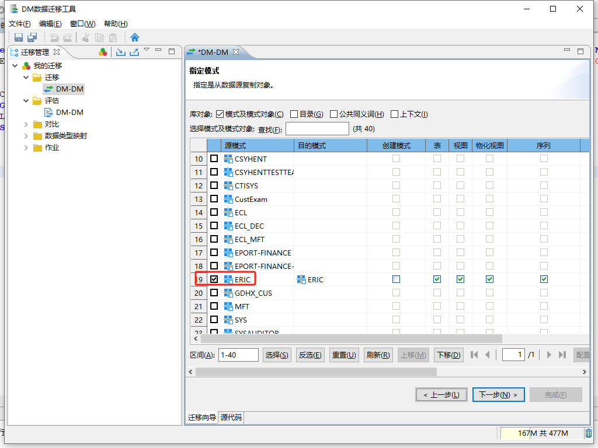

官方文档：https://eco.dameng.com/document/dm/zh-cn/start/tool-dm-migrate

## 1.启动迁移工具

Windows 环境启动 DM 数据迁移工具
点击【开始界面】，选择【达梦数据库】菜单，点击【DM 数据迁移工具】，即可进入数据迁移工具，如下图所示：

## 2、迁移管理

### 2.1 新建工程和迁移

点击按钮创建新的工程，输入工程名和工程描述，点击【确定】，即可创建工程，如下图所示：

### 2.2 迁移评估

右键选择【新建评估】，输入评估名称和评估描述，即可创建评估，如下图所示：

输入数据源的信息：主机名 (IP) 、端口，服务名，角色（默认），用户名和口令，要确认数据库信息正确，保持开启状态，监听已启动，然后点击【下一步】。如下图所示：

### 2.3 迁移

查看结果：

