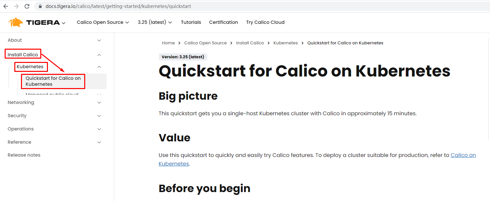
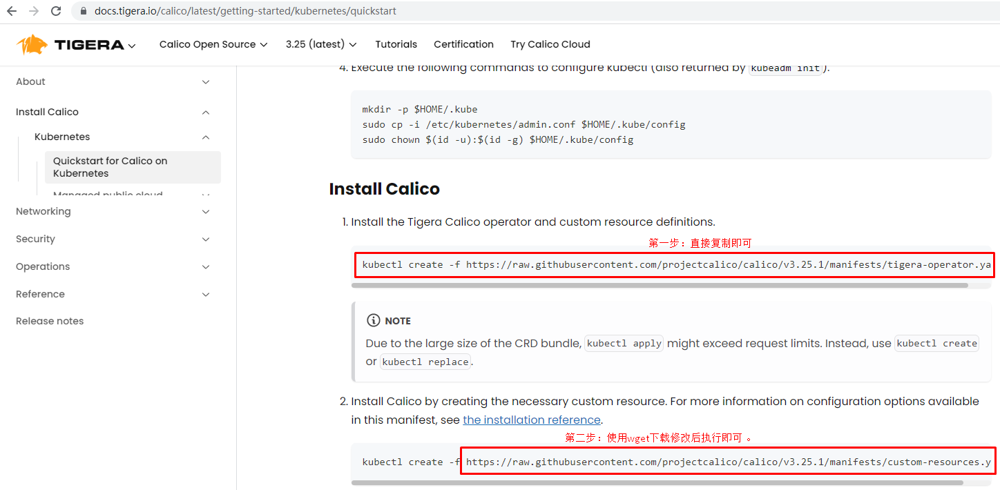

# k8s 1.27集群部署 容器运行时为containerd

# 一、主机准备

## 1.1 Kubernetes 1.27版本集群部署环境准备

### 1.1.1 主机操作系统说明

| 序号 | 操作系统及版本 | 备注 |
| :--: | :------------: | :--: |
|  1   |   CentOS7u9    |      |

### 1.1.2 主机硬件配置说明

| 需求 | CPU  | 内存 | 硬盘   | 角色         | 主机名       |
| ---- | ---- | ---- | ------ | ------------ | ------------ |
| 值   | 8C   | 8G   | 1024GB | master1      | k8s-master01 |
| 值   | 8C   | 16G  | 1024GB | master2      | k8s-master02 |
| 值   | 8C   | 16G  | 1024GB | master3      | k8s-master03 |
| 值   | 8C   | 16G  | 1024GB | worker(node) | k8s-worker01 |

### 1.1.3 主机配置

#### 1.1.3.1  主机名配置

由于本次使用3台主机完成kubernetes集群部署，其中1台为master节点,名称为k8s-master01;其中2台为worker节点，名称分别为：k8s-master02及k8s-master03

~~~powershell
master节点
# hostnamectl set-hostname k8s-master01
~~~

~~~powershell
worker01节点
# hostnamectl set-hostname k8s-master02
~~~

~~~powershell
worker02节点
# hostnamectl set-hostname k8s-master03
~~~

#### 1.1.3.2 主机IP地址配置

~~~powershell
k8s-master节点IP地址为：172.100.3.116/24
# vim /etc/sysconfig/network-scripts/ifcfg-ens33
TYPE="Ethernet"
PROXY_METHOD="none"
BROWSER_ONLY="no"
BOOTPROTO="none"
DEFROUTE="yes"
IPV4_FAILURE_FATAL="no"
IPV6INIT="yes"
IPV6_AUTOCONF="yes"
IPV6_DEFROUTE="yes"
IPV6_FAILURE_FATAL="no"
IPV6_ADDR_GEN_MODE="stable-privacy"
NAME="ens33"
DEVICE="ens33"
ONBOOT="yes"
IPADDR="172.100.3.116"
PREFIX="24"
GATEWAY="172.100.3.254"
DNS1="114.114.114.114"
~~~

~~~powershell
k8s-worker1节点IP地址为：172.100.3.117/24
# vim /etc/sysconfig/network-scripts/ifcfg-ens33
TYPE="Ethernet"
PROXY_METHOD="none"
BROWSER_ONLY="no"
BOOTPROTO="none"
DEFROUTE="yes"
IPV4_FAILURE_FATAL="no"
IPV6INIT="yes"
IPV6_AUTOCONF="yes"
IPV6_DEFROUTE="yes"
IPV6_FAILURE_FATAL="no"
IPV6_ADDR_GEN_MODE="stable-privacy"
NAME="ens33"
DEVICE="ens33"
ONBOOT="yes"
IPADDR="172.100.3.117"
PREFIX="24"
GATEWAY="172.100.3.254"
DNS1="114.114.114.114"
~~~

~~~powershell
k8s-worker2节点IP地址为：172.100.3.118/24
# vim /etc/sysconfig/network-scripts/ifcfg-ens33
TYPE="Ethernet"
PROXY_METHOD="none"
BROWSER_ONLY="no"
BOOTPROTO="none"
DEFROUTE="yes"
IPV4_FAILURE_FATAL="no"
IPV6INIT="yes"
IPV6_AUTOCONF="yes"
IPV6_DEFROUTE="yes"
IPV6_FAILURE_FATAL="no"
IPV6_ADDR_GEN_MODE="stable-privacy"
NAME="ens33"
DEVICE="ens33"
ONBOOT="yes"
IPADDR="172.100.3.118"
PREFIX="24"
GATEWAY="172.100"
DNS1="114.114.114.114"
~~~

#### 1.1.3.3 主机名与IP地址解析

> 所有集群主机均需要进行配置。

~~~powershell
# cat /etc/hosts
127.0.0.1   localhost localhost.localdomain localhost4 localhost4.localdomain4
::1         localhost localhost.localdomain localhost6 localhost6.localdomain6
172.100.3.116 k8s-master01
172.100.3.117 k8s-master02
172.100.3.118 k8s-master03
~~~

#### 1.1.3.4  防火墙配置

> 所有主机均需要操作。

~~~powershell
关闭现有防火墙firewalld
# systemctl disable firewalld
# systemctl stop firewalld
# firewall-cmd --state
not running
~~~

#### 1.1.3.5 SELINUX配置

> 所有主机均需要操作。修改SELinux配置需要重启操作系统。

~~~powershell
# sed -ri 's/SELINUX=enforcing/SELINUX=disabled/' /etc/selinux/config
~~~

#### 1.1.3.6 时间同步配置

>所有主机均需要操作。最小化安装系统需要安装ntpdate软件。

~~~powershell
# crontab -l
0 */1 * * * /usr/sbin/ntpdate time1.aliyun.com
~~~

#### 1.1.3.7 升级操作系统内核

> 所有主机均需要操作。

~~~powershell
导入elrepo gpg key
# rpm --import https://www.elrepo.org/RPM-GPG-KEY-elrepo.org
~~~

~~~powershell
安装elrepo YUM源仓库
# yum -y install https://www.elrepo.org/elrepo-release-7.0-4.el7.elrepo.noarch.rpm
~~~

~~~powershell
安装kernel-ml版本，ml为长期稳定版本，lt为长期维护版本
# yum --enablerepo="elrepo-kernel" -y install kernel-lt.x86_64
~~~

~~~powershell
设置grub2默认引导为0
# grub2-set-default 0
~~~

~~~powershell
重新生成grub2引导文件
# grub2-mkconfig -o /boot/grub2/grub.cfg
~~~

~~~powershell
更新后，需要重启，使用升级的内核生效。
# reboot
~~~

~~~powershell
重启后，需要验证内核是否为更新对应的版本
# uname -r
~~~

#### 1.1.3.8  配置内核转发及网桥过滤

>所有主机均需要操作。

~~~powershell
添加网桥过滤及内核转发配置文件
# cat > /etc/sysctl.d/k8s.conf << EOF
net.bridge.bridge-nf-call-ip6tables = 1
net.bridge.bridge-nf-call-iptables = 1
net.ipv4.ip_forward = 1
vm.swappiness = 0
EOF
~~~

~~~powershell
加载br_netfilter模块
# modprobe br_netfilter
~~~

~~~powershell
查看是否加载
# lsmod | grep br_netfilter
br_netfilter           22256  0
bridge                151336  1 br_netfilter
~~~

#### 1.1.3.9 安装ipset及ipvsadm

> 所有主机均需要操作。

~~~powershell
安装ipset及ipvsadm
# yum -y install ipset ipvsadm
~~~

~~~powershell
配置ipvsadm模块加载方式
添加需要加载的模块
# cat > /etc/sysconfig/modules/ipvs.modules <<EOF
#!/bin/bash
modprobe -- ip_vs
modprobe -- ip_vs_rr
modprobe -- ip_vs_wrr
modprobe -- ip_vs_sh
modprobe -- nf_conntrack
EOF
~~~

~~~powershell
授权、运行、检查是否加载
# chmod 755 /etc/sysconfig/modules/ipvs.modules && bash /etc/sysconfig/modules/ipvs.modules && lsmod | grep -e ip_vs -e nf_conntrack
~~~

#### 1.1.3.10 关闭SWAP分区

> 修改完成后需要重启操作系统，如不重启，可临时关闭，命令为swapoff -a

~~~powershell
永远关闭swap分区，需要重启操作系统
# cat /etc/fstab
......

# /dev/mapper/centos-swap swap                    swap    defaults        0 0

在上一行中行首添加#
~~~
## 2.2 负载均衡器准备（ha1，ha2）

### 2.2.1 安装haproxy与keepalived

~~~powershell
yum -y install haproxy keepalived
~~~

### 2.2.2 HAProxy配置

~~~powershell
cat >/etc/haproxy/haproxy.cfg<<"EOF"
global
 maxconn 2000
 ulimit-n 16384
 log 127.0.0.1 local0 err
 stats timeout 30s

defaults
 log global
 mode http
 option httplog
 timeout connect 5000
 timeout client 50000
 timeout server 50000
 timeout http-request 15s
 timeout http-keep-alive 15s

frontend monitor-in
 bind *:33305
 mode http
 option httplog
 monitor-uri /monitor

frontend k8s-master
 bind 0.0.0.0:16443
 bind 127.0.0.1:16443
 mode tcp
 option tcplog
 tcp-request inspect-delay 5s
 default_backend k8s-master

backend k8s-master
 mode tcp
 option tcplog
 option tcp-check
 balance roundrobin
 default-server inter 10s downinter 5s rise 2 fall 2 slowstart 60s maxconn 250 maxqueue 256 weight 100
 server  k8s-master1  172.100.2.116:6443 check
 server  k8s-master2  172.100.2.117:6443 check
 server  k8s-master3  172.100.2.118:6443 check
EOF
~~~

### 2.2.3 KeepAlived

> 主从配置不一致，需要注意。

~~~powershell
ha1:

cat >/etc/keepalived/keepalived.conf<<"EOF"
! Configuration File for keepalived
global_defs {
   router_id LVS_DEVEL
script_user root
   enable_script_security
}
vrrp_script chk_apiserver {
   script "/etc/keepalived/check_apiserver.sh"
   interval 5
   weight -5
   fall 2 
rise 1
}
vrrp_instance VI_1 {
   state MASTER
   interface eth0
   mcast_src_ip 172.100.3.116
   virtual_router_id 51
   priority 100
   advert_int 2
   authentication {
       auth_type PASS
       auth_pass K8SHA_KA_AUTH
   }
   virtual_ipaddress {
       172.100.3.111
   }
   track_script {
      chk_apiserver
   }
}
EOF
~~~

~~~powershell
ha2:

cat >/etc/keepalived/keepalived.conf<<"EOF"
! Configuration File for keepalived
global_defs {
   router_id LVS_DEVEL
script_user root
   enable_script_security
}
vrrp_script chk_apiserver {
   script "/etc/keepalived/check_apiserver.sh"
  interval 5
   weight -5
   fall 2 
rise 1
}
vrrp_instance VI_1 {
   state BACKUP
   interface eth0
   mcast_src_ip 172.100.3.117
   virtual_router_id 51
   priority 99
   advert_int 2
   authentication {
       auth_type PASS
       auth_pass K8SHA_KA_AUTH
   }
   virtual_ipaddress {
       172.100.3.111
   }
   track_script {
      chk_apiserver
   }
}
EOF
~~~

### 2.2.4 健康检查脚本

> ha1及ha2均要配置

~~~powershell
cat > /etc/keepalived/check_apiserver.sh <<"EOF"
#!/bin/bash
err=0
for k in $(seq 1 3)
do
   check_code=$(pgrep haproxy)
   if [[ $check_code == "" ]]; then
       err=$(expr $err + 1)
       sleep 1
       continue
   else
       err=0
       break
   fi
done

if [[ $err != "0" ]]; then
   echo "systemctl stop keepalived"
   /usr/bin/systemctl stop keepalived
   exit 1
else
   exit 0
fi
EOF
~~~

~~~powershell
chmod +x /etc/keepalived/check_apiserver.sh
~~~

### 2.2.5 启动服务并验证

~~~powershell
systemctl daemon-reload
systemctl enable --now haproxy
systemctl enable --now keepalived
~~~

~~~powershell
ip address show
~~~

### 2.4.2 获取cfssl工具

~~~powershell
cd /data/k8s-work
wget https://pkg.cfssl.org/R1.2/cfssl_linux-amd64
wget https://pkg.cfssl.org/R1.2/cfssljson_linux-amd64
wget https://pkg.cfssl.org/R1.2/cfssl-certinfo_linux-amd64
~~~

~~~powershell
说明：
cfssl是使用go编写，由CloudFlare开源的一款PKI/TLS工具。主要程序有：

- cfssl，是CFSSL的命令行工具
- cfssljson用来从cfssl程序获取JSON输出，并将证书，密钥，CSR和bundle写入文件中。
~~~

~~~powershell
chmod +x cfssl*
~~~

~~~powershell
mv cfssl_linux-amd64 /usr/local/bin/cfssl
mv cfssljson_linux-amd64 /usr/local/bin/cfssljson
mv cfssl-certinfo_linux-amd64 /usr/local/bin/cfssl-certinfo
~~~

~~~powershell
# cfssl version
Version: 1.2.0
Revision: dev
Runtime: go1.6
~~~

### 2.4.3 创建CA证书

#### 2.4.3.1 配置ca证书请求文件

~~~powershell
cat > ca-csr.json <<"EOF"
{
  "CN": "kubernetes",
  "key": {
      "algo": "rsa",
      "size": 2048
  },
  "names": [
    {
      "C": "CN",
      "ST": "Beijing",
      "L": "Beijing",
      "O": "erick8s",
      "OU": "CN"
    }
  ],
  "ca": {
          "expiry": "87600h"
  }
}
EOF
~~~

#### 2.4.3.2 创建ca证书

~~~powershell
cfssl gencert -initca ca-csr.json | cfssljson -bare ca
~~~

#### 2.4.3.3 配置ca证书策略

~~~powershell
生成默认文件
cfssl print-defaults config > ca-config.json
修改www为kubernetes
~~~

~~~powershell
自己配置文件（效果同上）
cat > ca-config.json <<"EOF"
{
  "signing": {
      "default": {
          "expiry": "87600h"
        },
      "profiles": {
          "kubernetes": {
              "usages": [
                  "signing",
                  "key encipherment",
                  "server auth",
                  "client auth"
              ],
              "expiry": "87600h"
          }
      }
  }
}
EOF
~~~

~~~powershell
server auth 表示client可以对使用该ca对server提供的证书进行验证

client auth 表示server可以使用该ca对client提供的证书进行验证
~~~

### 2.4.4 创建etcd证书

#### 2.4.4.1 配置etcd请求文件

~~~powershell
cat > etcd-csr.json <<"EOF"
{
  "CN": "etcd",
  "hosts": [
    "127.0.0.1",
    "172.100.3.116",
    "172.100.3.117",
    "172.100.3.118"
  ],
  "key": {
    "algo": "rsa",
    "size": 2048
  },
  "names": [{
    "C": "CN",
    "ST": "Beijing",
    "L": "Beijing",
    "O": "erick8s",
    "OU": "CN"
  }]
}
EOF
~~~

#### 2.4.4.2 生成etcd证书

~~~powershell
cfssl gencert -ca=ca.pem -ca-key=ca-key.pem -config=ca-config.json -profile=kubernetes etcd-csr.json | cfssljson  -bare etcd
~~~

~~~powershell
# ls
输出
ca-config.json  ca.csr  ca-csr.json  ca-key.pem  ca.pem  etcd.csr  etcd-csr.json  etcd-key.pem  etcd.pem
~~~

### 2.4.5  部署etcd集群

#### 2.4.5.1 下载etcd软件包

https://github.com/etcd-io/etcd/releases

~~~powershell
wget https://github.com/etcd-io/etcd/releases/download/v3.5.2/etcd-v3.5.2-linux-amd64.tar.gz
~~~

#### 2.4.5.2 安装etcd软件
~~~powershell
yum install etcd -y
~~~
~~~powershell
tar -xvf etcd-v3.5.2-linux-amd64.tar.gz
cp -p etcd-v3.5.2-linux-amd64/etcd* /usr/local/bin/
~~~

#### 2.4.5.3 分发etcd软件

~~~powershell
scp etcd-v3.5.2-linux-amd64/etcd* k8s-master2:/usr/local/bin/

scp etcd-v3.5.2-linux-amd64/etcd* k8s-master3:/usr/local/bin/
~~~

#### 2.4.5.4 创建配置文件

~~~powershell
mkdir /etc/etcd
~~~

~~~powershell
master1:

cat >  /etc/etcd/etcd.conf <<"EOF"
#[Member]
ETCD_NAME="etcd1"
ETCD_DATA_DIR="/var/lib/etcd/default.etcd"
ETCD_LISTEN_PEER_URLS="https://172.100.3.116:2380"
ETCD_LISTEN_CLIENT_URLS="https://172.100.3.116:2379,http://127.0.0.1:2379"

#[Clustering]
ETCD_INITIAL_ADVERTISE_PEER_URLS="https://172.100.3.116:2380"
ETCD_ADVERTISE_CLIENT_URLS="https://172.100.3.116:2379"
ETCD_INITIAL_CLUSTER="etcd1=https://172.100.3.116:2380,etcd2=https://172.100.3.117:2380,etcd3=https://172.100.3.118:2380"
ETCD_INITIAL_CLUSTER_TOKEN="etcd-cluster"
ETCD_INITIAL_CLUSTER_STATE="new"
EOF
~~~

~~~powershell
说明：
ETCD_NAME：节点名称，集群中唯一
ETCD_DATA_DIR：数据目录
ETCD_LISTEN_PEER_URLS：集群通信监听地址
ETCD_LISTEN_CLIENT_URLS：客户端访问监听地址
ETCD_INITIAL_ADVERTISE_PEER_URLS：集群通告地址
ETCD_ADVERTISE_CLIENT_URLS：客户端通告地址
ETCD_INITIAL_CLUSTER：集群节点地址
ETCD_INITIAL_CLUSTER_TOKEN：集群Token
ETCD_INITIAL_CLUSTER_STATE：加入集群的当前状态，new是新集群，existing表示加入已有集群
~~~

~~~powershell
k8s-master2:

cat >  /etc/etcd/etcd.conf <<"EOF"
#[Member]
ETCD_NAME="etcd2"
ETCD_DATA_DIR="/var/lib/etcd/default.etcd"
ETCD_LISTEN_PEER_URLS="https://172.100.3.117:2380"
ETCD_LISTEN_CLIENT_URLS="https://172.100.3.117:2379,http://127.0.0.1:2379"

#[Clustering]
ETCD_INITIAL_ADVERTISE_PEER_URLS="https://172.100.3.117:2380"
ETCD_ADVERTISE_CLIENT_URLS="https://172.100.3.117:2379"
ETCD_INITIAL_CLUSTER="etcd1=https://172.100.3.116:2380,etcd2=https://172.100.3.117:2380,etcd3=https://172.100.3.118:2380"
ETCD_INITIAL_CLUSTER_TOKEN="etcd-cluster"
ETCD_INITIAL_CLUSTER_STATE="new"
EOF
~~~

~~~powershell
k8s-master3:

cat >  /etc/etcd/etcd.conf <<"EOF"
#[Member]
ETCD_NAME="etcd3"
ETCD_DATA_DIR="/var/lib/etcd/default.etcd"
ETCD_LISTEN_PEER_URLS="https://172.100.3.118:2380"
ETCD_LISTEN_CLIENT_URLS="https://172.100.3.118:2379,http://127.0.0.1:2379"

#[Clustering]
ETCD_INITIAL_ADVERTISE_PEER_URLS="https://172.100.3.118:2380"
ETCD_ADVERTISE_CLIENT_URLS="https://172.100.3.118:2379"
ETCD_INITIAL_CLUSTER="etcd1=https://172.100.3.116:2380,etcd2=https://172.100.3.117:2380,etcd3=https://172.100.3.118:2380"
ETCD_INITIAL_CLUSTER_TOKEN="etcd-cluster"
ETCD_INITIAL_CLUSTER_STATE="new"
EOF
~~~

#### 2.4.5.5 创建服务配置文件

~~~powershell
mkdir -p /etc/etcd/ssl
mkdir -p /var/lib/etcd/default.etcd
~~~

~~~powershell
cd /data/k8s-work
cp ca*.pem /etc/etcd/ssl
cp etcd*.pem /etc/etcd/ssl
~~~

~~~powershell
cat > /etc/systemd/system/etcd.service <<"EOF"
[Unit]
Description=Etcd Server
After=network.target
After=network-online.target
Wants=network-online.target

[Service]
Type=notify
EnvironmentFile=-/etc/etcd/etcd.conf
WorkingDirectory=/var/lib/etcd/
ExecStart=/usr/local/bin/etcd \
  --cert-file=/etc/etcd/ssl/etcd.pem \
  --key-file=/etc/etcd/ssl/etcd-key.pem \
  --trusted-ca-file=/etc/etcd/ssl/ca.pem \
  --peer-cert-file=/etc/etcd/ssl/etcd.pem \
  --peer-key-file=/etc/etcd/ssl/etcd-key.pem \
  --peer-trusted-ca-file=/etc/etcd/ssl/ca.pem \
  --peer-client-cert-auth \
  --client-cert-auth
Restart=on-failure
RestartSec=5
LimitNOFILE=65536

[Install]
WantedBy=multi-user.target
EOF

chmod +x /etc/systemd/system/etcd.service
~~~

#### 2.4.5.6 同步etcd配置到集群其它master节点

~~~powershell
创建目录
mkdir -p /etc/etcd
mkdir -p /etc/etcd/ssl
mkdir -p /var/lib/etcd/default.etcd

for i in k8s-master2 k8s-master3; do echo $i; scp /etc/etcd/ssl/* $i:/etc/etcd/ssl; scp /etc/systemd/system/etcd.service $i:/etc/systemd/system/etcd.service; done

for i in k8s-master2 k8s-master3
do echo $i
  ssh $i "mkdir -p /etc/etcd/ssl&mkdir -p /var/lib/etcd/default.etcd"
  scp /etc/etcd/ssl/* $i:/etc/etcd/ssl
done
~~~

#### 2.4.5.7 启动etcd集群

~~~powershell
systemctl daemon-reload
systemctl enable --now etcd.service
systemctl status etcd
~~~

#### 2.4.5.8 验证集群状态

~~~powershell

~~~

~~~powershell
ETCDCTL_API=3 /usr/local/bin/etcdctl --write-out=table --cacert=/etc/etcd/ssl/ca.pem --cert=/etc/etcd/ssl/etcd.pem --key=/etc/etcd/ssl/etcd-key.pem --endpoints=https://172.100.3.116:2379,https://172.100.3.117:2379,https://172.100.3.118:2379 endpoint health
~~~

~~~powershell
+----------------------------+--------+-------------+-------+
|          ENDPOINT          | HEALTH |    TOOK     | ERROR |
+----------------------------+--------+-------------+-------+
| https://172.100.3.118:2379 |   true | 10.393062ms |       |
| https://172.100.3.116:2379 |   true |  15.70437ms |       |
| https://172.100.3.117:2379 |   true | 15.871684ms |       |
+----------------------------+--------+-------------+-------+
~~~

~~~powershell
检查ETCD数据库性能
ETCDCTL_API=3 /usr/local/bin/etcdctl --write-out=table --cacert=/etc/etcd/ssl/ca.pem --cert=/etc/etcd/ssl/etcd.pem --key=/etc/etcd/ssl/etcd-key.pem --endpoints=https://172.100.3.116:2379,https://172.100.3.117:2379,https://172.100.3.118:2379 check perf
~~~

~~~powershell
59 / 60 Boooooooooooooooooooooooooooooooooooooooooooooooooooooooooooooooooooooooooooooooooooooooooooooooooooooooooooooooooooooooooooooooooooooom  !  98.33%
PASS: Throughput is 151 writes/s
PASS: Slowest request took 0.066478s
PASS: Stddev is 0.002354s
PASS
~~~

~~~powershell
ETCDCTL_API=3 /usr/local/bin/etcdctl --write-out=table --cacert=/etc/etcd/ssl/ca.pem --cert=/etc/etcd/ssl/etcd.pem --key=/etc/etcd/ssl/etcd-key.pem --endpoints=https://172.100.3.116:2379,https://172.100.3.117:2379,https://172.100.3.118:2379 member list
~~~

~~~powershell
+------------------+---------+-------+----------------------------+----------------------------+------------+
|        ID        | STATUS  | NAME  |         PEER ADDRS         |        CLIENT ADDRS        | IS LEARNER |
+------------------+---------+-------+----------------------------+----------------------------+------------+
| 9b449b0ff1d4c375 | started | etcd1 | https://172.100.3.116:2380 | https://172.100.3.116:2379 |      false |
| d1fbb74bc6a61e5c | started | etcd2 | https://172.100.3.117:2380 | https://172.100.3.117:2379 |      false |
| f60b205fb02fe23c | started | etcd3 | https://172.100.3.118:2380 | https://172.100.3.118:2379 |      false |
+------------------+---------+-------+----------------------------+----------------------------+------------+
~~~

~~~powershell
ETCDCTL_API=3 /usr/local/bin/etcdctl --write-out=table --cacert=/etc/etcd/ssl/ca.pem --cert=/etc/etcd/ssl/etcd.pem --key=/etc/etcd/ssl/etcd-key.pem --endpoints=https://172.100.3.116:2379,https://172.100.3.117:2379,https://172.100.3.118:2379 endpoint status
~~~

~~~powershell
+----------------------------+------------------+---------+---------+-----------+------------+-----------+------------+--------------------+--------+
|          ENDPOINT          |        ID        | VERSION | DB SIZE | IS LEADER | IS LEARNER | RAFT TERM | RAFT INDEX | RAFT APPLIED INDEX | ERRORS |
+----------------------------+------------------+---------+---------+-----------+------------+-----------+------------+--------------------+--------+
| https://172.100.3.116:2379 | 9b449b0ff1d4c375 |   3.5.2 |   24 MB |      true |      false |         2 |     403774 |             403774 |        |
| https://172.100.3.117:2379 | d1fbb74bc6a61e5c |   3.5.2 |   24 MB |     false |      false |         2 |     403774 |             403774 |        |
| https://172.100.3.118:2379 | f60b205fb02fe23c |   3.5.2 |   24 MB |     false |      false |         2 |     403774 |             403774 |        |
+----------------------------+------------------+---------+---------+-----------+------------+-----------+------------+--------------------+--------+
~~~

# 三、K8S集群部署

## 3.1 K8S集群软件YUM源准备

~~~powershell
# cat > /etc/yum.repos.d/k8s.repo <<EOF
[kubernetes]
name=Kubernetes
baseurl=https://mirrors.aliyun.com/kubernetes/yum/repos/kubernetes-el7-x86_64/
enabled=1
gpgcheck=0
repo_gpgcheck=0
gpgkey=https://mirrors.aliyun.com/kubernetes/yum/doc/yum-key.gpg https://mirrors.aliyun.com/kubernetes/yum/doc/rpm-package-key.gpg
EOF
~~~

## 3.2 K8S集群软件安装

### 3.2.1 集群软件安装

> 所有节点均可安装

~~~powershell
默认安装
# yum -y install  kubeadm  kubelet kubectl
~~~

~~~powershell
查看指定版本
# yum list kubeadm.x86_64 --showduplicates | sort -r
# yum list kubelet.x86_64 --showduplicates | sort -r
# yum list kubectl.x86_64 --showduplicates | sort -r
~~~

~~~powershell
安装指定版本
# yum -y install  kubeadm-1.27.X-0  kubelet-1.27.X-0 kubectl-1.27.X-0
~~~

### 3.2.2  配置kubelet

>为了实现docker使用的cgroupdriver与kubelet使用的cgroup的一致性，建议修改如下文件内容。

~~~powershell
# vim /etc/sysconfig/kubelet
KUBELET_EXTRA_ARGS="--cgroup-driver=systemd"
~~~

~~~powershell
设置kubelet为开机自启动即可，由于没有生成配置文件，集群初始化后自动启动
# systemctl enable kubelet
~~~

## 3.3 K8S集群初始化

### 导入镜像

链接：https://pan.baidu.com/s/13Ugocu0T7z0PUMK4tpwQZQ?pwd=gzrr 
提取码：gzrr
crictl images 查不到镜像原因：ctr是containerd自带的工具，有命名空间的概念，若是k8s相关的镜像，都默认在k8s.io这个命名空间，所以导入镜像时需要指定命令空间为k8s.io
~~~powershell
#导入
ctr -n k8s.io images import coredns-v1.10.1.tar.gz 
ctr -n k8s.io images import kube-apiserver-v1.27.2.tar.gz 
ctr -n k8s.io images import kube-proxy-1.27.2.tar.gz 
ctr -n k8s.io images import kube-controller-manager-1.27.2.tar.gz 
ctr -n k8s.io images import kube-scheduler-1.27.2.tar.gz 
ctr -n k8s.io images import etcd-3.5.7.tar.gz 
ctr -n k8s.io images import pause-3.9.tar.gz 
ctr images list
#查看
crictl img
~~~
~~~powershell
kubeadm init --kubernetes-version=v1.27.2 \
--pod-network-cidr=10.244.0.0/16 \
--apiserver-advertise-address=172.100.3.116  \
--cri-socket unix:///var/run/containerd/containerd.sock
~~~

~~~powershell
kubeadm init --kubernetes-version=v1.27.0 \
--pod-network-cidr=10.244.0.0/16 \
--apiserver-advertise-address=172.100.3.116  \
--image-repository registry.aliyuncs.com/google_containers \
--cri-socket unix:///var/run/containerd/containerd.sock
~~~

~~~powershell
[init] Using Kubernetes version: v1.27.0
[preflight] Running pre-flight checks
[preflight] Pulling images required for setting up a Kubernetes cluster
[preflight] This might take a minute or two, depending on the speed of your internet connection
[preflight] You can also perform this action in beforehand using 'kubeadm config images pull'
[certs] Using certificateDir folder "/etc/kubernetes/pki"
[certs] Generating "ca" certificate and key
[certs] Generating "apiserver" certificate and key
[certs] apiserver serving cert is signed for DNS names [k8s-master01 kubernetes kubernetes.default kubernetes.default.svc kubernetes.default.svc.cluster.local] and IPs [10.96.0.1 172.100.3.116]
[certs] Generating "apiserver-kubelet-client" certificate and key
[certs] Generating "front-proxy-ca" certificate and key
[certs] Generating "front-proxy-client" certificate and key
[certs] Generating "etcd/ca" certificate and key
[certs] Generating "etcd/server" certificate and key
[certs] etcd/server serving cert is signed for DNS names [k8s-master01 localhost] and IPs [172.100.3.116 127.0.0.1 ::1]
[certs] Generating "etcd/peer" certificate and key
[certs] etcd/peer serving cert is signed for DNS names [k8s-master01 localhost] and IPs [172.100.3.116 127.0.0.1 ::1]
[certs] Generating "etcd/healthcheck-client" certificate and key
[certs] Generating "apiserver-etcd-client" certificate and key
[certs] Generating "sa" key and public key
[kubeconfig] Using kubeconfig folder "/etc/kubernetes"
[kubeconfig] Writing "admin.conf" kubeconfig file
[kubeconfig] Writing "kubelet.conf" kubeconfig file
[kubeconfig] Writing "controller-manager.conf" kubeconfig file
[kubeconfig] Writing "scheduler.conf" kubeconfig file
[kubelet-start] Writing kubelet environment file with flags to file "/var/lib/kubelet/kubeadm-flags.env"
[kubelet-start] Writing kubelet configuration to file "/var/lib/kubelet/config.yaml"
[kubelet-start] Starting the kubelet
[control-plane] Using manifest folder "/etc/kubernetes/manifests"
[control-plane] Creating static Pod manifest for "kube-apiserver"
[control-plane] Creating static Pod manifest for "kube-controller-manager"
[control-plane] Creating static Pod manifest for "kube-scheduler"
[etcd] Creating static Pod manifest for local etcd in "/etc/kubernetes/manifests"
[wait-control-plane] Waiting for the kubelet to boot up the control plane as static Pods from directory "/etc/kubernetes/manifests". This can take up to 4m0s
[apiclient] All control plane components are healthy after 20.502191 seconds
[upload-config] Storing the configuration used in ConfigMap "kubeadm-config" in the "kube-system" Namespace
[kubelet] Creating a ConfigMap "kubelet-config" in namespace kube-system with the configuration for the kubelets in the cluster
[upload-certs] Skipping phase. Please see --upload-certs
[mark-control-plane] Marking the node k8s-master01 as control-plane by adding the labels: [node-role.kubernetes.io/control-plane node.kubernetes.io/exclude-from-external-load-balancers]
[mark-control-plane] Marking the node k8s-master01 as control-plane by adding the taints [node-role.kubernetes.io/control-plane:NoSchedule]
[bootstrap-token] Using token: hd74hg.r8l1pe4tivwyjz73
[bootstrap-token] Configuring bootstrap tokens, cluster-info ConfigMap, RBAC Roles
[bootstrap-token] Configured RBAC rules to allow Node Bootstrap tokens to get nodes
[bootstrap-token] Configured RBAC rules to allow Node Bootstrap tokens to post CSRs in order for nodes to get long term certificate credentials
[bootstrap-token] Configured RBAC rules to allow the csrapprover controller automatically approve CSRs from a Node Bootstrap Token
[bootstrap-token] Configured RBAC rules to allow certificate rotation for all node client certificates in the cluster
[bootstrap-token] Creating the "cluster-info" ConfigMap in the "kube-public" namespace
[kubelet-finalize] Updating "/etc/kubernetes/kubelet.conf" to point to a rotatable kubelet client certificate and key
[addons] Applied essential addon: CoreDNS
[addons] Applied essential addon: kube-proxy

Your Kubernetes control-plane has initialized successfully!

To start using your cluster, you need to run the following as a regular user:

  mkdir -p $HOME/.kube
  sudo cp -i /etc/kubernetes/admin.conf $HOME/.kube/config
  sudo chown $(id -u):$(id -g) $HOME/.kube/config

Alternatively, if you are the root user, you can run:

  export KUBECONFIG=/etc/kubernetes/admin.conf

You should now deploy a pod network to the cluster.
Run "kubectl apply -f [podnetwork].yaml" with one of the options listed at:
  https://kubernetes.io/docs/concepts/cluster-administration/addons/

Then you can join any number of worker nodes by running the following on each as root:

kubeadm join 172.100.3.116:6443 --token hd74hg.r8l1pe4tivwyjz73 \
        --discovery-token-ca-cert-hash sha256:29a00daed8d96dfa8e913ab4c0a8c4037f1c253a20742ca8913932dd7c8b3bd1
~~~

## 3.4 工作节点加入集群

~~~powershell
[root@k8s-master02 ~]# kubeadm join 172.100.3.116:6443 --token hd74hg.r8l1pe4tivwyjz73 \
>         --discovery-token-ca-cert-hash sha256:29a00daed8d96dfa8e913ab4c0a8c4037f1c253a20742ca8913932dd7c8b3bd1 --cri-socket unix:///var/run/containerd/containerd.sock
~~~

~~~powershell
[root@k8s-master03 ~]# kubeadm join 172.100.3.116:6443 --token hd74hg.r8l1pe4tivwyjz73 \
>         --discovery-token-ca-cert-hash sha256:29a00daed8d96dfa8e913ab4c0a8c4037f1c253a20742ca8913932dd7c8b3bd1 --cri-socket unix:///var/run/containerd/containerd.sock
~~~

## 3.5 验证K8S集群节点是否可用

~~~powershell
[root@k8s-master01 ~]# kubectl get nodes
NAME           STATUS   ROLES           AGE   VERSION
k8s-master01   Ready    control-plane   15m   v1.27.0
k8s-master02   Ready    <none>          13m   v1.27.0
k8s-master03   Ready    <none>          13m   v1.27.0
~~~

# 四、网络插件calico部署

> calico访问链接：https://projectcalico.docs.tigera.io/about/about-calico

~~~powershell
# kubectl create -f https://raw.githubusercontent.com/projectcalico/calico/v3.25.1/manifests/tigera-operator.yaml
~~~

~~~powershell
# wget https://raw.githubusercontent.com/projectcalico/calico/v3.25.1/manifests/custom-resources.yaml
~~~

~~~powershell
# vim custom-resources.yaml

# cat custom-resources.yaml

# This section includes base Calico installation configuration.
# For more information, see: https://projectcalico.docs.tigera.io/master/reference/installation/api#operator.tigera.io/v1.Installation
apiVersion: operator.tigera.io/v1
kind: Installation
metadata:
  name: default
spec:
  # Configures Calico networking.
  calicoNetwork:
    # Note: The ipPools section cannot be modified post-install.
    ipPools:
    - blockSize: 26
      cidr: 10.244.0.0/16 修改此行内容为初始化时定义的pod network cidr
      encapsulation: VXLANCrossSubnet
      natOutgoing: Enabled
      nodeSelector: all()

---

# This section configures the Calico API server.
# For more information, see: https://projectcalico.docs.tigera.io/master/reference/installation/api#operator.tigera.io/v1.APIServer
apiVersion: operator.tigera.io/v1
kind: APIServer
metadata:
  name: default
spec: {}
~~~

~~~powershell
# kubectl create -f custom-resources.yaml

installation.operator.tigera.io/default created
apiserver.operator.tigera.io/default created
~~~

~~~powershell
[root@k8s-master01 ~]# kubectl get pods -n calico-system
NAME                                       READY   STATUS    RESTARTS   AGE
calico-kube-controllers-6bb86c78b4-cnr9l   1/1     Running   0          2m26s
calico-node-86cs9                          1/1     Running   0          2m26s
calico-node-gjgcc                          1/1     Running   0          2m26s
calico-node-hlr69                          1/1     Running   0          2m26s
calico-typha-6f877c9d8f-8f5fb              1/1     Running   0          2m25s
calico-typha-6f877c9d8f-spxqf              1/1     Running   0          2m26s
csi-node-driver-9b8nd                      2/2     Running   0          2m26s
csi-node-driver-rg6dc                      2/2     Running   0          2m26s
csi-node-driver-tf82w                      2/2     Running   0          2m26s
~~~

