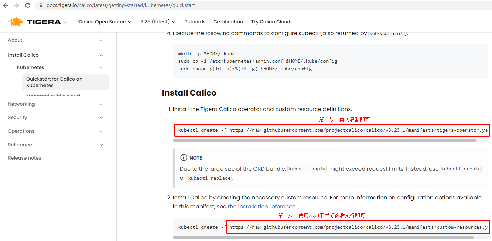

# k8s 1.27集群部署 容器运行时为docker

# 一、主机准备

## 1.1 Kubernetes 1.27版本集群部署环境准备

### 1.1.1 主机操作系统说明

| 序号 | 操作系统及版本 | 备注 |
| :--: | :------------: | :--: |
|  1   |   CentOS7u9    |      |


### 1.1.2 主机硬件配置说明

| 需求 | CPU  | 内存 | 硬盘   | 角色         | 主机名       |
| ---- | ---- | :--: | ------ | ------------ | ------------ |
| 值   | 8C   |  4G  | 1024GB | master1      | k8s-master01 |
| 值   | 8C   |  4G  | 1024GB | master2      | k8s-master02 |
| 值   | 8C   |  4G  | 1024GB | master3      | k8s-master03 |
| 值   | 8C   |  8G  | 1024GB | worker(node) | k8s-node01   |


### 1.1.3 主机配置

#### 1.1.3.1  主机名配置

由于本次使用3台主机完成kubernetes集群部署，其中1台为master节点,名称为k8s-master01;其中2台为worker节点，名称分别为：k8s-master02及k8s-master03

~~~powershell
master节点
# hostnamectl set-hostname k8s-master01
~~~


~~~powershell
worker节点
# hostnamectl set-hostname k8s-node01
~~~

#### 1.1.3.2 主机IP地址配置


~~~powershell
k8s-master节点IP地址为：172.100.3.116/24
# vim /etc/sysconfig/network-scripts/ifcfg-ens33
TYPE="Ethernet"
PROXY_METHOD="none"
BROWSER_ONLY="no"
BOOTPROTO="none"
DEFROUTE="yes"
IPV4_FAILURE_FATAL="no"
IPV6INIT="yes"
IPV6_AUTOCONF="yes"
IPV6_DEFROUTE="yes"
IPV6_FAILURE_FATAL="no"
IPV6_ADDR_GEN_MODE="stable-privacy"
NAME="ens33"
DEVICE="ens33"
ONBOOT="yes"
IPADDR="172.100.3.116"
PREFIX="24"
GATEWAY="172.100.3.254"
DNS1="114.114.114.114"
~~~


~~~powershell
k8s-node1节点IP地址为：172.100.3.117/24
# vim /etc/sysconfig/network-scripts/ifcfg-ens33
TYPE="Ethernet"
PROXY_METHOD="none"
BROWSER_ONLY="no"
BOOTPROTO="none"
DEFROUTE="yes"
IPV4_FAILURE_FATAL="no"
IPV6INIT="yes"
IPV6_AUTOCONF="yes"
IPV6_DEFROUTE="yes"
IPV6_FAILURE_FATAL="no"
IPV6_ADDR_GEN_MODE="stable-privacy"
NAME="ens33"
DEVICE="ens33"
ONBOOT="yes"
IPADDR="172.100.3.117"
PREFIX="24"
GATEWAY="172.100.3.254"
DNS1="114.114.114.114"
~~~


~~~powershell
k8s-worker2节点IP地址为：172.100.3.118/24
# vim /etc/sysconfig/network-scripts/ifcfg-ens33
TYPE="Ethernet"
PROXY_METHOD="none"
BROWSER_ONLY="no"
BOOTPROTO="none"
DEFROUTE="yes"
IPV4_FAILURE_FATAL="no"
IPV6INIT="yes"
IPV6_AUTOCONF="yes"
IPV6_DEFROUTE="yes"
IPV6_FAILURE_FATAL="no"
IPV6_ADDR_GEN_MODE="stable-privacy"
NAME="ens33"
DEVICE="ens33"
ONBOOT="yes"
IPADDR="172.100.3.118"
PREFIX="24"
GATEWAY="172.100.3.254"
DNS1="114.114.114.114"
~~~


#### 1.1.3.3 主机名与IP地址解析


> 所有集群主机均需要进行配置。


~~~powershell
# cat /etc/hosts
127.0.0.1   localhost localhost.localdomain localhost4 localhost4.localdomain4
::1         localhost localhost.localdomain localhost6 localhost6.localdomain6
172.100.3.116 k8s-master01
172.100.3.117 k8s-master02
172.100.3.118 k8s-master03
172.100.3.120 k8s-node01
172.100.3.200 vip
~~~


#### 1.1.3.4  防火墙配置


> 所有主机均需要操作。


~~~powershell
关闭现有防火墙firewalld
# systemctl disable firewalld
# systemctl stop firewalld
# firewall-cmd --state
not running
~~~


#### 1.1.3.5 SELINUX配置


> 所有主机均需要操作。修改SELinux配置需要重启操作系统。


~~~powershell
# sed -ri 's/SELINUX=enforcing/SELINUX=disabled/' /etc/selinux/config
~~~


#### 1.1.3.6 时间同步配置


>所有主机均需要操作。最小化安装系统需要安装ntpdate软件。


~~~powershell
# crontab -l
0 */1 * * * /usr/sbin/ntpdate time1.aliyun.com
~~~


#### 1.1.3.7 升级操作系统内核

> 所有主机均需要操作。


~~~powershell
导入elrepo gpg key
# rpm --import https://www.elrepo.org/RPM-GPG-KEY-elrepo.org
~~~


~~~powershell
安装elrepo YUM源仓库
# yum -y install https://www.elrepo.org/elrepo-release-7.0-4.el7.elrepo.noarch.rpm
~~~


~~~powershell
安装kernel-ml版本，ml为长期稳定版本，lt为长期维护版本
# yum --enablerepo="elrepo-kernel" -y install kernel-lt.x86_64
~~~


~~~powershell
设置grub2默认引导为0
# grub2-set-default 0
~~~


~~~powershell
重新生成grub2引导文件
# grub2-mkconfig -o /boot/grub2/grub.cfg
~~~


~~~powershell
更新后，需要重启，使用升级的内核生效。
# reboot
~~~


~~~powershell
重启后，需要验证内核是否为更新对应的版本
# uname -r
~~~


#### 1.1.3.8  配置内核转发及网桥过滤

>所有主机均需要操作。


~~~powershell
添加网桥过滤及内核转发配置文件
# cat > /etc/sysctl.d/k8s.conf << EOF
net.bridge.bridge-nf-call-ip6tables = 1
net.bridge.bridge-nf-call-iptables = 1
net.ipv4.ip_forward = 1
vm.swappiness = 0
EOF
~~~


~~~powershell
加载br_netfilter模块
# modprobe br_netfilter
~~~


~~~powershell
查看是否加载
# lsmod | grep br_netfilter
br_netfilter           22256  0
bridge                151336  1 br_netfilter
~~~


#### 1.1.3.9 安装ipset及ipvsadm

> 所有主机均需要操作。


~~~powershell
安装ipset及ipvsadm
# yum -y install ipset ipvsadm
~~~


~~~powershell
配置ipvsadm模块加载方式
添加需要加载的模块
# cat > /etc/sysconfig/modules/ipvs.modules <<EOF
#!/bin/bash
modprobe -- ip_vs
modprobe -- ip_vs_rr
modprobe -- ip_vs_wrr
modprobe -- ip_vs_sh
modprobe -- nf_conntrack
EOF
~~~


~~~powershell
授权、运行、检查是否加载
# chmod 755 /etc/sysconfig/modules/ipvs.modules && bash /etc/sysconfig/modules/ipvs.modules && lsmod | grep -e ip_vs -e nf_conntrack
~~~


#### 1.1.3.10 关闭SWAP分区


> 修改完成后需要重启操作系统，如不重启，可临时关闭，命令为swapoff -a


~~~powershell
永远关闭swap分区，需要重启操作系统
# cat /etc/fstab
......

# /dev/mapper/centos-swap swap                    swap    defaults        0 0

在上一行中行首添加#
~~~
# 二 安装准备软件

## 2.2 负载均衡器准备（ha1，ha2）

### 2.2.1 安装haproxy与keepalived


~~~powershell
yum -y install haproxy keepalived
~~~


### 2.2.2 HAProxy配置


~~~powershell
cat >/etc/haproxy/haproxy.cfg<<"EOF"
global
 maxconn 2000
 ulimit-n 16384
 log 127.0.0.1 local0 err
 stats timeout 30s

defaults
 log global
 mode http
 option httplog
 timeout connect 5000
 timeout client 50000
 timeout server 50000
 timeout http-request 15s
 timeout http-keep-alive 15s

frontend monitor-in
 bind *:33305
 mode http
 option httplog
 monitor-uri /monitor

frontend k8s-master
 bind 0.0.0.0:6443
 bind 127.0.0.1:6443
 mode tcp
 option tcplog
 tcp-request inspect-delay 5s
 default_backend k8s-master

backend k8s-master
 mode tcp
 option tcplog
 option tcp-check
 balance roundrobin
 default-server inter 10s downinter 5s rise 2 fall 2 slowstart 60s maxconn 250 maxqueue 256 weight 100
 server  k8s-master1  172.100.2.116:6443 check
 server  k8s-master2  172.100.2.117:6443 check
 server  k8s-master3  172.100.2.118:6443 check
EOF
~~~


### 2.2.3 KeepAlived

> 主从配置不一致，需要注意。


~~~powershell
ha1:

cat >/etc/keepalived/keepalived.conf<<"EOF"
! Configuration File for keepalived
global_defs {
   router_id LVS_DEVEL
script_user root
   enable_script_security
}
vrrp_script chk_apiserver {
   script "/etc/keepalived/check_apiserver.sh"
   interval 5
   weight -5
   fall 2 
rise 1
}
vrrp_instance VI_1 {
   state MASTER
   interface eth0
   mcast_src_ip 172.100.3.130
   virtual_router_id 51
   priority 100
   advert_int 2
   authentication {
       auth_type PASS
       auth_pass K8SHA_KA_AUTH
   }
   virtual_ipaddress {
       172.100.3.200
   }
   track_script {
      chk_apiserver
   }
}
EOF
~~~


~~~powershell
ha2:

cat >/etc/keepalived/keepalived.conf<<"EOF"
! Configuration File for keepalived
global_defs {
   router_id LVS_DEVEL
script_user root
   enable_script_security
}
vrrp_script chk_apiserver {
   script "/etc/keepalived/check_apiserver.sh"
  interval 5
   weight -5
   fall 2 
rise 1
}
vrrp_instance VI_1 {
   state BACKUP
   interface eth0
   mcast_src_ip 172.100.3.131
   virtual_router_id 51
   priority 99
   advert_int 2
   authentication {
       auth_type PASS
       auth_pass K8SHA_KA_AUTH
   }
   virtual_ipaddress {
       172.100.3.200
   }
   track_script {
      chk_apiserver
   }
}
EOF
~~~


### 2.2.4 健康检查脚本

> ha1及ha2均要配置

~~~powershell
cat > /etc/keepalived/check_apiserver.sh <<"EOF"
#!/bin/bash
err=0
for k in $(seq 1 3)
do
   check_code=$(pgrep haproxy)
   if [[ $check_code == "" ]]; then
       err=$(expr $err + 1)
       sleep 1
       continue
   else
       err=0
       break
   fi
done

if [[ $err != "0" ]]; then
   echo "systemctl stop keepalived"
   /usr/bin/systemctl stop keepalived
   exit 1
else
   exit 0
fi
EOF
~~~


~~~powershell
chmod +x /etc/keepalived/check_apiserver.sh
~~~


### 2.2.5 启动服务并验证


~~~powershell
systemctl daemon-reload
systemctl enable --now haproxy
systemctl enable --now keepalived
~~~


~~~powershell
ip address show
~~~

卸载

```
systemctl stop haproxy
systemctl stop keepalived
systemctl disable keepalived
systemctl disable haproxy
yum -y remove haproxy keepalived
rm -rf /etc/haproxy/haproxy.cfg
rm -rf /etc/keepalived/keepalived.conf
rm -rf /etc/keepalived/check_apiserver.sh
```


## 2.3  创建证书

### 2.3.1获取cfssl工具


~~~powershell
cd /data/k8s-work
wget https://pkg.cfssl.org/R1.2/cfssl_linux-amd64
wget https://pkg.cfssl.org/R1.2/cfssljson_linux-amd64
wget https://pkg.cfssl.org/R1.2/cfssl-certinfo_linux-amd64
~~~

~~~powershell
说明：
cfssl是使用go编写，由CloudFlare开源的一款PKI/TLS工具。主要程序有：

- cfssl，是CFSSL的命令行工具
- cfssljson用来从cfssl程序获取JSON输出，并将证书，密钥，CSR和bundle写入文件中。
~~~

~~~powershell
chmod +x cfssl*
~~~

~~~powershell
mv cfssl_linux-amd64 /usr/local/bin/cfssl
mv cfssljson_linux-amd64 /usr/local/bin/cfssljson
mv cfssl-certinfo_linux-amd64 /usr/local/bin/cfssl-certinfo
~~~

~~~powershell
# cfssl version
Version: 1.2.0
Revision: dev
Runtime: go1.6
~~~


### 2.3.1 创建CA证书

#### 2.3.1.1 配置ca证书请求文件


~~~powershell
cat > ca-csr.json <<"EOF"
{
  "CN": "kubernetes",
  "key": {
      "algo": "rsa",
      "size": 2048
  },
  "names": [
    {
      "C": "CN",
      "ST": "Beijing",
      "L": "Beijing",
      "O": "erick8s",
      "OU": "CN"
    }
  ],
  "ca": {
          "expiry": "87600h"
  }
}
EOF
~~~


#### 2.3.1.2 创建ca证书


~~~powershell
cfssl gencert -initca ca-csr.json | cfssljson -bare ca
~~~


#### 2.3.1.3 配置ca证书策略


~~~powershell
生成默认文件
cfssl print-defaults config > ca-config.json
修改www为kubernetes
~~~

~~~powershell
自己配置文件（效果同上）
cat > ca-config.json <<"EOF"
{
  "signing": {
      "default": {
          "expiry": "87600h"
        },
      "profiles": {
          "kubernetes": {
              "usages": [
                  "signing",
                  "key encipherment",
                  "server auth",
                  "client auth"
              ],
              "expiry": "87600h"
          }
      }
  }
}
EOF
~~~


~~~powershell
server auth 表示client可以对使用该ca对server提供的证书进行验证

client auth 表示server可以使用该ca对client提供的证书进行验证
~~~

### 2.3.2 创建etcd证书

#### 2.3.2.1 配置etcd请求文件

~~~powershell
cat > etcd-csr.json <<"EOF"
{
  "CN": "etcd",
  "hosts": [
    "127.0.0.1",
    "172.100.3.116",
    "172.100.3.117",
    "172.100.3.118"
  ],
  "key": {
    "algo": "rsa",
    "size": 2048
  },
  "names": [{
    "C": "CN",
    "ST": "Beijing",
    "L": "Beijing",
    "O": "erick8s",
    "OU": "CN"
  }]
}
EOF
~~~

#### 2.3.2.2 生成etcd证书

~~~powershell
cfssl gencert -ca=ca.pem -ca-key=ca-key.pem -config=ca-config.json -profile=kubernetes etcd-csr.json | cfssljson  -bare etcd
~~~

~~~powershell
# ls
输出
ca-config.json  ca.csr  ca-csr.json  ca-key.pem  ca.pem  etcd.csr  etcd-csr.json  etcd-key.pem  etcd.pem
~~~


## 2.4  部署etcd集群

#### 2.4.1 下载etcd软件包

https://github.com/etcd-io/etcd/releases


~~~powershell
wget https://github.com/etcd-io/etcd/releases/download/v3.5.2/etcd-v3.5.2-linux-amd64.tar.gz
~~~

#### 2.4.2 安装etcd软件

yum安装

~~~powershell
yum install etcd -y
~~~
~~~powershell
tar -xvf etcd-v3.5.2-linux-amd64.tar.gz
cp -p etcd-v3.5.2-linux-amd64/etcd* /usr/local/bin/
~~~

#### 2.4.3 分发etcd软件

~~~powershell
scp /usr/local/bin/etcd* k8s-master2:/usr/local/bin/
scp /usr/local/bin/etcd* k8s-master3:/usr/local/bin/
~~~

#### 2.4.4 创建配置文件

~~~powershell
mkdir /etc/etcd
~~~

~~~powershell
master1:

cat >  /etc/etcd/etcd.conf <<"EOF"
#[Member]
ETCD_NAME="etcd1"
ETCD_DATA_DIR="/var/lib/etcd/default.etcd"
ETCD_LISTEN_PEER_URLS="https://172.100.3.116:2380"
ETCD_LISTEN_CLIENT_URLS="https://172.100.3.116:2379,http://127.0.0.1:2379"

#[Clustering]
ETCD_INITIAL_ADVERTISE_PEER_URLS="https://172.100.3.116:2380"
ETCD_ADVERTISE_CLIENT_URLS="https://172.100.3.116:2379"
ETCD_INITIAL_CLUSTER="etcd1=https://172.100.3.116:2380,etcd2=https://172.100.3.117:2380,etcd3=https://172.100.3.118:2380"
ETCD_INITIAL_CLUSTER_TOKEN="etcd-cluster"
ETCD_INITIAL_CLUSTER_STATE="new"
EOF
~~~

~~~powershell
说明：
ETCD_NAME：节点名称，集群中唯一
ETCD_DATA_DIR：数据目录
ETCD_LISTEN_PEER_URLS：集群通信监听地址
ETCD_LISTEN_CLIENT_URLS：客户端访问监听地址
ETCD_INITIAL_ADVERTISE_PEER_URLS：集群通告地址
ETCD_ADVERTISE_CLIENT_URLS：客户端通告地址
ETCD_INITIAL_CLUSTER：集群节点地址
ETCD_INITIAL_CLUSTER_TOKEN：集群Token
ETCD_INITIAL_CLUSTER_STATE：加入集群的当前状态，new是新集群，existing表示加入已有集群
~~~

~~~powershell
k8s-master2:

cat >  /etc/etcd/etcd.conf <<"EOF"
#[Member]
ETCD_NAME="etcd2"
ETCD_DATA_DIR="/var/lib/etcd/default.etcd"
ETCD_LISTEN_PEER_URLS="https://172.100.3.117:2380"
ETCD_LISTEN_CLIENT_URLS="https://172.100.3.117:2379,http://127.0.0.1:2379"

#[Clustering]
ETCD_INITIAL_ADVERTISE_PEER_URLS="https://172.100.3.117:2380"
ETCD_ADVERTISE_CLIENT_URLS="https://172.100.3.117:2379"
ETCD_INITIAL_CLUSTER="etcd1=https://172.100.3.116:2380,etcd2=https://172.100.3.117:2380,etcd3=https://172.100.3.118:2380"
ETCD_INITIAL_CLUSTER_TOKEN="etcd-cluster"
ETCD_INITIAL_CLUSTER_STATE="new"
EOF
~~~

~~~powershell
k8s-master3:

cat >  /etc/etcd/etcd.conf <<"EOF"
#[Member]
ETCD_NAME="etcd3"
ETCD_DATA_DIR="/var/lib/etcd/default.etcd"
ETCD_LISTEN_PEER_URLS="https://172.100.3.118:2380"
ETCD_LISTEN_CLIENT_URLS="https://172.100.3.118:2379,http://127.0.0.1:2379"

#[Clustering]
ETCD_INITIAL_ADVERTISE_PEER_URLS="https://172.100.3.118:2380"
ETCD_ADVERTISE_CLIENT_URLS="https://172.100.3.118:2379"
ETCD_INITIAL_CLUSTER="etcd1=https://172.100.3.116:2380,etcd2=https://172.100.3.117:2380,etcd3=https://172.100.3.118:2380"
ETCD_INITIAL_CLUSTER_TOKEN="etcd-cluster"
ETCD_INITIAL_CLUSTER_STATE="new"
EOF
~~~

#### 2.4.5 创建服务配置文件（yum安装跳过）

~~~powershell
mkdir -p /etc/etcd/ssl
mkdir -p /var/lib/etcd/default.etcd
~~~

~~~powershell
cd /data/k8s-work
cp ca*.pem /etc/etcd/ssl
cp etcd*.pem /etc/etcd/ssl
~~~

~~~powershell
cat > /etc/systemd/system/etcd.service <<"EOF"
[Unit]
Description=Etcd Server
After=network.target
After=network-online.target
Wants=network-online.target

[Service]
Type=notify
EnvironmentFile=-/etc/etcd/etcd.conf
WorkingDirectory=/var/lib/etcd/
ExecStart=/usr/local/bin/etcd \
  --cert-file=/etc/etcd/ssl/etcd.pem \
  --key-file=/etc/etcd/ssl/etcd-key.pem \
  --trusted-ca-file=/etc/etcd/ssl/ca.pem \
  --peer-cert-file=/etc/etcd/ssl/etcd.pem \
  --peer-key-file=/etc/etcd/ssl/etcd-key.pem \
  --peer-trusted-ca-file=/etc/etcd/ssl/ca.pem \
  --peer-client-cert-auth \
  --client-cert-auth
Restart=on-failure
RestartSec=5
LimitNOFILE=65536

[Install]
WantedBy=multi-user.target
EOF
~~~

```
chmod +x /etc/systemd/system/etcd.service
```

#### 2.4.6 同步etcd配置到集群其它master节点

~~~powershell
创建目录
mkdir -p /etc/etcd
mkdir -p /etc/etcd/ssl
mkdir -p /var/lib/etcd/default.etcd

for i in k8s-master2 k8s-master3; do echo $i; scp /etc/etcd/ssl/* $i:/etc/etcd/ssl; scp /etc/systemd/system/etcd.service $i:/etc/systemd/system/etcd.service; done

for i in k8s-master2 k8s-master3
do echo $i
  #ssh $i "mkdir -p /etc/etcd/ssl&mkdir -p /var/lib/etcd/default.etcd"
  scp /etc/etcd/ssl/* $i:/etc/etcd/ssl
done
~~~

#### 2.4.7 启动etcd集群

~~~powershell
systemctl daemon-reload
systemctl enable --now etcd.service
systemctl status etcd
~~~

#### 2.4.8 验证集群状态

~~~powershell
ETCDCTL_API=3 /usr/local/bin/etcdctl --write-out=table --cacert=/etc/etcd/ssl/ca.pem --cert=/etc/etcd/ssl/etcd.pem --key=/etc/etcd/ssl/etcd-key.pem --endpoints=https://172.100.3.116:2379,https://172.100.3.117:2379,https://172.100.3.118:2379 endpoint health
~~~

~~~powershell
+----------------------------+--------+-------------+-------+
|          ENDPOINT          | HEALTH |    TOOK     | ERROR |
+----------------------------+--------+-------------+-------+
| https://172.100.3.118:2379 |   true | 10.393062ms |       |
| https://172.100.3.116:2379 |   true |  15.70437ms |       |
| https://172.100.3.117:2379 |   true | 15.871684ms |       |
+----------------------------+--------+-------------+-------+
~~~

~~~powershell
检查ETCD数据库性能
ETCDCTL_API=3 /usr/local/bin/etcdctl --write-out=table --cacert=/etc/etcd/ssl/ca.pem --cert=/etc/etcd/ssl/etcd.pem --key=/etc/etcd/ssl/etcd-key.pem --endpoints=https://172.100.3.116:2379,https://172.100.3.117:2379,https://172.100.3.118:2379 check perf
~~~

~~~powershell
59 / 60 Boooooooooooooooooooooooooooooooooooooooooooooooooooooooooooooooooooooooooooooooooooooooooooooooooooooooooooooooooooooooooooooooooooooom  !  98.33%
PASS: Throughput is 151 writes/s
PASS: Slowest request took 0.066478s
PASS: Stddev is 0.002354s
PASS
~~~

~~~powershell
ETCDCTL_API=3 /usr/local/bin/etcdctl --write-out=table --cacert=/etc/etcd/ssl/ca.pem --cert=/etc/etcd/ssl/etcd.pem --key=/etc/etcd/ssl/etcd-key.pem --endpoints=https://172.100.3.116:2379,https://172.100.3.117:2379,https://172.100.3.118:2379 member list
~~~

~~~powershell
+------------------+---------+-------+----------------------------+----------------------------+------------+
|        ID        | STATUS  | NAME  |         PEER ADDRS         |        CLIENT ADDRS        | IS LEARNER |
+------------------+---------+-------+----------------------------+----------------------------+------------+
| 9b449b0ff1d4c375 | started | etcd1 | https://172.100.3.116:2380 | https://172.100.3.116:2379 |      false |
| d1fbb74bc6a61e5c | started | etcd2 | https://172.100.3.117:2380 | https://172.100.3.117:2379 |      false |
| f60b205fb02fe23c | started | etcd3 | https://172.100.3.118:2380 | https://172.100.3.118:2379 |      false |
+------------------+---------+-------+----------------------------+----------------------------+------------+
~~~

~~~powershell
ETCDCTL_API=3 /usr/local/bin/etcdctl --write-out=table --cacert=/etc/etcd/ssl/ca.pem --cert=/etc/etcd/ssl/etcd.pem --key=/etc/etcd/ssl/etcd-key.pem --endpoints=https://172.100.3.116:2379,https://172.100.3.117:2379,https://172.100.3.118:2379 endpoint status
~~~

~~~powershell
+----------------------------+------------------+---------+---------+-----------+------------+-----------+------------+--------------------+--------+
|          ENDPOINT          |        ID        | VERSION | DB SIZE | IS LEADER | IS LEARNER | RAFT TERM | RAFT INDEX | RAFT APPLIED INDEX | ERRORS |
+----------------------------+------------------+---------+---------+-----------+------------+-----------+------------+--------------------+--------+
| https://172.100.3.116:2379 | 9b449b0ff1d4c375 |   3.5.2 |   24 MB |      true |      false |         2 |     403774 |             403774 |        |
| https://172.100.3.117:2379 | d1fbb74bc6a61e5c |   3.5.2 |   24 MB |     false |      false |         2 |     403774 |             403774 |        |
| https://172.100.3.118:2379 | f60b205fb02fe23c |   3.5.2 |   24 MB |     false |      false |         2 |     403774 |             403774 |        |
+----------------------------+------------------+---------+---------+-----------+------------+-----------+------------+--------------------+--------+
~~~

# Kubernetes集群二进制部署


### 2.5.1 Kubernetes软件包下载

[Download Kubernetes](https://www.downloadkubernetes.com/)

```
wget https://dl.k8s.io/v1.21.10/kubernetes-server-linux-amd64.tar.gz
```

### 2.5.2 Kubernetes软件包安装

```
tar -xvf kubernetes-server-linux-amd64.tar.gz

cd kubernetes/server/bin/

cp kube-apiserver kube-controller-manager kube-scheduler kubectl /usr/local/bin/
```

### 2.5.3 Kubernetes软件分发

```
scp kube-apiserver kube-controller-manager kube-scheduler kubectl k8s-master2:/usr/local/bin/
scp kube-apiserver kube-controller-manager kube-scheduler kubectl k8s-master3:/usr/local/bin/
scp kubelet kube-proxy k8s-master1:/usr/local/bin
scp kubelet kube-proxy k8s-master2:/usr/local/bin
scp kubelet kube-proxy k8s-master3:/usr/local/bin
scp kubelet kube-proxy k8s-node1:/usr/local/bin
```

### 2.5.4 在集群节点上创建目录

> 所有节点

```
mkdir -p /etc/kubernetes/        
mkdir -p /etc/kubernetes/ssl     
mkdir -p /var/log/kubernetes 
```

### 2.5.5 部署api-server

#### 2.5.5.1 创建apiserver证书请求文件

> 所有master节点

```
cat > kube-apiserver-csr.json << "EOF"
{
"CN": "kubernetes",
  "hosts": [
    "127.0.0.1",
    "172.100.3.116",
    "172.100.3.117",
    "172.100.3.118",
    "172.100.3.119",
    "172.100.3.120",
    "172.100.3.121",
    "172.100.3.122",
    "172.100.3.123",
    "172.100.3.124",
    "172.100.3.200",
    "10.96.0.1",
    "kubernetes",
    "kubernetes.default",
    "kubernetes.default.svc",
    "kubernetes.default.svc.cluster",
    "kubernetes.default.svc.cluster.local"
  ],
  "key": {
    "algo": "rsa",
    "size": 2048
  },
  "names": [
    {
      "C": "CN",
      "ST": "Beijing",
      "L": "Beijing",
      "O": "erick8s",
      "OU": "CN"
    }
  ]
}
EOF
```

```
说明：
如果 hosts 字段不为空则需要指定授权使用该证书的 IP（含VIP） 或域名列表。由于该证书被 集群使用，需要将节点的IP都填上，为了方便后期扩容可以多写几个预留的IP。
同时还需要填写 service 网络的首个IP(一般是 kube-apiserver 指定的 service-cluster-ip-range 网段的第一个IP，如 10.96.0.1)。
```

#### 2.5.5.2 生成apiserver证书及token文件

```
cfssl gencert -ca=ca.pem -ca-key=ca-key.pem -config=ca-config.json -profile=kubernetes kube-apiserver-csr.json | cfssljson -bare kube-apiserver
cat > token.csv << EOF
$(head -c 16 /dev/urandom | od -An -t x | tr -d ' '),kubelet-bootstrap,10001,"system:kubelet-bootstrap"
EOF
```

```
说明：
创建TLS机制所需TOKEN
TLS Bootstraping：Master apiserver启用TLS认证后，Node节点kubelet和kube-proxy与kube-apiserver进行通信，必须使用CA签发的有效证书才可以，当Node节点很多时，这种客户端证书颁发需要大量工作，同样也会增加集群扩展复杂度。为了简化流程，Kubernetes引入了TLS bootstraping机制来自动颁发客户端证书，kubelet会以一个低权限用户自动向apiserver申请证书，kubelet的证书由apiserver动态签署。所以强烈建议在Node上使用这种方式，目前主要用于kubelet，kube-proxy还是由我们统一颁发一个证书。
```


#### 2.5.5.3 创建apiserver服务配置文件

master1：

```
cat > /etc/kubernetes/kube-apiserver.conf << "EOF"
KUBE_APISERVER_OPTS="--enable-admission-plugins=NamespaceLifecycle,NodeRestriction,LimitRanger,ServiceAccount,DefaultStorageClass,ResourceQuota \
  --anonymous-auth=false \
  --bind-address=172.100.3.116 \
  --secure-port=6443 \
  --advertise-address=172.100.3.116 \
  --insecure-port=0 \
  --authorization-mode=Node,RBAC \
  --runtime-config=api/all=true \
  --enable-bootstrap-token-auth \
  --service-cluster-ip-range=10.96.0.0/16 \
  --token-auth-file=/etc/kubernetes/token.csv \
  --service-node-port-range=30000-32767 \
  --tls-cert-file=/etc/kubernetes/ssl/kube-apiserver.pem  \
  --tls-private-key-file=/etc/kubernetes/ssl/kube-apiserver-key.pem \
  --client-ca-file=/etc/kubernetes/ssl/ca.pem \
  --kubelet-client-certificate=/etc/kubernetes/ssl/kube-apiserver.pem \
  --kubelet-client-key=/etc/kubernetes/ssl/kube-apiserver-key.pem \
  --service-account-key-file=/etc/kubernetes/ssl/ca-key.pem \
  --service-account-signing-key-file=/etc/kubernetes/ssl/ca-key.pem  \
  --service-account-issuer=api \
  --etcd-cafile=/etc/etcd/ssl/ca.pem \
  --etcd-certfile=/etc/etcd/ssl/etcd.pem \
  --etcd-keyfile=/etc/etcd/ssl/etcd-key.pem \
  --etcd-servers=https://172.100.3.116:2379,https://172.100.3.117:2379,https://172.100.3.118:2379 \
  --enable-swagger-ui=true \
  --allow-privileged=true \
  --apiserver-count=3 \
  --audit-log-maxage=30 \
  --audit-log-maxbackup=3 \
  --audit-log-maxsize=100 \
  --audit-log-path=/var/log/kube-apiserver-audit.log \
  --event-ttl=1h \
  --alsologtostderr=true \
  --logtostderr=false \
  --log-dir=/var/log/kubernetes \
  --v=4"
EOF
```

master2：

```
cat > /etc/kubernetes/kube-apiserver.conf << "EOF"
KUBE_APISERVER_OPTS="--enable-admission-plugins=NamespaceLifecycle,NodeRestriction,LimitRanger,ServiceAccount,DefaultStorageClass,ResourceQuota \
  --anonymous-auth=false \
  --bind-address=172.100.3.117 \
  --secure-port=6443 \
  --advertise-address=172.100.3.117 \
  --insecure-port=0 \
  --authorization-mode=Node,RBAC \
  --runtime-config=api/all=true \
  --enable-bootstrap-token-auth \
  --service-cluster-ip-range=10.96.0.0/16 \
  --token-auth-file=/etc/kubernetes/token.csv \
  --service-node-port-range=30000-32767 \
  --tls-cert-file=/etc/kubernetes/ssl/kube-apiserver.pem  \
  --tls-private-key-file=/etc/kubernetes/ssl/kube-apiserver-key.pem \
  --client-ca-file=/etc/kubernetes/ssl/ca.pem \
  --kubelet-client-certificate=/etc/kubernetes/ssl/kube-apiserver.pem \
  --kubelet-client-key=/etc/kubernetes/ssl/kube-apiserver-key.pem \
  --service-account-key-file=/etc/kubernetes/ssl/ca-key.pem \
  --service-account-signing-key-file=/etc/kubernetes/ssl/ca-key.pem  \
  --service-account-issuer=api \
  --etcd-cafile=/etc/etcd/ssl/ca.pem \
  --etcd-certfile=/etc/etcd/ssl/etcd.pem \
  --etcd-keyfile=/etc/etcd/ssl/etcd-key.pem \
  --etcd-servers=https://172.100.3.116:2379,https://172.100.3.117:2379,https://172.100.3.118:2379 \
  --enable-swagger-ui=true \
  --allow-privileged=true \
  --apiserver-count=3 \
  --audit-log-maxage=30 \
  --audit-log-maxbackup=3 \
  --audit-log-maxsize=100 \
  --audit-log-path=/var/log/kube-apiserver-audit.log \
  --event-ttl=1h \
  --alsologtostderr=true \
  --logtostderr=false \
  --log-dir=/var/log/kubernetes \
  --v=4"
EOF
```

master3：

```
cat > /etc/kubernetes/kube-apiserver.conf << "EOF"
KUBE_APISERVER_OPTS="--enable-admission-plugins=NamespaceLifecycle,NodeRestriction,LimitRanger,ServiceAccount,DefaultStorageClass,ResourceQuota \
  --anonymous-auth=false \
  --bind-address=172.100.3.118 \
  --secure-port=6443 \
  --advertise-address=172.100.3.118 \
  --insecure-port=0 \
  --authorization-mode=Node,RBAC \
  --runtime-config=api/all=true \
  --enable-bootstrap-token-auth \
  --service-cluster-ip-range=10.96.0.0/16 \
  --token-auth-file=/etc/kubernetes/token.csv \
  --service-node-port-range=30000-32767 \
  --tls-cert-file=/etc/kubernetes/ssl/kube-apiserver.pem  \
  --tls-private-key-file=/etc/kubernetes/ssl/kube-apiserver-key.pem \
  --client-ca-file=/etc/kubernetes/ssl/ca.pem \
  --kubelet-client-certificate=/etc/kubernetes/ssl/kube-apiserver.pem \
  --kubelet-client-key=/etc/kubernetes/ssl/kube-apiserver-key.pem \
  --service-account-key-file=/etc/kubernetes/ssl/ca-key.pem \
  --service-account-signing-key-file=/etc/kubernetes/ssl/ca-key.pem  \
  --service-account-issuer=api \
  --etcd-cafile=/etc/etcd/ssl/ca.pem \
  --etcd-certfile=/etc/etcd/ssl/etcd.pem \
  --etcd-keyfile=/etc/etcd/ssl/etcd-key.pem \
  --etcd-servers=https://172.100.3.116:2379,https://172.100.3.117:2379,https://172.100.3.118:2379 \
  --enable-swagger-ui=true \
  --allow-privileged=true \
  --apiserver-count=3 \
  --audit-log-maxage=30 \
  --audit-log-maxbackup=3 \
  --audit-log-maxsize=100 \
  --audit-log-path=/var/log/kube-apiserver-audit.log \
  --event-ttl=1h \
  --alsologtostderr=true \
  --logtostderr=false \
  --log-dir=/var/log/kubernetes \
  --v=4"
EOF
```

**1.27中去掉下面几行，不然启动不了**

```
  --insecure-port=0 \
  --enable-swagger-ui=true \
  --alsologtostderr=true \
  --logtostderr=false \
  --log-dir=/var/log/kubernetes \
```


#### 2.5.5.4 创建apiserver服务管理配置文件

```
cat > kube-apiserver.service << "EOF"
[Unit]
Description=Kubernetes API Server
Documentation=https://github.com/kubernetes/kubernetes
After=etcd.service
Wants=etcd.service

[Service]
EnvironmentFile=-/etc/kubernetes/kube-apiserver.conf
ExecStart=/usr/local/bin/kube-apiserver $KUBE_APISERVER_OPTS
Restart=on-failure
RestartSec=5
Type=notify
LimitNOFILE=65536

[Install]
WantedBy=multi-user.target
EOF
```

```
chmod +x kube-apiserver.service
mv kube-apiserver.service /etc/systemd/system/
```


#### 2.5.5.5 同步文件到集群master节点

```
cp ca*.pem kube-apiserver*.pem token.csv /etc/kubernetes/ssl/
cp token.csv /etc/kubernetes
cp kube-apiserver.service /etc/systemd/system/
ll /etc/kubernetes/ssl/
ll /etc/systemd/system/  |grep kube-apiserver.service
scp ca*.pem kube-apiserver*.pem  k8s-master2:/etc/kubernetes/ssl
scp ca*.pem kube-apiserver*.pem  k8s-master3:/etc/kubernetes/ssl
scp token.csv k8s-master2:/etc/kubernetes
scp token.csv k8s-master3:/etc/kubernetes
scp kube-apiserver.service k8s-master2:/etc/systemd/system/kube-apiserver.service
scp kube-apiserver.service k8s-master3:/etc/systemd/system/kube-apiserver.service
```

#### 2.5.5.6 启动apiserver服务

```
systemctl daemon-reload
systemctl enable --now kube-apiserver
systemctl status kube-apiserver

# 测试
curl --insecure https://172.100.3.116:6443/
curl --insecure https://172.100.3.117:6443/
curl --insecure https://172.100.3.118:6443/
curl --insecure https://172.100.3.200:6443/
```

### 2.5.6 部署kubectl

#### 2.5.6.1 创建kubectl证书请求文件

```
cat > admin-csr.json << "EOF"
{
  "CN": "admin",
  "hosts": [],
  "key": {
    "algo": "rsa",
    "size": 2048
  },
  "names": [
    {
      "C": "CN",
      "ST": "Beijing",
      "L": "Beijing",
      "O": "system:masters",             
      "OU": "system"
    }
  ]
}
EOF
```

```
说明：

后续 kube-apiserver 使用 RBAC 对客户端(如 kubelet、kube-proxy、Pod)请求进行授权；
kube-apiserver 预定义了一些 RBAC 使用的 RoleBindings，如 cluster-admin 将 Group system:masters 与 Role cluster-admin 绑定，该 Role 授予了调用kube-apiserver 的所有 API的权限；
O指定该证书的 Group 为 system:masters，kubelet 使用该证书访问 kube-apiserver 时 ，由于证书被 CA 签名，所以认证通过，同时由于证书用户组为经过预授权的 system:masters，所以被授予访问所有 API 的权限；
注：
这个admin 证书，是将来生成管理员用的kubeconfig 配置文件用的，现在我们一般建议使用RBAC 来对kubernetes 进行角色权限控制， kubernetes 将证书中的CN 字段 作为User， O 字段作为 Group；
"O": "system:masters", 必须是system:masters，否则后面kubectl create clusterrolebinding报错。
```

#### 2.5.6.2 生成证书文件

```
cfssl gencert -ca=ca.pem -ca-key=ca-key.pem -config=ca-config.json -profile=kubernetes admin-csr.json | cfssljson -bare admin
```

#### 2.5.6.3 复制文件到指定目录

```
cp admin*.pem /etc/kubernetes/ssl/
```

#### 2.5.6.4 生成kubeconfig配置文件

kube.config 为 kubectl 的配置文件，包含访问 apiserver 的所有信息，如 apiserver 地址、CA 证书和自身使用的证书

```
kubectl config set-cluster kubernetes --certificate-authority=ca.pem --embed-certs=true --server=https://172.100.3.200:6443 --kubeconfig=kube.config

kubectl config set-credentials admin --client-certificate=admin.pem --client-key=admin-key.pem --embed-certs=true --kubeconfig=kube.config

kubectl config set-context kubernetes --cluster=kubernetes --user=admin --kubeconfig=kube.config

kubectl config use-context kubernetes --kubeconfig=kube.config
```

#### 2.5.6.5 准备kubectl配置文件并进行角色绑定

```
mkdir ~/.kube
cp kube.config ~/.kube/config
kubectl create clusterrolebinding kube-apiserver:kubelet-apis --clusterrole=system:kubelet-api-admin --user kubernetes --kubeconfig=/root/.kube/config
```

#### 2.5.6.6 查看集群状态

```
export KUBECONFIG=$HOME/.kube/config
查看集群信息
kubectl cluster-info dump

查看集群组件状态
kubectl get componentstatuses

查看命名空间中资源对象
kubectl get all --all-namespaces
```

#### 2.5.6.7 同步kubectl配置文件到集群其它master节点

```
ssh k8s-master2 mkdir /root/.kube
ssh k8s-master3 mkdir /root/.kube
scp /root/.kube/config k8s-master2:/root/.kube/config
scp /root/.kube/config k8s-master3:/root/.kube/config
```

#### 2.5.6.8 配置kubectl命令补全(所有节点可选)

```
yum install -y bash-completion
source /usr/share/bash-completion/bash_completion
source <(kubectl completion bash)
kubectl completion bash > ~/.kube/completion.bash.inc
source '/root/.kube/completion.bash.inc'  
source $HOME/.bash_profile
```

### 2.5.7 部署kube-controller-manager

#### 2.5.7.1 创建kube-controller-manager证书请求文件

```
cat > kube-controller-manager-csr.json << "EOF"
{
    "CN": "system:kube-controller-manager",
    "key": {
        "algo": "rsa",
        "size": 2048
    },
    "hosts": [
      "127.0.0.1",
      "172.100.3.116",
      "172.100.3.117",
      "172.100.3.118"
    ],
    "names": [
      {
        "C": "CN",
        "ST": "Beijing",
        "L": "Beijing",
        "O": "system:kube-controller-manager",
        "OU": "system"
      }
    ]
}
EOF
```

```
说明：

hosts 列表包含所有 kube-controller-manager 节点 IP；
CN 为 system:kube-controller-manager;
O 为 system:kube-controller-manager，kubernetes 内置的 ClusterRoleBindings system:kube-controller-manager 赋予 kube-controller-manager 工作所需的权限
```


#### 2.5.7.2 创建kube-controller-manager证书文件

```
cfssl gencert -ca=ca.pem -ca-key=ca-key.pem -config=ca-config.json -profile=kubernetes kube-controller-manager-csr.json | cfssljson -bare kube-controller-manager
# ls |grep kube-controller-manager

kube-controller-manager.csr     
kube-controller-manager-csr.json
kube-controller-manager-key.pem
kube-controller-manager.pem
```

#### 2.5.7.3 创建kube-controller-manager的kube-controller-manager.kubeconfig

```
kubectl config set-cluster kubernetes --certificate-authority=ca.pem --embed-certs=true --server=https://172.100.3.116:6443 --kubeconfig=kube-controller-manager.kubeconfig

kubectl config set-credentials system:kube-controller-manager --client-certificate=kube-controller-manager.pem --client-key=kube-controller-manager-key.pem --embed-certs=true --kubeconfig=kube-controller-manager.kubeconfig

kubectl config set-context system:kube-controller-manager --cluster=kubernetes --user=system:kube-controller-manager --kubeconfig=kube-controller-manager.kubeconfig

kubectl config use-context system:kube-controller-manager --kubeconfig=kube-controller-manager.kubeconfig
```

#### 2.5.7.4 创建kube-controller-manager配置文件

```
cat > kube-controller-manager.conf << "EOF"
KUBE_CONTROLLER_MANAGER_OPTS="--port=10252 \
  --secure-port=10257 \
  --bind-address=127.0.0.1 \
  --kubeconfig=/etc/kubernetes/kube-controller-manager.kubeconfig \
  --service-cluster-ip-range=10.96.0.0/16 \
  --cluster-name=kubernetes \
  --cluster-signing-cert-file=/etc/kubernetes/ssl/ca.pem \
  --cluster-signing-key-file=/etc/kubernetes/ssl/ca-key.pem \
  --allocate-node-cidrs=true \
  --cluster-cidr=10.244.0.0/16 \
  --experimental-cluster-signing-duration=87600h \
  --root-ca-file=/etc/kubernetes/ssl/ca.pem \
  --service-account-private-key-file=/etc/kubernetes/ssl/ca-key.pem \
  --leader-elect=true \
  --feature-gates=RotateKubeletServerCertificate=true \
  --controllers=*,bootstrapsigner,tokencleaner \
  --horizontal-pod-autoscaler-use-rest-clients=true \
  --horizontal-pod-autoscaler-sync-period=10s \
  --tls-cert-file=/etc/kubernetes/ssl/kube-controller-manager.pem \
  --tls-private-key-file=/etc/kubernetes/ssl/kube-controller-manager-key.pem \
  --use-service-account-credentials=true \
  --alsologtostderr=true \
  --logtostderr=false \
  --log-dir=/var/log/kubernetes \
  --v=2"
EOF
```

1.27.2：

```
cat > /etc/kubernetes/kube-controller-manager.conf << "EOF"
KUBE_CONTROLLER_MANAGER_OPTS="--secure-port=10257 \
  --bind-address=127.0.0.1 \
  --kubeconfig=/etc/kubernetes/kube-controller-manager.kubeconfig \
  --service-cluster-ip-range=10.96.0.0/16 \
  --cluster-name=kubernetes \
  --cluster-signing-cert-file=/etc/kubernetes/ssl/ca.pem \
  --cluster-signing-key-file=/etc/kubernetes/ssl/ca-key.pem \
  --allocate-node-cidrs=true \
  --cluster-cidr=10.244.0.0/16 \
  --root-ca-file=/etc/kubernetes/ssl/ca.pem \
  --service-account-private-key-file=/etc/kubernetes/ssl/ca-key.pem \
  --leader-elect=true \
  --feature-gates=RotateKubeletServerCertificate=true \
  --controllers=*,bootstrapsigner,tokencleaner \
  --horizontal-pod-autoscaler-sync-period=10s \
  --tls-cert-file=/etc/kubernetes/ssl/kube-controller-manager.pem \
  --tls-private-key-file=/etc/kubernetes/ssl/kube-controller-manager-key.pem \
  --use-service-account-credentials=true \
  --v=2"
EOF
```


#### 2.5.7.5 创建服务启动文件

```
cat > kube-controller-manager.service << "EOF"
[Unit]
Description=Kubernetes Controller Manager
Documentation=https://github.com/kubernetes/kubernetes

[Service]
EnvironmentFile=-/etc/kubernetes/kube-controller-manager.conf
ExecStart=/usr/local/bin/kube-controller-manager $KUBE_CONTROLLER_MANAGER_OPTS
Restart=on-failure
RestartSec=5

[Install]
WantedBy=multi-user.target
EOF
```

```
chmod +x kube-controller-manager.service
```


#### 2.5.7.6 同步文件到集群master节点

```
cp kube-controller-manager*.pem /etc/kubernetes/ssl/
cp kube-controller-manager.kubeconfig /etc/kubernetes/
cp kube-controller-manager.conf /etc/kubernetes/
cp kube-controller-manager.service /usr/lib/systemd/system/
scp  kube-controller-manager*.pem k8s-master2:/etc/kubernetes/ssl/
scp  kube-controller-manager*.pem k8s-master3:/etc/kubernetes/ssl/
scp  kube-controller-manager.kubeconfig kube-controller-manager.conf k8s-master2:/etc/kubernetes/
scp  kube-controller-manager.kubeconfig kube-controller-manager.conf k8s-master3:/etc/kubernetes/
scp  kube-controller-manager.service k8s-master2:/usr/lib/systemd/system/
scp  kube-controller-manager.service k8s-master3:/usr/lib/systemd/system/
#查看证书
openssl x509 -in /etc/kubernetes/ssl/kube-controller-manager.pem -noout -text
```

#### 2.5.7.7 启动服务

```
systemctl daemon-reload 
systemctl enable --now kube-controller-manager
systemctl status kube-controller-manager
kubectl get componentstatuses
```

### 2.5.8 部署kube-scheduler

#### 2.5.8.1 创建kube-scheduler证书请求文件

```
cat > kube-scheduler-csr.json << "EOF"
{
    "CN": "system:kube-scheduler",
    "hosts": [
      "127.0.0.1",
      "172.100.3.116",
      "172.100.3.117",
      "172.100.3.118"
    ],
    "key": {
        "algo": "rsa",
        "size": 2048
    },
    "names": [
      {
        "C": "CN",
        "ST": "Beijing",
        "L": "Beijing",
        "O": "system:kube-scheduler",
        "OU": "system"
      }
    ]
}
EOF
```

#### 2.5.8.2 生成kube-scheduler证书

```
cfssl gencert -ca=ca.pem -ca-key=ca-key.pem -config=ca-config.json -profile=kubernetes kube-scheduler-csr.json | cfssljson -bare kube-scheduler
# ls |grep kube-scheduler
kube-scheduler.csr
kube-scheduler-csr.json
kube-scheduler-key.pem
kube-scheduler.pem
```

#### 2.5.8.3 创建kube-scheduler的kubeconfig

```
kubectl config set-cluster kubernetes --certificate-authority=ca.pem --embed-certs=true --server=https://172.100.3.116:6443 --kubeconfig=kube-scheduler.kubeconfig

kubectl config set-credentials system:kube-scheduler --client-certificate=kube-scheduler.pem --client-key=kube-scheduler-key.pem --embed-certs=true --kubeconfig=kube-scheduler.kubeconfig

kubectl config set-context system:kube-scheduler --cluster=kubernetes --user=system:kube-scheduler --kubeconfig=kube-scheduler.kubeconfig

kubectl config use-context system:kube-scheduler --kubeconfig=kube-scheduler.kubeconfig
```

#### 2.5.8.4 创建服务配置文件

```
cat > kube-scheduler.conf << "EOF"
KUBE_SCHEDULER_OPTS="--address=127.0.0.1 \
--kubeconfig=/etc/kubernetes/kube-scheduler.kubeconfig \
--leader-elect=true \
--alsologtostderr=true \
--logtostderr=false \
--log-dir=/var/log/kubernetes \
--v=2"
EOF
```

#### 2.5.8.5创建服务启动配置文件

```
cat > kube-scheduler.service << "EOF"
[Unit]
Description=Kubernetes Scheduler
Documentation=https://github.com/kubernetes/kubernetes

[Service]
EnvironmentFile=-/etc/kubernetes/kube-scheduler.conf
ExecStart=/usr/local/bin/kube-scheduler $KUBE_SCHEDULER_OPTS
Restart=on-failure
RestartSec=5

[Install]
WantedBy=multi-user.target
EOF
```

```
chmod +x kube-scheduler.service
```


#### 2.5.8.6 同步文件至集群master节点

```
cp kube-scheduler*.pem /etc/kubernetes/ssl/
cp kube-scheduler.kubeconfig /etc/kubernetes/
cp kube-scheduler.conf /etc/kubernetes/
cp kube-scheduler.service /usr/lib/systemd/system/
scp  kube-scheduler*.pem k8s-master2:/etc/kubernetes/ssl/
scp  kube-scheduler*.pem k8s-master3:/etc/kubernetes/ssl/
scp  kube-scheduler.kubeconfig kube-scheduler.conf k8s-master2:/etc/kubernetes/
scp  kube-scheduler.kubeconfig kube-scheduler.conf k8s-master3:/etc/kubernetes/
scp  kube-scheduler.service k8s-master2:/usr/lib/systemd/system/
scp  kube-scheduler.service k8s-master3:/usr/lib/systemd/system/
```

#### 2.5.8.7 启动服务

```
systemctl daemon-reload
systemctl enable --now kube-scheduler
systemctl status kube-scheduler
kubectl get componentstatuses
```

### 2.5.9 工作节点（worker node）部署

#### 2.5.9.1 Docker安装及cri-docker配置

##### 2.5.9.1.1 获取软件包

```
安装Docker（all）
wget https://mirrors.aliyun.com/docker-ce/linux/centos/docker-ce.repo -O /etc/yum.repos.d/docker-ce.repo
yum -y install docker-ce-18.06.1.ce-3.el7
systemctl enable docker && systemctl start docker &&systemctl status docker
docker --version
Docker version 18.06.1-ce, build e68fc7a
mkdir -p /etc/docker
cat > /etc/docker/daemon.json << EOF
{
"registry-mirrors": ["https://kzjowymh.mirror.aliyuncs.com"],
"exec-opts": ["native.cgroupdriver=systemd"]
}
EOF
systemctl daemon-reload
systemctl restart docker &&systemctl status docker
- 报错：The HTTP call equal to 'curl -sSL http://localhost:10248/healthz' failed with error: Get "http://localhost:10248/healthz": dial tcp [::1]:10248: connect: connection refused
  在/etc/docker/daemon.json添加
  "exec-opts": ["native.cgroupdriver=systemd"]
systemctl daemon-reload
systemctl disable containerd
systemctl stop containerd
```

到下面的链接下载最新版cri-docker

```
https://github.com/Mirantis/cri-dockerd/tags
#下载解压
wget https://github.com/Mirantis/cri-dockerd/releases/download/v0.3.2/cri-dockerd-0.3.2.amd64.tgz
tar zxvf cri-dockerd-0.2.6.amd64.tgz
cp cri-dockerd/cri-dockerd /usr/bin/
#设置参数
cat <<EOF > /etc/sysctl.d/k8s.conf
net.bridge.bridge-nf-call-ip6tables = 1
net.bridge.bridge-nf-call-iptables = 1
net.ipv4.ip_forward = 1
EOF
sysctl -p /etc/sysctl.d/k8s.conf
```

创建cri-docker启动文件

```
https://github.com/Mirantis/cri-dockerd/blob/master/packaging/systemd/cri-docker.service 

/usr/lib/systemd/system/cri-docker.service
systemctl daemon-reload
systemctl restart cri-docker &&systemctl status cri-docker&&systemctl enable cri-docker
```

rpm安装

```
wget https://github.com/Mirantis/cri-dockerd/releases/download/v0.3.2/cri-dockerd-0.3.2-3.el7.src.rpm
rpm -ivh cri-dockerd-0.3.2-3.el7.x86_64.rpm
```

```
# vim /usr/lib/systemd/system/cri-docker.service
ExecStart=/usr/bin/cri-dockerd --pod-infra-container-image=registry.k8s.io/pause:3.9 --container-runtime-endpoint fd://

```

```
systemctl restart cri-docker &&systemctl status cri-docker&&systemctl enable cri-docker
```

导入镜像

```
docker load -i coredns-v1.10.1.tar.gz
docker load -i etcd-3.5.7.tar.gz
docker load -i kube-apiserver-v1.27.2.tar.gz
docker load -i kube-controller-manager-1.27.2.tar.gz
docker load -i kube-proxy-1.27.2.tar.gz
docker load -i kube-scheduler-1.27.2.tar.gz
docker load -i pause-3.9.tar.gz
```


#### 2.5.9.2 部署kubelet

> 在k8s-master1上操作

##### 2.5.9.2.1 创建kubelet-bootstrap.kubeconfig

```
BOOTSTRAP_TOKEN=$(awk -F "," '{print $1}' /etc/kubernetes/token.csv)

kubectl config set-cluster kubernetes --certificate-authority=ca.pem --embed-certs=true --server=https://172.100.3.116:6443 --kubeconfig=kubelet-bootstrap.kubeconfig

kubectl config set-credentials kubelet-bootstrap --token=${BOOTSTRAP_TOKEN} --kubeconfig=kubelet-bootstrap.kubeconfig

kubectl config set-context default --cluster=kubernetes --user=kubelet-bootstrap --kubeconfig=kubelet-bootstrap.kubeconfig

kubectl config use-context default --kubeconfig=kubelet-bootstrap.kubeconfig
kubectl create clusterrolebinding cluster-system-anonymous --clusterrole=cluster-admin --user=kubelet-bootstrap

kubectl create clusterrolebinding kubelet-bootstrap --clusterrole=system:node-bootstrapper --user=kubelet-bootstrap --kubeconfig=kubelet-bootstrap.kubeconfig
kubectl describe clusterrolebinding cluster-system-anonymous

kubectl describe clusterrolebinding kubelet-bootstrap
```

##### 2.5.9.2.2 创建kubelet配置文件

```
cat > kubelet.json << "EOF"
{
  "kind": "KubeletConfiguration",
  "apiVersion": "kubelet.config.k8s.io/v1beta1",
  "authentication": {
    "x509": {
      "clientCAFile": "/etc/kubernetes/ssl/ca.pem"
    },
    "webhook": {
      "enabled": true,
      "cacheTTL": "2m0s"
    },
    "anonymous": {
      "enabled": false
    }
  },
  "authorization": {
    "mode": "Webhook",
    "webhook": {
      "cacheAuthorizedTTL": "5m0s",
      "cacheUnauthorizedTTL": "30s"
    }
  },
  "address": "172.100.3.116",
  "port": 10250,
  "readOnlyPort": 10255,
  "cgroupDriver": "systemd",                    
  "hairpinMode": "promiscuous-bridge",
  "serializeImagePulls": false,
  "clusterDomain": "cluster.local.",
  "clusterDNS": ["10.96.0.2"]
}
EOF
```

##### 2.5.9.2.3 创建kubelet服务启动管理文件

```
cat > kubelet.service << "EOF"
[Unit]
Description=Kubernetes Kubelet
Documentation=https://github.com/kubernetes/kubernetes
After=docker.service
Requires=docker.service

[Service]
WorkingDirectory=/var/lib/kubelet
ExecStart=/usr/local/bin/kubelet \
  --bootstrap-kubeconfig=/etc/kubernetes/kubelet-bootstrap.kubeconfig \
  --cert-dir=/etc/kubernetes/ssl \
  --kubeconfig=/etc/kubernetes/kubelet.kubeconfig \
  --config=/etc/kubernetes/kubelet.json \
  --pod-infra-container-image=registry.aliyuncs.com/google_containers/pause:3.2 \
  --container-runtime-endpoint=unix:///run/containerd/containerd.sock \
  --log-dir=/var/log/kubernetes \
  --v=2
Restart=on-failure
RestartSec=5

[Install]
WantedBy=multi-user.target
EOF
```

1.27

```
cat > /usr/lib/systemd/system/kubelet.service << "EOF"
[Unit]
Description=Kubernetes Kubelet
Documentation=https://github.com/kubernetes/kubernetes
After=docker.service
Requires=docker.service

[Service]
WorkingDirectory=/var/lib/kubelet
ExecStart=/usr/local/bin/kubelet \
  --bootstrap-kubeconfig=/etc/kubernetes/kubelet-bootstrap.kubeconfig \
  --cert-dir=/etc/kubernetes/ssl \
  --kubeconfig=/etc/kubernetes/kubelet.kubeconfig \
  --container-runtime-endpoint=unix:///var/run/cri-dockerd.sock
  --config=/etc/kubernetes/kubelet.json \
  --v=2
Restart=on-failure
RestartSec=5

[Install]
WantedBy=multi-user.target
EOF
```

##### 2.5.9.2.4 同步文件到集群节点

```
cp kubelet-bootstrap.kubeconfig /etc/kubernetes/
cp kubelet.json /etc/kubernetes/
cp kubelet.service /usr/lib/systemd/system/
for i in  k8s-master2 k8s-master3 k8s-node1;do scp kubelet-bootstrap.kubeconfig kubelet.json $i:/etc/kubernetes/;done

for i in  k8s-master2 k8s-master3 k8s-node1;do scp ca.pem $i:/etc/kubernetes/ssl/;done

for i in k8s-master2 k8s-master3 k8s-node1;do scp kubelet.service $i:/usr/lib/systemd/system/;done
说明：
kubelet.json中address需要修改为当前主机IP地址。
```

##### 2.5.9.2.5 创建目录及启动服务

```
mkdir -p /var/lib/kubelet
mkdir -p /var/log/kubernetes
systemctl daemon-reload
systemctl disable containerd
systemctl stop containerd


systemctl daemon-reload
systemctl enable --now kubelet

systemctl status kubelet
# kubectl get nodes
NAME          STATUS     ROLES    AGE     VERSION
k8s-master1   NotReady   <none>   2m55s   v1.21.10
k8s-master2   NotReady   <none>   45s     v1.21.10
k8s-master3   NotReady   <none>   39s     v1.21.10
k8s-node1   NotReady   <none>   5m1s    v1.21.10
# kubectl get csr
NAME        AGE     SIGNERNAME                                    REQUESTOR           CONDITION
csr-b949p   7m55s   kubernetes.io/kube-apiserver-client-kubelet   kubelet-bootstrap   Approved,Issued
csr-c9hs4   3m34s   kubernetes.io/kube-apiserver-client-kubelet   kubelet-bootstrap   Approved,Issued
csr-r8vhp   5m50s   kubernetes.io/kube-apiserver-client-kubelet   kubelet-bootstrap   Approved,Issued
csr-zb4sr   3m40s   kubernetes.io/kube-apiserver-client-kubelet   kubelet-bootstrap   Approved,Issued
说明：
确认kubelet服务启动成功后，接着到master上Approve一下bootstrap请求。
```

#### 2.5.9.3 部署kube-proxy

##### 2.5.9.3.1 创建kube-proxy证书请求文件

```
cat > kube-proxy-csr.json << "EOF"
{
  "CN": "system:kube-proxy",
  "key": {
    "algo": "rsa",
    "size": 2048
  },
  "names": [
    {
      "C": "CN",
      "ST": "Beijing",
      "L": "Beijing",
      "O": "erick8s",
      "OU": "CN"
    }
  ]
}
EOF
```

##### 2.5.9.3.2 生成证书

```
cfssl gencert -ca=ca.pem -ca-key=ca-key.pem -config=ca-config.json -profile=kubernetes kube-proxy-csr.json | cfssljson -bare kube-proxy
# ls kube-proxy*
kube-proxy.csr  kube-proxy-csr.json  kube-proxy-key.pem  kube-proxy.pem
```

##### 2.5.9.3.3 创建kubeconfig文件

```
kubectl config set-cluster kubernetes --certificate-authority=ca.pem --embed-certs=true --server=https://172.100.3.116:6443 --kubeconfig=kube-proxy.kubeconfig

kubectl config set-credentials kube-proxy --client-certificate=kube-proxy.pem --client-key=kube-proxy-key.pem --embed-certs=true --kubeconfig=kube-proxy.kubeconfig

kubectl config set-context default --cluster=kubernetes --user=kube-proxy --kubeconfig=kube-proxy.kubeconfig

kubectl config use-context default --kubeconfig=kube-proxy.kubeconfig
```

##### 2.5.9.3.4 创建服务配置文件

```
cat > kube-proxy.yaml << "EOF"
apiVersion: kubeproxy.config.k8s.io/v1alpha1
bindAddress: 172.100.3.116
clientConnection:
  kubeconfig: /etc/kubernetes/kube-proxy.kubeconfig
clusterCIDR: 10.244.0.0/16
healthzBindAddress: 172.100.3.116:10256
kind: KubeProxyConfiguration
metricsBindAddress: 172.100.3.116:10249
mode: "ipvs"
EOF
```

##### 2.5.9.3.5 创建服务启动管理文件

```
cat >  kube-proxy.service << "EOF"
[Unit]
Description=Kubernetes Kube-Proxy Server
Documentation=https://github.com/kubernetes/kubernetes
After=network.target

[Service]
WorkingDirectory=/var/lib/kube-proxy
ExecStart=/usr/local/bin/kube-proxy \
  --config=/etc/kubernetes/kube-proxy.yaml \
  --alsologtostderr=true \
  --logtostderr=false \
  --log-dir=/var/log/kubernetes \
  --v=2
Restart=on-failure
RestartSec=5
LimitNOFILE=65536

[Install]
WantedBy=multi-user.target
EOF
```

```
chmod +x kube-proxy.service
```

1.27

```
cat > /usr/lib/systemd/system/kube-proxy.service << "EOF"
[Unit]
Description=Kubernetes Kube-Proxy Server
Documentation=https://github.com/kubernetes/kubernetes
After=network.target

[Service]
WorkingDirectory=/var/lib/kube-proxy
ExecStart=/usr/local/bin/kube-proxy \
  --config=/etc/kubernetes/kube-proxy.yaml \
  --v=2
Restart=on-failure
RestartSec=5
LimitNOFILE=65536

[Install]
WantedBy=multi-user.target
EOF
```

```
chmod +x kube-proxy.service
```


##### 2.5.9.3.6 同步文件到集群工作节点主机

```
cp kube-proxy*.pem /etc/kubernetes/ssl/
cp kube-proxy.kubeconfig kube-proxy.yaml /etc/kubernetes/
cp kube-proxy.service /usr/lib/systemd/system/
for i in k8s-master2 k8s-master3 k8s-node1;do scp kube-proxy.kubeconfig kube-proxy.yaml $i:/etc/kubernetes/;done
for i in k8s-master2 k8s-master3 k8s-node1;do scp  kube-proxy.service $i:/usr/lib/systemd/system/;done
说明：
修改kube-proxy.yaml中IP地址为当前主机IP.
```

##### 2.5.9.3.7 服务启动

```
mkdir -p /var/lib/kube-proxy
systemctl daemon-reload
systemctl enable --now kube-proxy

systemctl status kube-proxy
```

# 三、K8S集群部署（kubeadm）

## 3. 安装Docker

### 3.1安装docker

```
$ wget https://mirrors.aliyun.com/docker-ce/linux/centos/docker-ce.repo -O /etc/yum.repos.d/docker-ce.repo
$ yum -y install docker-ce-18.06.1.ce-3.el7
$ systemctl enable docker && systemctl start docker
$ docker --version
Docker version 18.06.1-ce, build e68fc7a
$ cat > /etc/docker/daemon.json << EOF
{
  "exec-opts": ["native.cgroupdriver=systemd"],
  "registry-mirrors": ["https://b9pmyelo.mirror.aliyuncs.com"]
}
EOF
cat /etc/docker/daemon.json
---
systemctl restart docker
cat > /etc/docker/daemon.json <<EOF
{
  "exec-opts": ["native.cgroupdriver=systemd"],
  "log-driver": "json-file",
  "log-opts": {
    "max-size": "100m"
  },
  "registry-mirrors": ["https://0gbs116j.mirror.aliyuncs.com","https://registry.docker-cn.com","https://mirror.ccs.tencentyun.com","https://docker.mirrors.ustc.edu.cn"],
  "storage-driver": "overlay2",
  "storage-opts": [
    "overlay2.override_kernel_check=true"
  ]
}
EOF

```

### 3.2 安装cri-docker

到下面的链接下载最新版cri-docker

```
https://github.com/Mirantis/cri-dockerd/tags
#下载解压
wget https://github.com/Mirantis/cri-dockerd/releases/download/v0.3.2/cri-dockerd-0.3.2.amd64.tgz
tar zxvf cri-dockerd-0.2.6.amd64.tgz
cp cri-dockerd/cri-dockerd /usr/bin/


#设置参数
cat <<EOF > /etc/sysctl.d/k8s.conf
net.bridge.bridge-nf-call-ip6tables = 1
net.bridge.bridge-nf-call-iptables = 1
net.ipv4.ip_forward = 1
EOF
sysctl -p /etc/sysctl.d/k8s.conf
```

创建cri-docker启动文件

```
https://github.com/Mirantis/cri-dockerd/blob/master/packaging/systemd/cri-docker.service 

/usr/lib/systemd/system/cri-docker.service
systemctl daemon-reload
systemctl restart cri-docker &&systemctl status cri-docker&&systemctl enable cri-docker
```

rpm安装

```
wget https://github.com/Mirantis/cri-dockerd/releases/download/v0.3.2/cri-dockerd-0.3.2-3.el7.src.rpm
rpm -ivh cri-dockerd-0.3.2-3.el7.x86_64.rpm
```

```
# vim /usr/lib/systemd/system/cri-docker.service
ExecStart=/usr/bin/cri-dockerd --pod-infra-container-image=registry.k8s.io/pause:3.9 --container-runtime-endpoint fd://

```

```
systemctl restart cri-docker &&systemctl status cri-docker&&systemctl enable cri-docker
```


## 3.2 K8S集群软件安装

### 3.2.1 集群软件安装

> 所有节点均可安装

K8S集群软件YUM源准备

```
# cat > /etc/yum.repos.d/k8s.repo <<EOF
[kubernetes]
name=Kubernetes
baseurl=https://mirrors.aliyun.com/kubernetes/yum/repos/kubernetes-el7-x86_64/
enabled=1
gpgcheck=0
repo_gpgcheck=0
gpgkey=https://mirrors.aliyun.com/kubernetes/yum/doc/yum-key.gpg https://mirrors.aliyun.com/kubernetes/yum/doc/rpm-package-key.gpg
EOF
```

~~~powershell
默认安装最新版本
# yum -y install  kubeadm  kubelet kubectl
~~~

~~~powershell
查看指定版本
# yum list kubeadm.x86_64 --showduplicates | sort -r
# yum list kubelet.x86_64 --showduplicates | sort -r
# yum list kubectl.x86_64 --showduplicates | sort -r
~~~

~~~powershell
安装指定版本
# yum -y install  kubeadm-1.27.X-0  kubelet-1.27.X-0 kubectl-1.27.X-0
~~~

### 3.2.2  配置kubelet

>为了实现docker使用的cgroupdriver与kubelet使用的cgroup的一致性，建议修改如下文件内容。

~~~powershell
# vim /etc/sysconfig/kubelet
KUBELET_EXTRA_ARGS="--cgroup-driver=systemd"
~~~

~~~powershell
设置kubelet为开机自启动即可，由于没有生成配置文件，集群初始化后自动启动
# systemctl enable kubelet
~~~

## 3.3 K8S集群初始化

### 3.3.1导入镜像

链接：https://pan.baidu.com/s/13Ugocu0T7z0PUMK4tpwQZQ?pwd=gzrr 
提取码：gzrr
crictl images 查不到镜像原因：ctr是containerd自带的工具，有命名空间的概念，若是k8s相关的镜像，都默认在k8s.io这个命名空间，所以导入镜像时需要指定命令空间为k8s.io
~~~powershell
#导入
ctr -n k8s.io images import coredns-v1.10.1.tar.gz 
ctr -n k8s.io images import kube-apiserver-v1.27.2.tar.gz 
ctr -n k8s.io images import kube-proxy-1.27.2.tar.gz 
ctr -n k8s.io images import kube-controller-manager-1.27.2.tar.gz 
ctr -n k8s.io images import kube-scheduler-1.27.2.tar.gz 
ctr -n k8s.io images import etcd-3.5.7.tar.gz 
ctr -n k8s.io images import pause-3.9.tar.gz 
ctr images list
#查看
crictl img
~~~
docker方式：

```
docker load -i coredns-v1.10.1.tar.gz
docker load -i etcd-3.5.7.tar.gz
docker load -i kube-apiserver-v1.27.2.tar.gz
docker load -i kube-controller-manager-1.27.2.tar.gz
docker load -i kube-proxy-1.27.2.tar.gz
docker load -i kube-scheduler-1.27.2.tar.gz
docker load -i pause-3.9.tar.gz
```

### 3.3.2 集群初始化

查看初始化文件

```
 kubeadm config print init-defaults --component-configs KubeletConfiguration
 kubeadm config print init-defaults --component-configs KubeProxyConfiguration
```

生成初始化文件修改

```
kubeadm config print init-defaults --component-configs \
KubeProxyConfiguration,KubeletConfiguration > kubeadm-config.yaml
```

```
kubeadm init --config kubeadm-config.yaml --upload-certs
```


~~~powershell
kubeadm init --kubernetes-version=v1.27.2 \
--pod-network-cidr=10.244.0.0/16 \
--apiserver-advertise-address=172.100.3.116  \
--cri-socket unix:///var/run/containerd/containerd.sock
~~~

~~~powershell
kubeadm init --kubernetes-version=v1.27.0 \
--pod-network-cidr=10.244.0.0/16 \
--apiserver-advertise-address=172.100.3.116  \
--image-repository registry.aliyuncs.com/google_containers \
--cri-socket unix:///var/run/containerd/containerd.sock
~~~

~~~powershell
[init] Using Kubernetes version: v1.27.0
[preflight] Running pre-flight checks
[preflight] Pulling images required for setting up a Kubernetes cluster
[preflight] This might take a minute or two, depending on the speed of your internet connection
[preflight] You can also perform this action in beforehand using 'kubeadm config images pull'
[certs] Using certificateDir folder "/etc/kubernetes/pki"
[certs] Generating "ca" certificate and key
[certs] Generating "apiserver" certificate and key
[certs] apiserver serving cert is signed for DNS names [k8s-master01 kubernetes kubernetes.default kubernetes.default.svc kubernetes.default.svc.cluster.local] and IPs [10.96.0.1 172.100.3.116]
[certs] Generating "apiserver-kubelet-client" certificate and key
[certs] Generating "front-proxy-ca" certificate and key
[certs] Generating "front-proxy-client" certificate and key
[certs] Generating "etcd/ca" certificate and key
[certs] Generating "etcd/server" certificate and key
[certs] etcd/server serving cert is signed for DNS names [k8s-master01 localhost] and IPs [172.100.3.116 127.0.0.1 ::1]
[certs] Generating "etcd/peer" certificate and key
[certs] etcd/peer serving cert is signed for DNS names [k8s-master01 localhost] and IPs [172.100.3.116 127.0.0.1 ::1]
[certs] Generating "etcd/healthcheck-client" certificate and key
[certs] Generating "apiserver-etcd-client" certificate and key
[certs] Generating "sa" key and public key
[kubeconfig] Using kubeconfig folder "/etc/kubernetes"
[kubeconfig] Writing "admin.conf" kubeconfig file
[kubeconfig] Writing "kubelet.conf" kubeconfig file
[kubeconfig] Writing "controller-manager.conf" kubeconfig file
[kubeconfig] Writing "scheduler.conf" kubeconfig file
[kubelet-start] Writing kubelet environment file with flags to file "/var/lib/kubelet/kubeadm-flags.env"
[kubelet-start] Writing kubelet configuration to file "/var/lib/kubelet/config.yaml"
[kubelet-start] Starting the kubelet
[control-plane] Using manifest folder "/etc/kubernetes/manifests"
[control-plane] Creating static Pod manifest for "kube-apiserver"
[control-plane] Creating static Pod manifest for "kube-controller-manager"
[control-plane] Creating static Pod manifest for "kube-scheduler"
[etcd] Creating static Pod manifest for local etcd in "/etc/kubernetes/manifests"
[wait-control-plane] Waiting for the kubelet to boot up the control plane as static Pods from directory "/etc/kubernetes/manifests". This can take up to 4m0s
[apiclient] All control plane components are healthy after 20.502191 seconds
[upload-config] Storing the configuration used in ConfigMap "kubeadm-config" in the "kube-system" Namespace
[kubelet] Creating a ConfigMap "kubelet-config" in namespace kube-system with the configuration for the kubelets in the cluster
[upload-certs] Skipping phase. Please see --upload-certs
[mark-control-plane] Marking the node k8s-master01 as control-plane by adding the labels: [node-role.kubernetes.io/control-plane node.kubernetes.io/exclude-from-external-load-balancers]
[mark-control-plane] Marking the node k8s-master01 as control-plane by adding the taints [node-role.kubernetes.io/control-plane:NoSchedule]
[bootstrap-token] Using token: hd74hg.r8l1pe4tivwyjz73
[bootstrap-token] Configuring bootstrap tokens, cluster-info ConfigMap, RBAC Roles
[bootstrap-token] Configured RBAC rules to allow Node Bootstrap tokens to get nodes
[bootstrap-token] Configured RBAC rules to allow Node Bootstrap tokens to post CSRs in order for nodes to get long term certificate credentials
[bootstrap-token] Configured RBAC rules to allow the csrapprover controller automatically approve CSRs from a Node Bootstrap Token
[bootstrap-token] Configured RBAC rules to allow certificate rotation for all node client certificates in the cluster
[bootstrap-token] Creating the "cluster-info" ConfigMap in the "kube-public" namespace
[kubelet-finalize] Updating "/etc/kubernetes/kubelet.conf" to point to a rotatable kubelet client certificate and key
[addons] Applied essential addon: CoreDNS
[addons] Applied essential addon: kube-proxy

Your Kubernetes control-plane has initialized successfully!

To start using your cluster, you need to run the following as a regular user:

  mkdir -p $HOME/.kube
  sudo cp -i /etc/kubernetes/admin.conf $HOME/.kube/config
  sudo chown $(id -u):$(id -g) $HOME/.kube/config

Alternatively, if you are the root user, you can run:

  export KUBECONFIG=/etc/kubernetes/admin.conf

You should now deploy a pod network to the cluster.
Run "kubectl apply -f [podnetwork].yaml" with one of the options listed at:
  https://kubernetes.io/docs/concepts/cluster-administration/addons/

Then you can join any number of worker nodes by running the following on each as root:

kubeadm join 172.100.3.116:6443 --token hd74hg.r8l1pe4tivwyjz73 \
        --discovery-token-ca-cert-hash sha256:29a00daed8d96dfa8e913ab4c0a8c4037f1c253a20742ca8913932dd7c8b3bd1
~~~


## 3.4 工作节点加入集群


~~~powershell
[root@k8s-master02 ~]# kubeadm join 172.100.3.116:6443 --token hd74hg.r8l1pe4tivwyjz73 \
>         --discovery-token-ca-cert-hash sha256:29a00daed8d96dfa8e913ab4c0a8c4037f1c253a20742ca8913932dd7c8b3bd1 --cri-socket unix:///var/run/containerd/containerd.sock
~~~


~~~powershell
[root@k8s-master03 ~]# kubeadm join 172.100.3.116:6443 --token hd74hg.r8l1pe4tivwyjz73 \
>         --discovery-token-ca-cert-hash sha256:29a00daed8d96dfa8e913ab4c0a8c4037f1c253a20742ca8913932dd7c8b3bd1 --cri-socket unix:///var/run/containerd/containerd.sock
~~~


## 3.5 验证K8S集群节点是否可用


~~~powershell
[root@k8s-master01 ~]# kubectl get nodes
NAME           STATUS   ROLES           AGE   VERSION
k8s-master01   Ready    control-plane   15m   v1.27.0
k8s-master02   Ready    <none>          13m   v1.27.0
k8s-master03   Ready    <none>          13m   v1.27.0
~~~


# 四、网络插件calico部署

> calico访问链接：https://projectcalico.docs.tigera.io/about/about-calico





~~~powershell
# kubectl create -f https://raw.githubusercontent.com/projectcalico/calico/v3.25.1/manifests/tigera-operator.yaml
~~~


~~~powershell
# wget https://raw.githubusercontent.com/projectcalico/calico/v3.25.1/manifests/custom-resources.yaml
~~~


~~~powershell
# vim custom-resources.yaml


# cat custom-resources.yaml


# This section includes base Calico installation configuration.
# For more information, see: https://projectcalico.docs.tigera.io/master/reference/installation/api#operator.tigera.io/v1.Installation
apiVersion: operator.tigera.io/v1
kind: Installation
metadata:
  name: default
spec:
  # Configures Calico networking.
  calicoNetwork:
    # Note: The ipPools section cannot be modified post-install.
    ipPools:
    - blockSize: 26
      cidr: 10.244.0.0/16 修改此行内容为初始化时定义的pod network cidr
      encapsulation: VXLANCrossSubnet
      natOutgoing: Enabled
      nodeSelector: all()

---

# This section configures the Calico API server.
# For more information, see: https://projectcalico.docs.tigera.io/master/reference/installation/api#operator.tigera.io/v1.APIServer
apiVersion: operator.tigera.io/v1
kind: APIServer
metadata:
  name: default
spec: {}
~~~


~~~powershell
# kubectl create -f custom-resources.yaml

installation.operator.tigera.io/default created
apiserver.operator.tigera.io/default created
~~~


~~~powershell
[root@k8s-master01 ~]# kubectl get pods -n calico-system
NAME                                       READY   STATUS    RESTARTS   AGE
calico-kube-controllers-6bb86c78b4-cnr9l   1/1     Running   0          2m26s
calico-node-86cs9                          1/1     Running   0          2m26s
calico-node-gjgcc                          1/1     Running   0          2m26s
calico-node-hlr69                          1/1     Running   0          2m26s
calico-typha-6f877c9d8f-8f5fb              1/1     Running   0          2m25s
calico-typha-6f877c9d8f-spxqf              1/1     Running   0          2m26s
csi-node-driver-9b8nd                      2/2     Running   0          2m26s
csi-node-driver-rg6dc                      2/2     Running   0          2m26s
csi-node-driver-tf82w                      2/2     Running   0          2m26s
~~~


