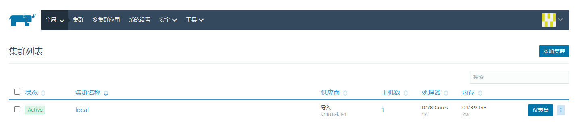
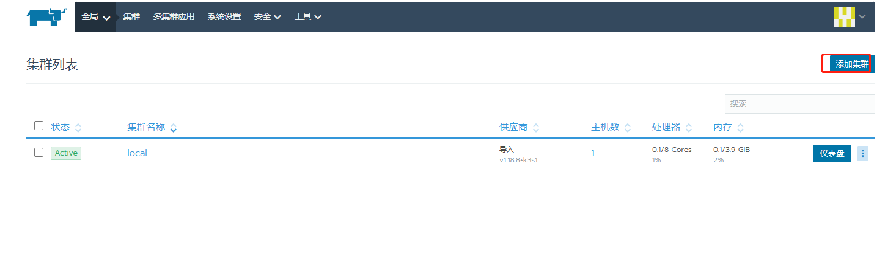
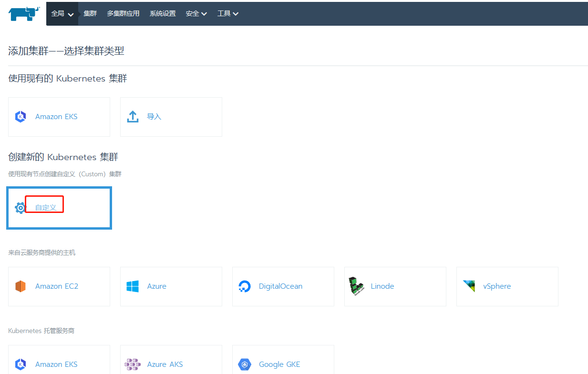
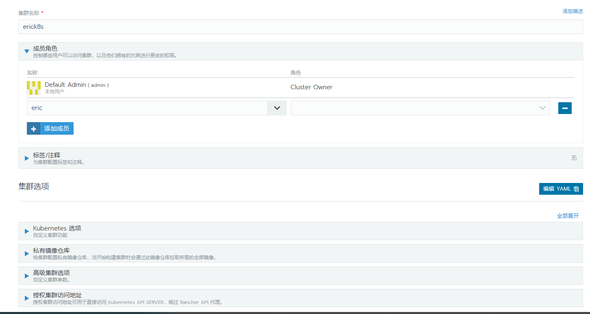
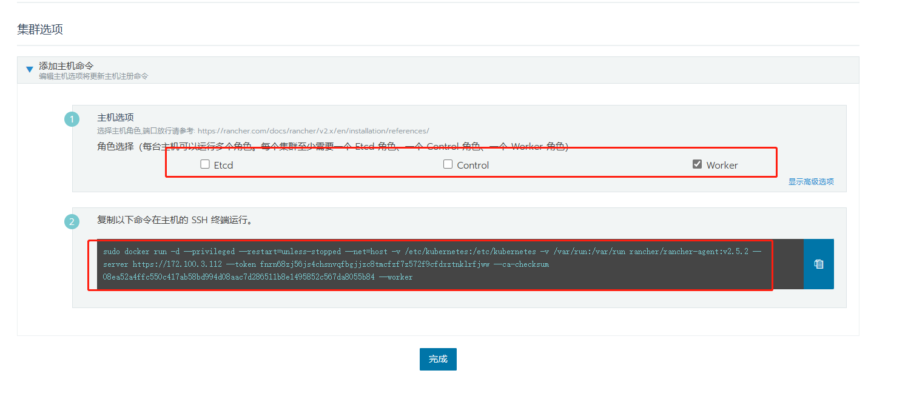
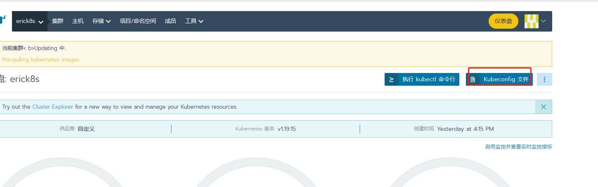
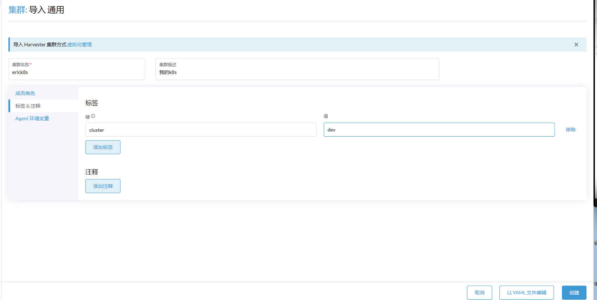
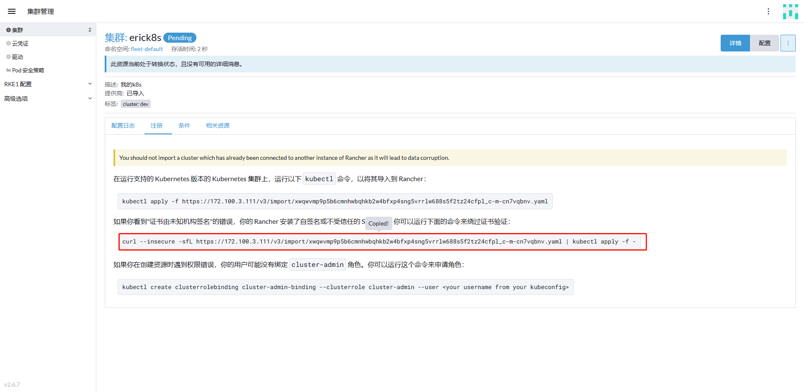
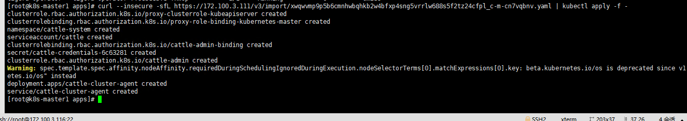

# rancher安装与配置

## 1.安装

```
docker run --privileged -d --restart=unless-stopped -p 80:80 -p 443:443 rancher/rancher:v2.5.2-linux-amd64
```

```
mkdir -p /data/rancher_data
docker run --privileged \
--restart=always \
-v /data/rancher_data:/var/lib/rancher \
-p 80:80 \
-p 443:443 \
-d rancher/rancher:v2.6.7
```


## 2.访问配置

访问：https://172.100.3.112/



## 3.创建k8s集群










获取新建命令到对应服务器执行：

master：

```
sudo docker run -d --privileged --restart=unless-stopped --net=host -v /etc/kubernetes:/etc/kubernetes -v /var/run:/var/run rancher/rancher-agent:v2.5.2 --server https://172.100.3.112 --token fnrn68zj56js4chsnvqfbgjjzc8tmcfzf7z572f9cfdxztnklrfjww --ca-checksum 08ea52a4ffc550c417ab58bd994d08aac7d286511b8e1495852c567da8055b84 --etcd --controlplane
```

node：

```

sudo docker run -d --privileged --restart=unless-stopped --net=host -v /etc/kubernetes:/etc/kubernetes -v /var/run:/var/run rancher/rancher-agent:v2.5.2 --server https://172.100.3.112 --token fnrn68zj56js4chsnvqfbgjjzc8tmcfzf7z572f9cfdxztnklrfjww --ca-checksum 08ea52a4ffc550c417ab58bd994d08aac7d286511b8e1495852c567da8055b84 --worker
```

## 4.安装kubectl

下载kubectl文件上传至服务器

下载kubeconfig



```
[root@k8s-master1 ~]# mkdir -p ~/.kube
[root@k8s-master1 ~]# vim ~/.kube/config
[root@k8s-master1 ~]# kubectl get nodes

```

config文件内容：

```
apiVersion: v1
kind: Config
clusters:
- name: "erick8s"
  cluster:
    server: "https://172.100.3.112/k8s/clusters/c-tgl2h"
    certificate-authority-data: "LS0tLS1CRUdJTiBDRVJUSUZJQ0FURS0tLS0tCk1JSUJoekNDQ\
      VM2Z0F3SUJBZ0lCQURBS0JnZ3Foa2pPUFFRREFqQTdNUnd3R2dZRFZRUUtFeE5rZVc1aGJXbGoKY\
      kdsemRHVnVaWEl0YjNKbk1Sc3dHUVlEVlFRREV4SmtlVzVoYldsamJHbHpkR1Z1WlhJdFkyRXdIa\
      GNOTWpNdwpOakU1TURjME56RTNXaGNOTXpNd05qRTJNRGMwTnpFM1dqQTdNUnd3R2dZRFZRUUtFe\
      E5rZVc1aGJXbGpiR2x6CmRHVnVaWEl0YjNKbk1Sc3dHUVlEVlFRREV4SmtlVzVoYldsamJHbHpkR\
      1Z1WlhJdFkyRXdXVEFUQmdjcWhrak8KUFFJQkJnZ3Foa2pPUFFNQkJ3TkNBQVRaM3l5dVg0TTBrN\
      nU5cW12ZkpUVmdtTU1FMkRxYlZ6eFBHVWJMWFhoOAowazdDdXVmSVhxQ0Zrb1dVNDNudGZVbEZTS\
      DhiNTZRNmRZRzdkNmk0c3lndm95TXdJVEFPQmdOVkhROEJBZjhFCkJBTUNBcVF3RHdZRFZSMFRBU\
      UgvQkFVd0F3RUIvekFLQmdncWhrak9QUVFEQWdOSEFEQkVBaUJLbUk0WG01Y04KRDU3ZExuZHc4b\
      G9BQVhMcVhYTm5rL0dUWWFybjA4a2U2UUlnQTdua2t3NmZRb01acEREM0ZVS2crd0hSTDB3UApmQ\
      005M0lFSGNjeTRmSGc9Ci0tLS0tRU5EIENFUlRJRklDQVRFLS0tLS0="
- name: "erick8s-k8s-master1"
  cluster:
    server: "https://172.100.3.116:6443"
    certificate-authority-data: "LS0tLS1CRUdJTiBDRVJUSUZJQ0FURS0tLS0tCk1JSUN3akNDQ\
      WFxZ0F3SUJBZ0lCQURBTkJna3Foa2lHOXcwQkFRc0ZBREFTTVJBd0RnWURWUVFERXdkcmRXSmwKT\
      FdOaE1CNFhEVEl6TURZeE9UQTRORFkwT1ZvWERUTXpNRFl4TmpBNE5EWTBPVm93RWpFUU1BNEdBM\
      VVFQXhNSAphM1ZpWlMxallUQ0NBU0l3RFFZSktvWklodmNOQVFFQkJRQURnZ0VQQURDQ0FRb0NnZ\
      0VCQUs5ODVCWS9hY2dyCnU1SGdsa2pONXNwVHZQekcvdFVLd29tbFZRaHNNRU1ld3BKYVlqTkxwe\
      W0raDFwdXdJWXlRTytXcmpLNGhsRGwKT0FwSDJIalBDTUx2VURIeHc0YVJyaFd0L0xHM3JnTnhqS\
      EM2RzYraEZiQTlLZUNLVisxR1BhYWJ4aHY1bXJyRQpnNk5ZdmwvNTJubytVa2Z1WUgvKzhRaklXN\
      zQ0eFhkOUVJcmpEVGRSUGVNUkxBUGpUMTFuWUhKLzl3RTBNVlFuCnV6Wnk0dHpTVmFJc0YzakxmM\
      0NOcWMzQjljWXcrQW1ZS2tic3FtWGdQVUZ0TjEwMEVjTFRYMVVuSXVoMS94Q0oKbFFzcjlCQjR4S\
      kh5TTlnd2krRENjY0VQQXlNNDZNN2paRHA3QW5TeDd6NzB2SGJDOXJLUW9DcTkvSDhzeUxvMgo3R\
      jRSMm14bGdsMENBd0VBQWFNak1DRXdEZ1lEVlIwUEFRSC9CQVFEQWdLa01BOEdBMVVkRXdFQi93U\
      UZNQU1CCkFmOHdEUVlKS29aSWh2Y05BUUVMQlFBRGdnRUJBQWxzMTJ4aU9EeVFFaWEzQ2VVSHBvR\
      nMwNTZ6RVlzUENuVy8KNHNMUWc2SFMvUTE5QWRaMGtjNnkvS2MzUXVmTkhwUXh4SEFNd0E1ZW5OZ\
      lg2a2FKSTE1MFdqUzRhVWVMRU9BMApsNTdQQUpvU2dXMzhwbW5yQ2gweGlzcllhK2k5aGZUOE1Bc\
      y9qaTM0bkIwejhIN0xydEpCSXNnSnd2RlRQTkhXCnF3ekJWNmFJN1Y3NGZTWmxITlJzbkt0Y1JUV\
      EhsZ1JRODhsMndaYWlJUkdRMmNHNHJHdFJTMFN1ZXFOWktNU1oKeStnMmptalN6bG5CQWhWSlY5V\
      DBwQ2ZJdDI3L3RhVmxoR3NkMGkwUXNaWWwyWk9UMWprVUhBS2poN3pkSHk3cApBTTFland5akpTe\
      UtQS21RdXFiV2VqWHJUTXZiYnBRN3hjRHV1TU1nY3BzclJrSE4zWWM9Ci0tLS0tRU5EIENFUlRJR\
      klDQVRFLS0tLS0K"

users:
- name: "erick8s"
  user:
    token: "kubeconfig-user-s2smg.c-tgl2h:ttb6sjqz5knmfxfb7gn5vgkftqwsxfw46rs4jmmh7jf7wwmpx4mbn7"


contexts:
- name: "erick8s"
  context:
    user: "erick8s"
    cluster: "erick8s"
- name: "erick8s-k8s-master1"
  context:
    user: "erick8s"
    cluster: "erick8s-k8s-master1"

current-context: "erick8s"
```

## 5.添加集群






