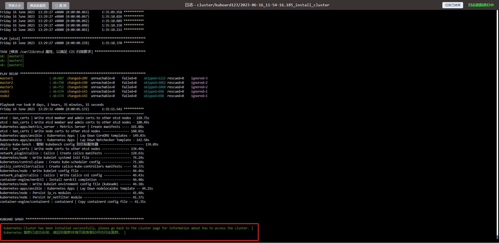

# 使用 KuboardSpray 安装kubernetes

Kuboard-Spray 是一款可以在图形界面引导下完成 Kubernetes 高可用集群离线安装的工具，开源仓库的地址为 [Kuboard-Spray](https://github.com/eip-work/kuboard-spray)

# 1.安装 Kuboard-Spray

- 取一台服务器或虚拟机，执行一条命令，即可完成 Kuboard-Spray 的安装。

  对这台服务器的最低要求为：

  - 1核2G
  - 不少于 10G 磁盘空余空间
  - 已经安装好 docker

   [docker与docker-compose安装](/k8s/docker与docker-compose安装.md)

  ```
  wget https://mirrors.aliyun.com/docker-ce/linux/centos/docker-ce.repo -O /etc/yum.repos.d/docker-ce.repo
  yum -y install docker-ce
  systemctl enable docker && systemctl start docker &&systemctl status docker
  mkdir -p /etc/docker
  cat > /etc/docker/daemon.json << EOF
  {
      "registry-mirrors": ["https://kzjowymh.mirror.aliyuncs.com"],
      "exec-opts": ["native.cgroupdriver=systemd"]
  }
  EOF
  systemctl daemon-reload
  systemctl restart docker &&systemctl status docker
  ```

  待执行的命令如下：

  ```sh
  docker run -d \
    --privileged \
    --restart=unless-stopped \
    --name=kuboard-spray \
    -p 80:80/tcp \
    -v /var/run/docker.sock:/var/run/docker.sock \
    -v /apps/kuboard-spray-data:/data \
    eipwork/kuboard-spray:latest-amd64
    # 如果抓不到这个镜像，可以尝试一下这个备用地址：
    # swr.cn-east-2.myhuaweicloud.com/kuboard/kuboard-spray:latest-amd64 
    
    sudo docker run -d \
    --restart=unless-stopped \
    --name=kuboard \
    -p 80:80/tcp \
    -p 10081:10081/tcp \
    -e KUBOARD_ENDPOINT="http://172.100.3.111:80" \
    -e KUBOARD_AGENT_SERVER_TCP_PORT="10081" \
    -v /apps/kuboard-data:/data \
    eipwork/kuboard:v3
  ```

  持久化

  - KuboardSpray 的信息保存在容器的 `/data` 路径，请将其映射到一个您认为安全的地方，上面的命令中，将其映射到了 `~/kuboard-spray-data` 路径；
  - 只要此路径的内容不受损坏，重启、升级、重新安装 Kuboard-Spray，或者将数据及 Kuboard-Spray 迁移到另外一台机器上，您都可以找回到原来的信息。

- 在浏览器打开地址 `http://这台机器的IP`，输入用户名 `admin`，默认密码 `Kuboard123`，即可登录 Kuboard-Spray 界面。

# 2.加载离线资源包

在 Kuboard-Spray 界面中，导航到 `系统设置` --> `资源包管理` 界面，可以看到已经等候您多时的 `Kuboard-Spray 离线资源包`，如下图所示：


- 点击 `导 入` 按钮，在界面的引导下完成资源包的加载-选择镜像源-查看日志。

  

  完成

  

  重要

  - 权限问题
    - 导入资源包时，可能会碰到 `no such file or directory` 或者 `permission denied` 之类的错误提示，通常是因为您开启了 SELinux，导致 kuboard-spray 不能读取映射到容器 `/data` 的路径
  - 离线导入
    - 如果您处在内网环境，上图中的列表默认将是空的，请注意其中的 `离线加载资源包` 按钮，它可以引导您轻松完成资源包的离线加载过程。

# 3.规划并安装集群

- 在 Kuboard-Spray 界面中，导航到 `集群管理` 界面，点击界面中的 `添加集群安装计划` 按钮，填写表单如下：
  - 集群名称： 自定义名称，本文中填写为 kuboard123，此名称不可以修改；
  - 资源包：选择前面步骤中导入的离线资源包。


点击上图对话框中的 `确定` 按钮后，将进入集群规划页面，在该界面中添加您每个集群节点的连接参数并设置节点的角色，如下图所示：

**重要： kuboard-spray 所在机器不能当做 K8S 集群的一个节点，因为安装过程中会重启集群节点的容器引擎，这会导致 kuboard-spray 被重启掉。**


- 注意事项

  - 最少的节点数量是 1 个；

  - ETCD 节点、控制节点的总数量必须为奇数；

  - 在 `全局设置` 标签页，可以设置节点的通用连接参数，例如所有的节点都使用相同的 ssh 端口、用户名、密码，则共同的参数只在此处设置即可；

  - 在节点标签页，如果该节点的角色包含 `etcd` 则必须填写 `ETCD 成员名称` 这个字段；

  - 如果您 KuboardSpray 所在节点不能直接访问到 Kubernetes 集群的节点，您可以设置跳板机参数，使 KuboardSpray 可以通过 ssh 访问集群节点。

  - 集群安装过程中，除了已经导入的资源包以外，还需要使用 yum 或 apt 指令安装一些系统软件，例如 curl, rsync, ipvadm, ipset, ethtool 等，此时要用到操作系统的 apt 软件源或者 yum 软件源。

    标签页中，可以引导您完成 apt / yum 软件源的设置，您可以：

    - 使用节点操作系统已经事先配置的 apt / yum 源，或者
    - 在安装过程中自动配置节点的操作系统使用指定的软件源

  - 如果您使用 docker 作为集群的容器引擎，还需要在

    标签页指定安装 docker 用的 apt / yum 源。

    > 如果您使用 containerd 作为容器引擎，则无需配置 docker 的 apt / yum 源，containerd 的安装包已经包含在 KuboardSpray 离线资源包中。

- 点击上图的 `保存` 按钮，再点击 `执行` 按钮，可以启动集群的离线安装过程，如下图所示：


取决于您机器的性能和网络访问速度，大概喝一杯茶的功夫，集群就安装好了，安装成功时，日志界面的显示如下图所示：



# 4.访问集群

- 如果集群日志界面提示您集群已经安装成功，此时您可以返回到集群规划页面，此界面将自动切换到 `访问集群` 标签页，如下图所示：

  界面给出了三种方式可以访问 kubernetes 集群：

  

  - 在集群主节点上执行 kubectl 命令
  - 获取集群的 .kubeconfig 文件
  - 将集群导入到 kuboard管理界面

  


# 5.安装 Kuboard v3.x

安装 Kuboard v3.x 版本的指令如下：

 

```sh
sudo docker run -d \
  --restart=unless-stopped \
  --name=kuboard \
  -p 80:80/tcp \
  -p 10081:10081/tcp \
  -e KUBOARD_ENDPOINT="http://内网IP:80" \
  -e KUBOARD_AGENT_SERVER_TCP_PORT="10081" \
  -v /root/kuboard-data:/data \
  eipwork/kuboard:v3
  # 也可以使用镜像 swr.cn-east-2.myhuaweicloud.com/kuboard/kuboard:v3 ，可以更快地完成镜像下载。
  # 请不要使用 127.0.0.1 或者 localhost 作为内网 IP \
  # Kuboard 不需要和 K8S 在同一个网段，Kuboard Agent 甚至可以通过代理访问 Kuboard Server \  
```

> WARNING

- KUBOARD_ENDPOINT 参数的作用是，让部署到 Kubernetes 中的 `kuboard-agent` 知道如何访问 Kuboard Server；
- KUBOARD_ENDPOINT 中也可以使用外网 IP；
- Kuboard 不需要和 K8S 在同一个网段，Kuboard Agent 甚至可以通过代理访问 Kuboard Server；
- 建议在 KUBOARD_ENDPOINT 中使用域名；
- 如果使用域名，必须能够通过 DNS 正确解析到该域名，如果直接在宿主机配置 `/etc/hosts` 文件，将不能正常运行；

> 参数解释

- 建议将此命令保存为一个 shell 脚本，例如 `start-kuboard.sh`，后续升级 Kuboard 或恢复 Kuboard 时，需要通过此命令了解到最初安装 Kuboard 时所使用的参数；
- 第 4 行，将 Kuboard Web 端口 80 映射到宿主机的 `80` 端口（您可以根据自己的情况选择宿主机的其他端口）；
- 第 5 行，将 Kuboard Agent Server 的端口 `10081/tcp` 映射到宿主机的 `10081` 端口（您可以根据自己的情况选择宿主机的其他端口）；
- 第 6 行，指定 KUBOARD_ENDPOINT 为 `http://内网IP`，如果后续修改此参数，需要将已导入的 Kubernetes 集群从 Kuboard 中删除，再重新导入；
- 第 7 行，指定 KUBOARD_AGENT_SERVER 的端口为 `10081`，此参数与第 5 行中的宿主机端口应保持一致，修改此参数不会改变容器内监听的端口 `10081`，例如，如果第 5 行为 `-p 30081:10081/tcp` 则第 7 行应该修改为 `-e KUBOARD_AGENT_SERVER_TCP_PORT="30081"`；
- 第 8 行，将持久化数据 `/data` 目录映射到宿主机的 `/root/kuboard-data` 路径，请根据您自己的情况调整宿主机路径；

其他参数

- 在启动命令行中增加环境变量 `KUBOARD_ADMIN_DERAULT_PASSWORD`，可以设置 `admin` 用户的初始默认密码。

# 6.[访问 Kuboard v3.x](https://kuboard.cn/install/v3/install-built-in.html#访问-kuboard-v3-x)

在浏览器输入 `http://your-host-ip:80` 即可访问 Kuboard v3.x 的界面，登录方式：

- 用户名： `admin`
- 密 码： `Kuboard123`

浏览器兼容性

请使用 Chrome / FireFox / Safari 等浏览器

不兼容 IE 以及以 IE 为内核的浏览器