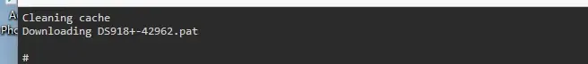
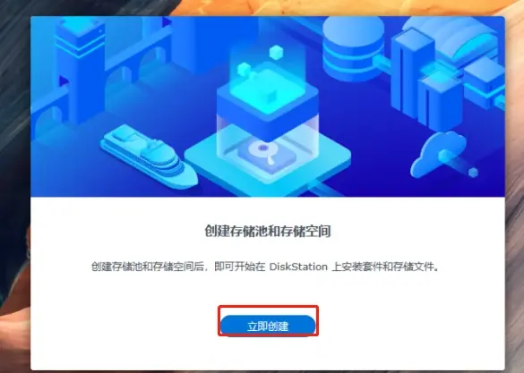
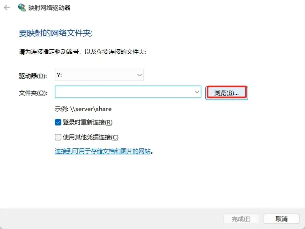

# **1. 下载：**

链接：https://pan.baidu.com/s/1dtA3u-m5dLpkCkFN42ak-g?pwd=z8t1

提取码：z8t1

本期涉及的相关链接：

巴西大佬引导制作页面：https://github.com/fbelavenuto/arpl/releases

rufus刷写工具：http://rufus.ie/en/

套件源：https://imnks.com/1780.html

# **2. 准备**

1. 制作启动盘

安装打开rufus工具选择img文件写入U盘

1. 制作虚拟机硬盘

下载swc工具：链接：https://pan.baidu.com/s/1RQnZ1ZgBZbW2Fl7uzGgfZA?pwd=smag

提取码：smag

下载软件解压打开-选择img

# **3. 安装**

## **3.1 虚拟机安装**

新建虚拟机-磁盘选择现有磁盘选择生成硬盘（之前选择sata）

记得给虚拟机再加一块硬盘(sata)哦

## **3.2 安装过程，物理机和虚拟机一样**

启动后出现下面界面证明引导可以了

访问地址：http://192.168.88.128:7681/

1.选择型号

2.一般选择918

3.选择系统版本

选择最新

4.选择序列号

生成一个随机的序列号

5.10代以上cpu选择显卡驱动，其他不选

6.开始编译

编译过程，下载pat文件，速度取决于你的网络

6.启动boot

记住版本和型号

7.输入：https://finds.synology.com/ 查找局域网NSA

选择继续，跳转至：http://192.168.3.22:5000/web_index.html

下载pat文件：https://archive.synology.cn/download/Os/DSM/7.1.1-42962-1-NanoPacked

选择下载好的文件

格式化磁盘

开始安装，等待即可

继续等待。。。

快了 ，别着急

好了，安装成功

设置用户名密码。admin已被预留，设置其他

设置不自动更新

跳过登录群晖账号

设置完成，安装完毕

**4. 配置**

**4.1 配置存储池和存储空间**

只有一块盘，一般选基础就行

选择硬盘

跳过检测

选择分配大小，一般全部就行

选择格式，nas不做服务器Linux，选择Btrfs

确认信息

配置完成

**4.2 设置套件源**

矿神源：https://imnks.com/1780.html

已添加

搜索安装-Jellyfin

**4.3 配置文件共享**

控制面板-共享文件夹

新建文件夹

设置信息

不加密，其他默认就行

设置访问权限

完成

客户端测试访问

输入用户名密码

访问成功

设置网络映射

开启网络发现

网络右键-映射

完成-查看

