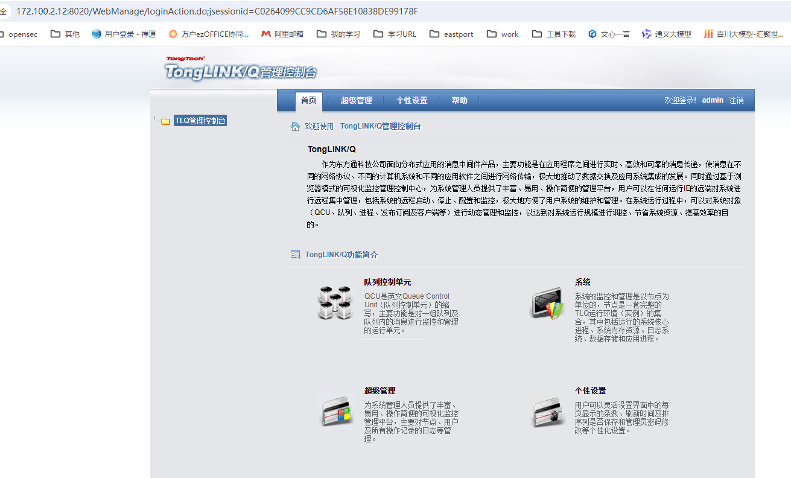

# 安装东方通TongLINK/Q

## 常用命令

```
#启动
tlq -cstart
#查看进程
ps -ef |grep tl_
#强制停止
tlq -cabort -y -w1
#停止
tlq -cstop
#查看qcu1 状态
tlqstat -qcu qcu1 -c
#查看自己连接其他状态
tlqstat -snd qcu1 1
#查看被连接状态
tlqstat -rcv qcu1 1
#查看许可证
tlqstat -lic
#开启监控代理对应配置文件tlsys.conf。
tlqremote
停止
tlqremote -cstop
查看ipc资源
tlqipc
```


## Linux安装

### 获取软件：

链接：https://pan.baidu.com/s/11dWEbDNBnO7wNKh5cr2cMg?pwd=8888 
提取码：8888

### 解压软件

```
tar zxvf Install_TLQ_Standard_Linux2.6.32_x86_64_8.1.16.1.tar.gz 

#赋值key
cp license.dat TLQ8/


```

### 配置环境变量

```
vim setp
#修改$PWD为安装目录：/apps/tlq/TLQ8
cat setp >> ~/.bash_profile
source /apps/tlq/TLQ8
```
### 配置系统资源
```
vim /etc/sysctl.conf 
kernel.sem =5120 32000 5120 5120
生效
sysctl -p /etc/sysctl.conf

 vim /etc/security/limits.conf
tlq      hard     nofile         65535
tlq      soft     nofile         65535
[root@ep-db-01 bin]# ulimit -a
core file size          (blocks, -c) 0
data seg size           (kbytes, -d) unlimited
scheduling priority             (-e) 0
file size               (blocks, -f) unlimited
pending signals                 (-i) 55380
max locked memory       (kbytes, -l) 64
max memory size         (kbytes, -m) unlimited
open files                      (-n) 65535
pipe size            (512 bytes, -p) 8
POSIX message queues     (bytes, -q) 819200
real-time priority              (-r) 0
stack size              (kbytes, -s) 8192
cpu time               (seconds, -t) unlimited
max user processes              (-u) 55380
virtual memory          (kbytes, -v) unlimited
file locks  

```
### 测试可用性

```
[root@ha2 TLQ8]# tlq -h

Usage:
tlq -h|-?|
	-c<cmd> |-w<time>|-y|
  -h or -?, display help message
  -c<cmd>, start or stop command
     cmd = start, start TLQ. default is start
     cmd = stop,  stop TLQ after AP stopped 
     cmd = abort, stop TLQ after AP being killed 
  -w<time>, time for waiting AP end(seconds)
  -y,   when stop TLQ, no prompt
  -u<TLQLicenseFlag>,  display TLQ License Message flag(1-enable 0-disable)

```

### 配置多个QCU（队列管理器）

复制一份配置文件

```
cd /apps/tlq/TLQ8/etc
cp tlqcu_qcu1.conf tlqcu_qcu2.conf
```

修改系统配置

```
vim tlsys.conf
#添加
#
[QCURecord]		#
QCUName = qcu2		# 队列控制单元名称
QCUStatus = 1		# 队列控制单元状态，0禁用，1正常
#
#-----------------------------------
#重启tlq
tlq -cstop
tlq -cstart
#查看
tlqstat -qcu qcu2 -c

```

### 配置两个QCU之间的连通性

修改配置文件ip和端口

主动端:

```
vim   tlqcu_qcu1.conf
#
[SendConnRecord]		# 发送连接小节
ConnName = conn1 		# 连接名称
SendQueName = sq		# 连接对应的发送队列名称
ConnStatus = 1		# 发送连接状态，0禁用，1正常
HostName = 172.100.3.111		# 被连接节点的IP地址
ConnPort = 10003		# 被连接节点的端口号，端口号需大于1024
ConnType = 0		# 连接类型,0为常连接，1为按需连接
SendBlockSize = 8		# 单个数据块大小，单位kbytes
SendBuff = 65536		# 连接发送缓冲区大小，单位byte
LineType = LINE1000M		# 线路类型
DiscInterval = 60		# 线路维持时间，单位为秒
BeatInterval = 20		# 线路检测时间(只适用于常连接)，单位为秒
SecExitFlag = 		# 出口标志 Net|Transport|ByRecv
SecExitNetData = 		# 网络层出口用户数据，类型为字符串(最大长度为48字节)
SecExitTransportData = 		# 传输层出口用户数据，类型为字符串(最大长度为48字节)
#
```

查看连接性（状态link正常）

```
]# tlqstat -snd qcu1 1

Name                                      QName                                     HostName                           PortNo  Type     Status        LinkStatus
conn1                                     sq                                        172.100.3.111                       10003  long     active        link   
```

被连接端查看（内容不为空）

```
]# tlqstat -rcv qcu1 1

SocketId  IP                                                SndNode                                           ConnType  LinkStatus
      11  172.100.3.112                                     t172.100.3.112_65f2b17a                           long      active 
```

### 配置QCU服务器集群

准备三台以上服务器分别安装TLQ程序，并启动

主动端：修改配置文件

```
vim   tlqcu_qcu1.conf
############################################################
[SendQue]		# 发送队列单元小节
#
[SendQueRecord]		# 
SendQueName = sq		# 发送队列名称
MsgNum = 1000		# 队列存放最大消息数
MsgSize = 5000000		# 单个消息最大长度，单位byte
QueSpaceSize = 50000		# 队列中消息占用空间大小，单位为 K bytes，0由系统自动分配		
SendQDataBuff = 100		# 发送队列数据存储区记录数，单位kbyte
DefDestQueName = 		# 缺省目的队列名
#
#add
#
[SendQueRecord]		# 
SendQueName = sq116		# 发送队列名称
MsgNum = 1000		# 队列存放最大消息数
MsgSize = 5000000		# 单个消息最大长度，单位byte
QueSpaceSize = 50000		# 队列中消息占用空间大小，单位为 K bytes，0由系统自动分配		
SendQDataBuff = 100		# 发送队列数据存储区记录数，单位kbyte
DefDestQueName = 		# 缺省目的队列名
#
############################################################
[RemoteQue]		# 远程队列单元小节
#
[RemoteQueRecord]		# 
RemoteQueName = rq 		# 远程队列名
SendQueName = sq		# 对应发送队列名
DestQueName = lq		# 目的队列名
#
##add
#
[RemoteQueRecord]		# 
RemoteQueName = rq116 		# 远程队列名
SendQueName = sq116		# 对应发送队列名
DestQueName = lq		# 目的队列名
#
[RemoteQueRecord]		# 
RemoteQueName = rq3 		# 远程队列名
SendQueName = sq		# 对应发送队列名
DestQueName = TLQ.SYS.BROKER.SYN		# 目的队列名
#
############################################################

##最后添加
############################################################
[ClusterQue]		# 集群队列单元小节
#
[ClusterQueRecord]		# 
ClusterQueName = cluster1		# 集群队列名
FunctionFlag = 1		# 0表示备份，1表示均衡负载,2表示按数据量动态均衡，3表示按路由, 4表示自适应（只限负载）,5表示根据连接数均衡分配
AddressList =           # JNDI连接url ip:port|ip:port,只在FunctionFlag=4或者5的时候使用
#
#
[ClusterQueDestination]		# 集群队列描述
ClusterDestination = rq		# 对应目的队列，只能是远程队列或本地队列
Weight = 1		# 权重
#
#
[ClusterQueDestination]		# 集群队列描述
ClusterDestination = rq116		# 对应目的队列，只能是远程队列或本地队列
Weight = 1		# 权重
#
#
#[ClusterQueDestination]		# 集群队列描述
#ClusterDestination = rq2		# 对应目的队列，只能是远程队列或本地队列
#Weight = 3		# 权重
#
############################################################

```

发送消息

```
]# java SendMsg qcu1 cluster1 B no
myMsgType is :B
--------------共发送消息2条!-----------
-----------sendmsg over!!-----------
```

接收端查看状态

```
tlqstat -qcu qcu1 -c

```


## 客户端安装

```
tar zxvf Install_TLQCli_Standard_Linux2.6.32_x86_64_8.1.16.1.tar.gz 
cd TLQCli8/
vim setp 
#修改$PWD为安装目录：/apps/tlq/TLQCli8
cat  setp >>~/.bash_profile 
source ~/.bash_profile 


```

### 常用命令：

```
#启动
tlq -cstart
#查看进程
ps -ef |grep tl_
#强制停止
tlq -cabort -y -w1
#停止
tlq -cstop
#查看qcu1 状态
tlqstat -qcu qcu1 -c
#查看自己连接其他状态
tlqstat -snd qcu1 1
#查看被连接状态
tlqstat -rcv qcu1 1
#查看许可证
tlqstat -lic

```

### 发送消息测试

编译javadome

```
cd /apps/tlq/TLQCli8/samples/demo_java/base
javac *.java
```

发送消息

```
#放消息
[root@ha2 base]# java SendMsgCli qcu1 lq B no
qcuname=qcu1
myMsgType is :B
--------------共发送消息2条!-----------
-----------sendmsg over!!-----------
[root@ha2 base]# tlqstat -qcu qcu1 -c
[Send Queue General Information]:

Quename                                                Ready  Snding  Rcving   WaitAck       Delay
sq                                                         0       0       0         0           0

[Local Queue General Information]:

Quename                                                Ready  Snding  Rcving   WaitAck       Delay  Getor
lq                                                         2       0       0         0           0      0
TLQ.SYS.EVENT                                              0       0       0         0           0      0
TLQ.SYS.DEAD                                               0       0       0         0           0      0
TLQ.SYS.BROKER.CONTROL                                     0       0       0         0           0      0
TLQ.SYS.BROKER.SYN                                         0       0       0         0           0      0
TLQ.SYS.BROKER.SUB                                         0       0       0         0           0      0
TLQ.SYS.BROKER.SUBREQ                                      0       0       0         0           0      0

[Remote Queue General Information]:

Quename                    SndQName                   DestQName                  SndConnName                HostName                ConnPort  ConnType  ConnStatus
rq                         sq                         lq                         conn1                      127.0.0.1                  10004  long      close   
rq3                        sq                         TLQ.SYS.BROKER.SYN         conn1                      127.0.0.1                  10004  long      close   

[Virtual Queue General Information]:

Quename                                           LocalQueName                                           Ready
#取消息
[root@ha2 base]# java GetMsgCli qcu1 lq 0
--------------------receive message begin------------------
Received a Buffer Msg
msgInfo.MsgId=ID:cfcdddab8000065f164d661100000   msgInfo.MsgSize=10
Received a Buffer Msg
msgInfo.MsgId=ID:cfcdddab8000065f164d661100001   msgInfo.MsgSize=10
com.tongtech.tlq.base.TlqException:syserr:2,tlqerrno:2603:tlq_getmsg: no message matched in the queue now
	at com.tongtech.tlq.base.ClientKernel.tlqGetMsg(Native Method)
	at com.tongtech.tlq.base.KernelFacade.tlqGetMsg(KernelFacade.java:251)
	at com.tongtech.tlq.base.TlqQCU.getMessage(TlqQCU.java:176)
	at GetMsgCli.recvMsg(GetMsgCli.java:76)
	at GetMsgCli.main(GetMsgCli.java:125)
----------GetMsg is over!------------

-------共接收消息2条-------

```

### 配置发送消息至远程qcu

打开启动节点时代理的启动状态记录端口

```
vim tlqcu_qcu1.conf
###########################################################
[ClientBroker]		# 瘦客户代理小节
#
[ClientBrokerRecord]		# 瘦客户代理
CliBrokerID = 2		# 代理进程编号
CliBrokerStatus = 1		# 启动节点时代理的启动状态,0:不启动,1:启动
ListenPort = 10261		# 代理监听的端口号，端口号需大于1024
HisRecMaxNum = 10		# 历史文件中历史记录的最大数（支持断点续传）
#
```

配置客户端文件修改服务地址和端口

```
vim tlqcli.conf
############################################################
[TcSystem]              # 系统小节
#
############################################################
[Broker]                # 代理模板小节
#
[BrokerRecord]          # 
BrokerId = 111          # 代理编号
BrokerDesc =            # 代理描述
HostName = 172.100.3.112                # 代理所在的机器名或IP
UserName =                      # 链接验证的用户名
Password =                      # 链接验证用户名的密码
ListenPort = 10261              # 代理的监听端口号
ConnTime = 30           # 连接的有效时间
BlockSize = 8           # 传输的数据块长度，单位kbytes
NeedBlockReply = 0              # 数据块是否需要应答：0（不需要）：消息发送完毕后返回一个应答。1（需要）：消息发送的每个数据块都需要应答。
ReplyTmout = 20         # 数据包的应答超时时间
ConnId =                # 客户连接的标识
RenFileRestituteFlag=   1               #传输过程中被重命名文件是否需要恢复原文件名：0（需要），1（不需要）。

```

## 控制台安装

### 1.获取软件

下载软件：链接：https://pan.baidu.com/s/16JUodnB4QA2tkC5TWOgw6A?pwd=8888 
提取码：8888

### 2.安装

```
[root@ep-db-01 tlq]# ./Install_TLQManageConsole8.1.15.12.bin -i console
正在准备进行安装
正在从安装程序档案中提取安装资源...
配置该系统环境的安装程序...

正在启动安装程序...

===============================================================================
选择区域...
-------

    1- English
  ->2- 简体中文

按编号选择区域: 2
===============================================================================
TLQ8.1_ManageConsole                                    (使用 InstallAnywhere 创建)
-------------------------------------------------------------------------------

正在准备控制台模式安装...


===============================================================================
简介
--

InstallAnywhere 将指导您完成 TLQ8.1_ManageConsole 的安装。

建议您在继续本次安装前，退出所有程序。
如果要回到前一屏幕进行更改，可输入“back”。

如果要取消本次安装，可随时输入“quit”。

请按 <ENTER> 键继续: 


===============================================================================
选择安装文件夹
-------

请为本次安装选择一个目的文件夹。

您想在哪一位置安装？

  缺省安装文件夹： /root/TLQ8.1_ManageConsole

输入一个绝对路径，或按 <ENTER> 键以接受缺省路径
      : /data/tlq/TLQ8.1_ManageConsole

安装文件夹为： /data/tlq/TLQ8.1_ManageConsole
   是否正确？ (Y/N): y


===============================================================================
选择链接位置
------

您想在哪一位置创建链接？

  ->1- 缺省位置： /root
    2- 在您的主文件夹中
    3- 另选一个位置...

    4- 不创建链接

输入上述选项的号码，或按 <ENTER> 键接受缺省位置
      : 


===============================================================================
选择license文件
-----------

请选择license文件

license file (默认﹕ ): 


===============================================================================
配置TLQ8.1控制台
-----------

管理控制台是TLQ8.1系统提供的工具，
用户可以通过这个工具浏览、监控和管理远程节点。

TLQ_PORT (默认﹕ 8020): 


===============================================================================
预安装摘要
-----

按 <ENTER> 键继续。如果所列信息有误，请输入“BACK”，
然后进行更改
   

产品名：
    TLQ8.1_ManageConsole

安装文件夹：
    /data/tlq/TLQ8.1_ManageConsole

链接文件夹：
    /root

磁盘空间信息（用于安装目标）： 
    所需空间：       309,988,773 字节
    可用空间： 1,094,630,502,400 字节

请按 <ENTER> 键继续: 


===============================================================================
正在安装...
-------

 [==================|==================|==================|==================]
 [------------------|------------------|------------------|------------------]


===============================================================================
安装完成
----

恭喜！TLQ8.1_ManageConsole 已成功地安装到：

   /data/tlq/TLQ8.1_ManageConsole

按 <ENTER> 键以退出安装程序: 
[root@ep-db-01 tlq]# 

```

### 3.配置启动

```
#将license.dat复制到安装部署下面
cp license.dat /data/tlq/TLQ8.1_ManageConsole
#启动
cd /data/tlq/TLQ8.1_ManageConsole/bin
./startservernohup.sh
#查看日志
 tailf ../logs/server.log
```

### 4.访问配置

浏览器访问：http://172.100.2.12:8020/WebManage/login.jsp

用户名 ： admin

密码：Admin@123.com

登录成功如下截图：



